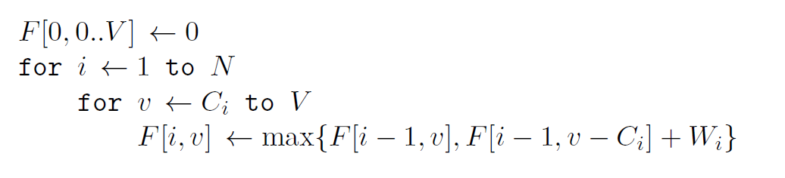
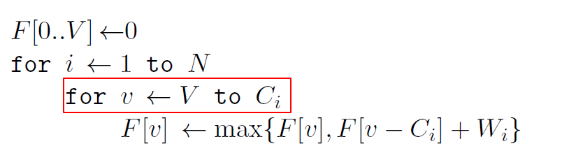
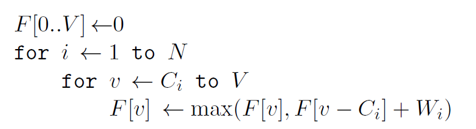

#### 背包问题

##### 01背包问题

​	有N种物品和一个容量为V的背包,放入第$i$种物品的费用是$C_i$，价值是$W_i$。求解将哪些物品装入背包可使价值总和最大 
$$
F[i,v]=\max\{F[i-1,v],F[i-1,v-C_i]+W_i\}
$$
​	伪代码：



​	空间改进：



​	原始代码

```c++
#include <bits/stdc++.h>
using namespace std;

int main(int argc, char const *argv[])
{
    int N, V;
    cin >> N >> V;
    vector<int> dp(V + 1, 0);
    for(size_t i = 0; i < N; i++) {  // 注意这里是倒序
        int vi, wi;
        cin >> vi >> wi;
        for(size_t j = V; j >= vi; j--) {
            dp[j] = max(dp[j], dp[j - vi] + wi);
        }
    }
    cout << dp[V] << endl;
    return 0;
}
```

​	[目标和](https://leetcode-cn.com/problems/target-sum/)

```c++
// 暴力遍历
class Solution {
public:
    void depthSearch(vector<int>& nums, int &res, int target, int rank, int flag, int temp) {
        if(rank == nums.size() - 1) {
            if(temp + nums[rank] * flag == target){
                res++;
            }
            return;
        }
        depthSearch(nums, res, target, rank + 1, 1, temp + nums[rank] * flag);
        depthSearch(nums, res, target, rank + 1, -1, temp + nums[rank] * flag);
    }

    int findTargetSumWays(vector<int>& nums, int target) {
        int res = 0;
        vector<int> flags;
        depthSearch(nums, res, target, 0, 1, 0);
        depthSearch(nums, res, target, 0, -1, 0);
        return res;
    }
};
// 01背包优化

class Solution {
public:
    int findTargetSumWays(vector<int>& nums, int target) {
        int sum = 0;
        for (auto &i : nums) {
            sum += i;
        }
        if(target > sum || (sum - target)%2!=0) {
            return 0;
        }
        int x = (sum + target) / 2;
        int y = (sum - target) / 2;

        /*
        * 有关状态转移公式的说明，dp[i][j]表示从前i个元素中选择和为j的数的方案数
        * 如果当前j < nums[i],那么不能选，dp[i][j] = dp[i-1][j]
        * 如果当前j >= nums[i]，如果不选dp[i][j] = dp[i-1][j]，如果选择dp[i][j] = dp[i-1][j-nums[i]] + dp[i-1][j]
        */
        vector<vector<int>> dp(nums.size() + 1, vector<int>(y + 1, 0));
        dp[0][0] = 1;
        for(size_t i = 1; i <= nums.size(); i++) {
            for(size_t j = 0; j <= y; j++) {
                dp[i][j] = dp[i - 1][j];
                if(j >=  nums[i-1]){
                    dp[i][j] += dp[i - 1][j - nums[i-1]];
                }
            }
        }
        return dp[nums.size()][y];
        
        // 下面为空间优化版本，循环部分为倒序，保证更新的值是原有的值，不是更新后的值
        vector<int> dp(y + 1, 0);
        dp[0] = 1;
        for(size_t i = 1; i <= nums.size(); i++) {
            int temp = nums[i - 1];
            for(size_t j = y; j >= 0; j--) {
                if(j > temp) {
                    dp[j] += dp[j - temp];
                }
            }
        }
        return dp.back();
    }
};
```

##### 完全背包问题

​	有$N$种物品和一个容量为$V$的背包，每种物品都有无限件可用。放入第$i$种物品的费用是$C_i$，价值是$W_i$。求解：将哪些物品装入背包，可使这些物品的耗费的费用总和不超过背包容量，且价值总和最大。
$$
F[i,v]=\max\{F[i-1,v-k\times W_i|0\le K\times C_i\le v\}
$$


​	源码

```C++
#include <bits/stdc++.h>
using namespace std;

int main(int argc, char const *argv[])
{
    int N, V;
    cin >> N >> V;
    vector<int> dp(V + 1, 0);
    for(size_t i = 0; i < N; i++) {
        int vi, wi;
        cin >> vi >> wi;
        for(size_t j = vi; j <= V; j++) {
            dp[j] = max(dp[j], dp[j - vi] + wi);
        }
    }
    cout << dp[V] << endl;
    return 0;
}
```

##### 多重背包问题

​	有$N$种物品和一个容量为$V$的背包，第$i$种物品有$M_i$个。放入第$i$种物品的费用是$C_i$，价值是$W_i$。求解：将哪些物品装入背包，可使这些物品的耗费的费用总和不超过背包容量，且价值总和最大。

> 还有一个滑动窗口求最大值的方法没有搞清楚

```c++
#include <bits/stdc++.h>
using namespace std;

struct good{
    int v;
    int w;
    good(int a, int b): v(a), w(b) {}
};

int main(int argc, char const *argv[])
{
    vector<good> Goods;
    int N, V;
    cin >> N >> V;
    vector<int> dp(V + 1, 0);
    for(size_t i = 0; i < N; i++) {
        int v, w, n;
        cin >> v >> w >> n;
        
        for(size_t k = 1; k <= n; k*=2) {
            n -= k;
            Goods.push_back({v * k, w * k});
        }
        if(n)
            Goods.push_back({v * n, w * n});
    }
    for(size_t i = 0; i < Goods.size(); i++) {
        int v = Goods[i].v, w = Goods[i].w;
        for(size_t j = V; j  >= v; j--) {
            dp[j] = max(dp[j], dp[j - v] + w);
        }
    }
    cout << dp[V] << endl;
    return 0;
}
```

##### 二维背包问题

​	二维费用的背包问题是指：对于每件物品，具有两种不同的费用，选择这件物品必须同时付出这两种费用。对于每种费用都有一个可付出的最大值（背包容量）。问怎样选择物品可以得到最大的价值。设第i 件物品所需的两种费用分别为$C_i$和$D_i$。两种费用可付出的最大值（也即两种背包容量）分别为$V$和$U$。物品的价值为$W_i$。
$$
F[i,v,u]=\max\{F[i-1,v,u], F[i-1,v-C_i,u-D_i]+W_i\}
$$
[879.盈利计划](https://leetcode-cn.com/problems/profitable-schemes/)

```C++
#include <bits/stdc++.h>
using namespace std;

class Solution {
public:
    /*
    * dp[i][j][k]表示前i个工作中选择j个员工，利润最起码是k
    * 二维背包问题的转移公式：
    * 如果不能够成功执行：dp[i][j][k] = dp[i-1][j][k]
    * 如果不能够成功执行 ：dp[i][j][k] = dp[i-1][j][k] + dp[i-1][j-group[i]][max(0, k-profit[i]]
    */
    int profitableSchemes(int n, int minProfit, vector<int>& group, vector<int>& profit) {
        vector<vector<int>> dp(n + 1, vector<int>(minProfit+1, 0));
        for(size_t i = 0; i < n+1; i++) {
            dp[i][0] = 1;
        }
        int worknum = group.size(), MOD = (int)1e9 + 7;
        for(size_t i = 0; i < worknum; i++) {
            int worker = group[i], pf = profit[i];
            for(int j = n; j >= worker; j--) {
                for(int k = minProfit; k >= 0; k--) {
                    dp[j][k] = (dp[j][k] + dp[j - worker][max(0, k - pf)])%MOD; // 体味下max(0, k-pf)
                }
            }
        }
        return dp[n][minProfit];
    }
};
```

