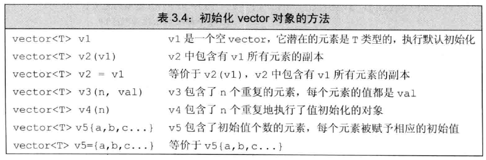
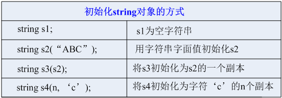
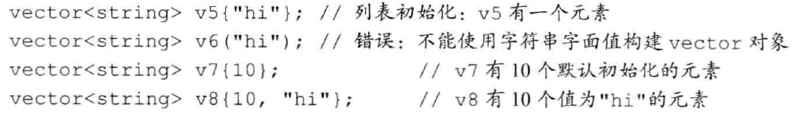
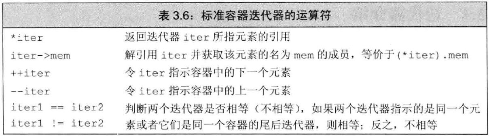
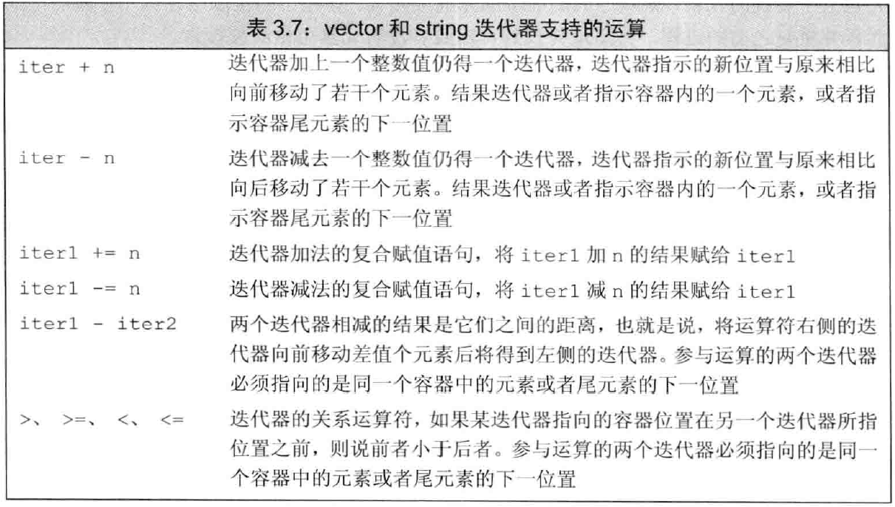
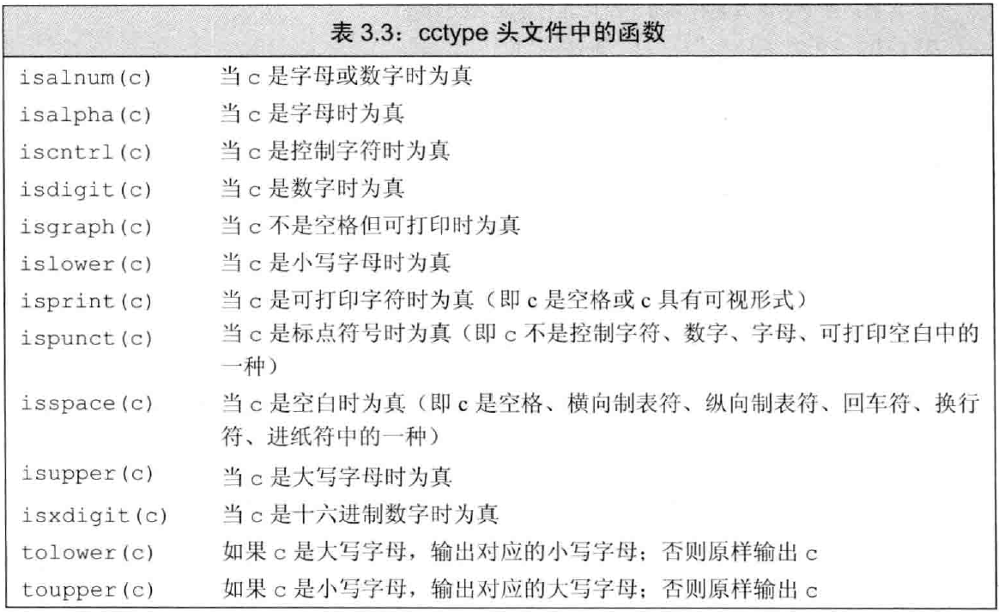

###  变量的基本类型
* 左值引用：`int &refval = val`将变量名称`refval`与变量`val`关联起来，相当于`val`的别名，但是不能引用一个常数，引用的初始值必须是一个对象，如`int\string\char\double`等等  

* 一条定义语句可以定义出**不同类型**的变量，比如`int i=1024, *p=&i, &r=i;`中定义出int型变量，指针和引用；同时`*`只作用于最近的变量，将其变为指针而不是整个句子`int* p1, p2`，其中`p1`、`p2`分别是指针和`int`型变量
* `const`
    * 初始化有两种方式，当初始化时复杂的式子(公式、或者函数)**运行**时初始化；如果是常数，则是**编译**时初始化
    * 当多文件都需要使用一个`const`变量时，可以采用`extern`关键字，在A文件中声明，添加`extern`关键字，即可在B文件中使用`const`常量
    * 当`const`左引用一个变量`i`的时候，虽然不可以通过常量改变`i`的值，反过来却可以通过变量`i`改变常量的值，**不知道是不是bug**
    * `const`指针可以指向常量或者变量，指针指向的地址不能变，但是可以改变指针地址指向变量(非常量)的值
    * `const`常量是顶层还是底层，这个问题不是很清楚
* 常量表达式是在**编译**的过程中就能得到计算结果的表达式
* auto表达式：将变量的类型调整为符合表达式的类型，`auto x = val1  + val2`就是将`x`的类型调整为`val1 + val2`结果的类型
* `decltype`：适用于希望从表达式的类型推断出要定义的变量的类型，但是又不想用表达式的值初始化，`decltype(f()) sum = x`,其中`sum`的类型就是函数`f()`的类型；注意当`decltype((i))`,就得到`i`的引用
* `#ifdef`、`#ifndef`、`#endif`、`#define`:
  
    * `#ifdef`当且仅当变量已定义时为真
    * `#ifndef`当且仅当变量未定义时为真，一旦未定义执行到`#endif`
    * `#define`将名字设定为预处理变量
    > 当第一次包含头文件时，`#ifndef`为真，预处理器将顺序执行后面直到`#endif`，下一次包含头文件时，`#ifndef`为假，将跳过直到`#endif`

### 字符串、向量和数组

* `cctype`头文件中可以对`string`类型的中元素进行多种操作，例如将将小写字母改为大写字母，统计标点符号等等(Page.82)
* `string.size()`返回的并不是常说的`int`型，而是`size_type`，在日常运用中发生了强制类型转换
* 在早期C++标准中，如果`vector`中的元素还是`vector`，则需要`vector<vector<int> >`这样声明，要加**空格**，新标准中没有类似的要求
* `vector`初始化问题
    * 初始化基本方式如下图，很多种是等价的方式
    * 如果`vector`中的元素不支持默认初始化，我们就必须提供初始值
    * 初始化时，圆括号值得时元素的个数，而花括号是指对`vector`中的元素赋值；**但是**，当花括号中的元素跟容器中的元素类型不同时，编译器就会尝用默认值初始化`vector`对象
* `vector`清理所有元素的三种方法
    * `vector.clear()`:清除当前容器中所有的元素，但是**不清除内存空间**
    * `vector.erase()`:清除当前容器中所有的元素，但是**不清除内存空间**
    * `vector<T>().swap(Ob)`:调用vector的构造函数，构建一个临时`vector`对象，与 `Ob`交换内存空间，此时 `Ob`已经是没有任何元素的空的 `vector`，而临时`vector`对象在生命周期结束时，析构函数帮助清理内存，所以这种方法时能够清理内存的，但是不是**直接清理**，而是通过互换内存和`vector`析构函数实现的

<div align=center>



</div>

* `vector`可以直接判断`==`，当且仅当元素个数相同并且`vector`对应位置元素相同；`vector`不支持通过下标添加元素，即下标只支持对已经存在的元素操作
> **迭代器**
<div>

</div>

* `end()`指向的是`vector`中的**不存在**的尾后元素，这个元素并没有什么意义，当`vector`是空的，`begin()`和`end()`是同一个迭代器
* `->`是解引用和访问成员函数的结合体，`(*item).mem`等价于`item->mem`
* 使用迭代器的`vector`对象，都不能对象容器中添加或者删去元素

<div align=center>

</div>

**********************************************
* 在很多用到数组名字的地方，编译器会自动的将其替换为一个数组首元素的指针；同时可利用库函数`begin(arr)`、`end(arr)`得到指向数组开头和结尾的指针，与`vector.end()`类似，都是指向不存在的尾后指针，尾后指针不能执行解引用和递增操作 

### 表达式

* 有4种运算符明确规定了运算对象的求值顺序。逻辑与(&)运算符，它规定先求左侧运算对象的值，只有当左侧运算对象的值为真时才继续求右侧运算对象的值。另外三种分别是逻辑或(||)运算符、条件(?:)运算符和逗号(,)运算符
    * 对于逻辑与运算符来说，当且仅当左侧运算对象为真时才对右侧运算对象求值
    * 对于逻辑或运算符来说，当且仅当左侧运算对象为假时才对右侧运算对象求值

* **后置递增运算符的优先级高于解引用运算符**，因此`*pbeg++`等价于`*(pbeg++)`。`pbeg++`把`pbeg`的值加1，然后返回`pbeg`的初始值的副本作为其求值结果，此时解引用运算符的运算对象是`pbeg`未增加之前的值。最终，这条语句输出`pbeg`开始时指向的那个元素，并将指针向前移动一个位置。
* `sizeof`运算符的结果部分地依赖于其作用的类型：
  
    * 对char或者类型为char的表达式执行`sizeof`运算，结果得1.
    * 对引用类型执行`sizeof`运算得到被引用对象所占空间的大小。
    * 对指针执行`sizeof`运算得到指针本身所占空间的大小。
    * 对解引用指针执行`sizeof`运算得到指针指向的对象所占空间的大小，指针不需有效。
    * 对数组执行`sizeof`运算得到整个数组所占空间的大小，等价于对数组中所有的元素各执行一次`sizeof`运算并将所得结果求和。注意， **`sizeof`运算不会把数组转换成指针来处理**。
        ```C++
        // sizeof(ia) /sizeof(*ia)返回ia的元素数量
        constexpr size t sz = sizeof(ia) /sizeof(*ia);
        int arr2[sz]； //正确： sizeof返回一个常量表达式
        ```
    * 对`string`对象或`vector`对象执行`sizeof`运算只返回该类型**固定部分的大小**，不会计算对象中的元素占用了多少空间。
* 无符号类型的运算对象
    * 如果一个运算对象是无符号类型、另外一个运算对象是带符号类型，而且其中的无符号类型不小于带符号类型，那么带符号的运算对象转换成无符号的。例如，假设两个类型分别是`unsigned int`和`int`,则`int`类型的运算对象转换成`unsigned int`类型。需要注意的是，如果`int`型的值恰好为负值，其结果将以2.1.2节（第32页）介绍的方法转换，并带来该节描述的所有副作用。
    * 剩下的一种情况是带符号类型大于无符号类型，此时转换的结果依赖于机器。如果无符号类型的所有值都能存在该带符号类型中，则无符号类型的运算对象转换成带符号类型。如果不能，那么带符号类型的运算对象转换成无符号类型。例如，如果两个运算对象的类型分别是`1ong`和`unsigned int`，并且`int`和`1ong`的大小相同，则`long`类型的运算对象转换成`unsigned int`类型：如果`long`类型占用的空间比`int`更多，则`unsigned int`类型的运算对象转换成`1ong`类型。
* 强制类型转换`cast-name<type>(expression);`
    * `static_ cast`：任何具有明确定义的类型转换，只要不包含底层`const`，都可以使用`static_cast`例如，通过将一个运算对象强制转换成`double`类型就能使表达式执行浮点数除法,当需要把一个**较大的算术类型赋值给较小的类型**时，`static_cast`非常有用。当我们把指针存放在void*中，并且使用static—cast将其强制转换回原来的类型时，应该确保指针的值保持不变。也就是说，**强制转换的结果将与原始的地址值相等**，因此我们必须**确保转换后所得的类型就是指针所指的类型**。
    ```C++
    double slope = static_cast<double>(a)/b;
    void* p = &d；              //正确：任何非常量对象的地址都能存入void*
    double *dp = static_cast    //正确：将void*转换回初始的指针类型
    ```
    * `const_cast`:去`const`,只能改变运算对象的底层`const`，只有`const_cast`能改变表达式的常量属性，使用其他形式的命名强制类型转换改变表达式的常量属性都将引发编译器错误。同样的，也不能用`const_cast`改变表达式的类型。
    ```C++
    const char *cp;
    char *q = static_cast<char*>(cp);    //错误： static_cast不能转换掉const性质
    static_cast<string>(cp);             // 正确：字符串字面值转换成string类型
    const_cast<string>(cp);              // 错误：const_cast只改变常量属性，不能改变数据的类型(char->string)
    ```
    * `reinterpret_cast`：通常为运算对象的位模式提供较低层次上的重新解释
    ```C++
    int *ip;
    char *pc = reinterpret_cast<char*>(ip);
    ```

### 函数基础

* 局部静态对象（**local static object**）在程序的执行路径第一次经过对象定义语句时初始化，并且直到程序终止才被销毁，在此期间即使对象所在的函数结束执行也不会对它有影响。

  ```C++
  size_t count_calls (){
      static size_t ctr =0； //调用结束后，这个值仍然有效
  	return ++ctr;
  }
  int main ()
  {
      for (size_t i=0; i!= 10; ++i)
  	cout << count_calls() << endl;
      return 0;
  }
  
  ```

* 函数声明和函数定义的区别

  * 函数声明：只是对编译系统的一个说明，是对定义的函数的返回值的类型说明，以通知系统在本函数中所调用的函数是什么类型；不包含函数体（或形参）；函数声明是一个说明语句，必须以分号结束；
  * 函数定义：函数的定义是一个完整的函数单元，包含函数类型、函数名、形参及形参类型、函数体等；在程序中，函数的定义只能有一次；函数首部与花括号间不加分号

* 当实参的值被拷贝给形参时，形参和实参是两个相互独立的对象。我们说这样的实参被**值传递**(passed by value)或者函数被**传值调用**(called by value)。

* 拷贝大的类类型对象或者容器对象比较低效，甚至有的类类型（包括IO类型在内）根本就不支持拷贝操作。当某种类型不支持拷贝操作时，函数只能通过**引用形参**访问该类型的对象。

* 管理指针形参的三种方式

  * 使用标记指定数组长度
  * 使用标准库规范
  * 显示传递一个表示数组大小的形参
  
* 2当使用`argv`中的实参时，一定要记得可选的实参从`argv[1]`开始；`argv[0]`保存程序的名字，而非用户输入。

* `initializer_list`提供的操作；`initializer_list`的作为形参类型之一，向函数传递**类型**一致**数量不等**的参数。

|                操作                 |                             意义                             |
| :---------------------------------: | :----------------------------------------------------------: |
|     `initializer_list<T> lst;`      |               默认初始化；` T`类型元素的空列表               |
| `initializer_list<T\> lst{a,b,c…};` | `lst`的元素数量和初始值一样多； `1st`的元素是对应初始值的副本；列表中的元素是`const` |
|    `lst2(lst1)`      `lst2=lst1`    | 拷贝或赋值一个`initializer_list`对象不会拷贝列表中的元素；拷贝后，原始列表和副本共享元素 |
|            `lst.size()`             |                       列表中的元素数量                       |
|            `lst.begin()`            |                 返回指向`1st`中首元素的指针                  |
|             `lst.end()`             |              返回指向`1st`中尾元素的下一个指针               |

* 函数完成后，它所占用的存储空间也随之被释放掉，因此函数终止意味着局部变量的引用将指向不再有效的内存区域

* 引用返回左值：调用一个返回引用的函数，我们可以像使用其他引用一样，为结果直接赋值

  ```C++
  char &get_val (string &str, string::size_type ix)
  {
      return str [ix];
  }
  int main
  {
      string s="a value";
      get_val(s, 0) = 'A';          // 字符串s的值为“A value”
  }
  ```

* 重载与作用域：如果在内层作用域中声明名字，将隐藏外层作用域中声明的同名实体，所以在不同的作用域中不能重载函数名

  ```C++
  string read();
  void print (const string &);
  void print (double);        //重载print函数
  void fooBar (int ival)
  {
      bool read = false;      //新作用域:隐藏了外层的read
      string s = read();      //错误： read是一个布尔值，而非函数
      //不好的习惯：通常来说，在局部作用域中声明函数不是一个好的选择
      void print (int);       //新作用域：隐藏了之前的print
      print("Value: ");       //错误： print (const string &)被隐藏掉了
      print (ival);           //正确:当前print(int)可见
      print (3.14);           //正确:调用print (int) ; print (double)被隐藏掉了
  }
  ```

* 内联函数`inline`：将函数指定为内联函数（inline），通常就是将它在每个调用点上“内联地”展开，适用于优化**规模较小、流程直接、频繁调用**的函数

  ```C++
  inline const string & shorterstring(const string &sl, const string &s2)
  {
      return ;
  }
  cout << shorterstring(s1, s2) << endl;
  // 等价于原地展开
  cout << (sl.size() <= s2.size() ? sl : s2) << endl;
  ```

* `constexpr`函数：能用于常量表达式的函数，约束：“函数的返回值和所有的形参必须是字面值类型，并且函数体中必须有且只有一条`return`语句”

* `assert(expr)`，当`expr`为假时，停止程序的运行

### 类

* 参数列表后，加 `const` 关键字，声明为常量成员函数，表明其不被允许修改类的数据成员

* 构造函数初始值列表：在构造函数中未出现的值，例如`units_sold`,`revenue`通过**合成默认构造函数**相同的方式隐式初始化

  ```C++
  Sales_data (const std::string&s) : bookNo (s) {}
  Sales_data (const std::string &s, unsigned n, double p):bookNo (s) , units_sold (n) , revenue (p*n) {}
  ```

* `class`和`struct`的区别：默认的访问权限，`class`的默认权限是`private`，而`strcut`默认`pubilc`

- 定义在类内部的成员函数是自动`inline`的

- `mutable`：可以修改类内数据成员，即使是在`const`成员函数内

  ```C++
  class Screen
  {
  public:
      void some_member() const;
  private：
      mutable size_t access_ctr； //即使在一个const对象内也能被修改
      //其他成员与之前的版本一致
  };
  void Screen::some_member() const
  {
       ++access_ctr;   //保存一个计数值，用于记录成员函数被调用的次数
       //该成员需要完成的其他工作
  }
  ```

- 提供类内初始值时，必须以符号`=`或者花括号表示

- 函数的返回类型出现在函数名之前：因此当成员函数定义在类的外部时，返回类型中使用的名字都位于类的作用域之外。这时，返回类型必须指明它是哪个类的成员

  ```C++
  class window_mgr {
  public:
      //向窗口添加一个Screen，返回它的编号
      ScreenIndex addScreen (const Screen&);   //其他成员与之前的版本一致
  };
  //首先处理返回类型，之后我们才进入window mgr的作用域
  Window_mgr:: ScreenIndex
  window_mgr::addScreen (const Screen &s)
  {
      screens.push_back(s);
      return screens.size()-1;
  }
  ```

- 成员定义中普通块作用域中的名字查找
  - 在成员函数内查找该名字的声明。和前面一样，只有在函数使用之前出现的声明才被考虑。如下例，函数`dummy_fcn`中`height`会隐藏了同名的成员，**所以不建议在成员函数中使用和成员变量一样名称的参数**
  
  ```C++
  //注意：这段代码仅为了说明而用，不是一段很好的代码
  //通常情况下不建议为参数和成员使用同样的名字
  int height;        //定义了一个名字，稍后将在screen中使用
  class Screen {
  public:
      typedef std::string::size type pos;
      void dummy_fcn (pos height) {
  		cursor = width* height;     // 哪个height？是那个参数
  	}
  private:
      pos cursor =0;
      pos height =0, width =0;
  };
  ```
  
  - 如果在成员函数内没有找到，则在类内继续查找，这时类的所有成员都可以被考虑
  - 类内也没找到该名字的声明，在成员函数定义之前的作用域内继续查找。当成员定义在类的外部时，名字查找的第三步不仅要考虑类定义之前的全局作用域中的声明，还需要考虑在成员函数定义之前的全局作用域中的声明；请注意，全局函数`verify`的声明在`screen`类的定义之前是不可见的。然而，名字查找的第三步包括了成员函数出现之前的全局作用域。在此例中， `verify`的声明位于`setHeight`的定义之前，因此可以被正常使用。
  
  ```C++
  int height;         //定义了一个名字，稍后将在Screen中使用
  class Screen{
  public:
      typedef std::string::size type pos;
      void setHeight (pos);
      pos height = 0; //隐藏了外层作用域中的height
  };
  Screen::pos verify (Screen::pos); // 全局函数，只是返回数据类型和参数类型是类Screen中的类型声明
  void Screen:: setHeight (pos var){
      // var：参数
      // height：类的成员
      // verify：全局函数
      height = verify (var);
  }
  ```

- 如果成员是`const`、引用，或者属于某种未提供默认构造函数的类类型，我们必须通过构造函数初始值列表为这些成员提供初值。


```C++
//正确：显式地初始化引用和const成员
ConstRef: : ConstRef(int ii): i(ii), ci(ii), ri(i) {}
```

- 成员的初始化顺序与它们在类定义中的出现顺序一致：第一个成员先被初始化，然后第二个，以此类推

  ```C++
  class x{
      int i；
      int j；
  public：
      //未定义的： i在j之前被初始化
      x(int val) : j(val), i(j) {}
  };
  ```

- 委托构造函数，将自己的职责委托给其他的构造函数执行

  ```C++
  class Sales data {
  public：
  	//非委托构造函数使用对应的实参初始化成员
      sales data(std::string s, unsigned cnt, double price):bookNo (s), units sold (cnt), revenue (cnt*price) {}
      //其余构造函数全都委托给另一个构造函数
      Sales data() : Sales data ("", 0, 0) {}
      Sales data(std: :string s): Sales data (s, 0,0) {}
      Sales data (std::istream &is): Sales data ()
      											{read (is, *this);}
  };
  ```

### IO类