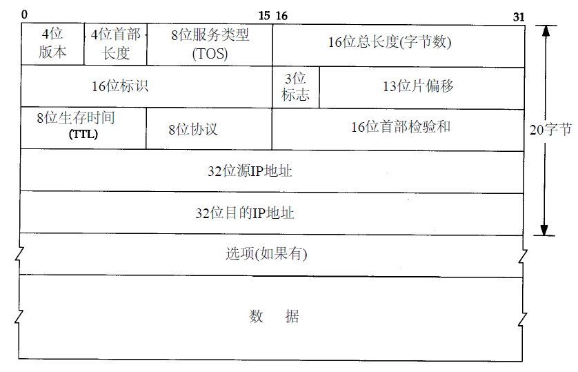

#### IP

##### IP数据报格式及首部中的各字段

1. 版本号：当前版本号是4，也有6
2. 首部长度：首部占32 bit字的数目，最大为60个字节，普通ip数据报是5，即占20个字节
3. 服务类型：字段包括一个3 bit的优先权子字段（现在已被忽略），4 bit的TOS子字段和1 bit未用位但必须置0。4 bit的TOS分别代表：最小时延、最大吞吐量、最高可靠性和最小费用。4 bit中只能置其中1 bit。如果所有4 bit均为0，那么就意味着是一般服务。
4. 总长度字段是指整个IP数据报的长度，以字节为单位。利用首部长度字段和总长度字段，就可以知道IP数据报中数据内容的起始位置和长度。由于该字段长16比特，所以IP数据报最长可达65535字节。**当数据报被分片时，该字段的值也随着变化**
5. 标识字段：唯一地标识主机发送的每一份数据报，通常每发送一份报文它的值就会加1
6. TTL：生存时间字段设置了数据报可以经过的最多路由器数，一旦经过一个处理它的路由器，它的值就减去1。当该字段的值为0时，数据报就被丢弃，并发送ICMP报文通知源主机
7. 协议字段：识别是哪个协议向IP传送数据。
8. 首部检验和：根据IP首部计算的检验和码
9. 源地址
10. 目的地址
    **选项字段一直都是以32bit作为界限，在必要的时候插入值为0的填充字节。这样就保证IP首部始终是32bit的整数倍**

##### 路由表项的内容

1. 目的IP地址：它既可以是一个完整的主机地址，也可以是一个网络地址，由该表目中的标志字段来指定。主机地址有一个非0的主机号，以指定某一特定的主机，而网络地址中的主机号为0，以指定网络中的所有主机（如以太网，令牌环网）。
2. 下一站路由器IP地址：下一站路由器是指一个在直接相连网络上的路由器，通过它可以转发数据报。下一站路由器不是最终的目的，但是它可以把传送给它的数据报转发到最终目的。
3. 标志：其中一个标志指明目的I P地址是网络地址还是主机地址，另一个标志指明下一站路由器是否为真正的下一站路由器，还是一个直接相连的接口
4. 接口：为数据报的传输指定一个网络接口

##### 路由选择过程

1. 搜索路由表，寻找能与目的I P地址完全匹配的表目（网络号和主机号都要匹配）。如果找到，则把报文发送给该表目指定的下一站路由器或直接连接的网络接口（取决于标志字段的值）。
2. 搜索路由表，寻找能与目的网络号相匹配的表目。如果找到，则把报文发送给该表目指定的下一站路由器或直接连接的网络接口（取决于标志字段的值）。目的网络上的所有主机都可以通过这个表目来处置。例如，一个以太网上的所有主机都是通过这种表目进行寻径的。
3. 搜索路由表，寻找标为“默认（default）”的表目。如果找到，则把报文发送给该表目指定的下一站路由器

> 为一个网络指定一个路由器，而不必为每个主机指定一个路由器

