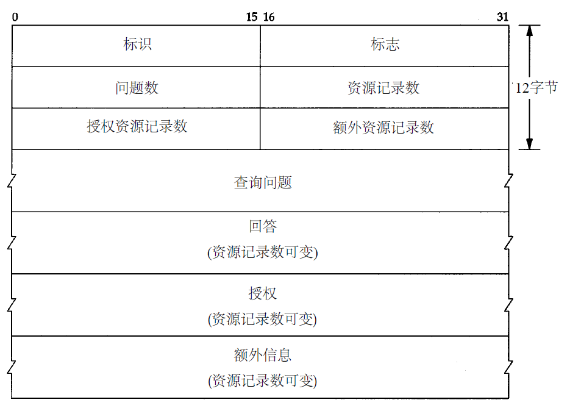
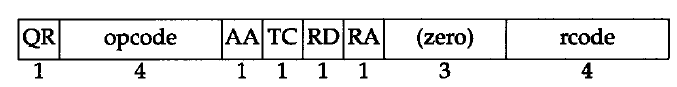
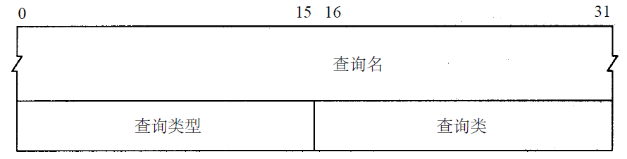
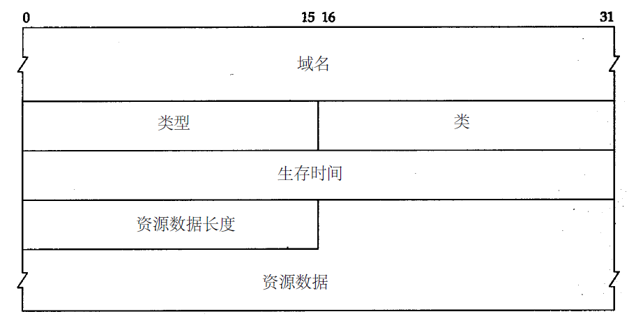

#### IP

##### IP数据报格式及首部中的各字段

1. 版本号：当前版本号是4，也有6
2. 首部长度：首部占32 bit字的数目，最大为60个字节，普通ip数据报是5，即占20个字节
3. 服务类型：字段包括一个3 bit的优先权子字段（现在已被忽略），4 bit的TOS子字段和1 bit未用位但必须置0。4 bit的TOS分别代表：最小时延、最大吞吐量、最高可靠性和最小费用。4 bit中只能置其中1 bit。如果所有4 bit均为0，那么就意味着是一般服务。
4. 总长度字段是指整个IP数据报的长度，以字节为单位。利用首部长度字段和总长度字段，就可以知道IP数据报中数据内容的起始位置和长度。由于该字段长16比特，所以IP数据报最长可达65535字节。**当数据报被分片时，该字段的值也随着变化**
5. 标识字段：唯一地标识主机发送的每一份数据报，通常每发送一份报文它的值就会加1
6. TTL：生存时间字段设置了数据报可以经过的最多路由器数，一旦经过一个处理它的路由器，它的值就减去1。当该字段的值为0时，数据报就被丢弃，并发送ICMP报文通知源主机
7. 协议字段：识别是哪个协议向IP传送数据。
8. 首部检验和：根据IP首部计算的检验和码
9. 源地址
10. 目的地址
    **选项字段一直都是以32bit作为界限，在必要的时候插入值为0的填充字节。这样就保证IP首部始终是32bit的整数倍**

##### 路由表项的内容

1. 目的IP地址：它既可以是一个完整的主机地址，也可以是一个网络地址，由该表目中的标志字段来指定。主机地址有一个非0的主机号，以指定某一特定的主机，而网络地址中的主机号为0，以指定网络中的所有主机（如以太网，令牌环网）。
2. 下一站路由器IP地址：下一站路由器是指一个在直接相连网络上的路由器，通过它可以转发数据报。下一站路由器不是最终的目的，但是它可以把传送给它的数据报转发到最终目的。
3. 标志：其中一个标志指明目的I P地址是网络地址还是主机地址，另一个标志指明下一站路由器是否为真正的下一站路由器，还是一个直接相连的接口
4. 接口：为数据报的传输指定一个网络接口

##### 路由选择过程

1. 搜索路由表，寻找能与目的I P地址完全匹配的表目（网络号和主机号都要匹配）。如果找到，则把报文发送给该表目指定的下一站路由器或直接连接的网络接口（取决于标志字段的值）。
2. 搜索路由表，寻找能与目的网络号相匹配的表目。如果找到，则把报文发送给该表目指定的下一站路由器或直接连接的网络接口（取决于标志字段的值）。目的网络上的所有主机都可以通过这个表目来处置。例如，一个以太网上的所有主机都是通过这种表目进行寻径的。
3. 搜索路由表，寻找标为“默认（default）”的表目。如果找到，则把报文发送给该表目指定的下一站路由器

> 为一个网络指定一个路由器，而不必为每个主机指定一个路由器

#### DNS

##### DNS查询和响应的基本模式

1. 标识字段由客户程序设置并由服务器返回结果。客户程序通过它来确定响应与查询是否匹配
2. 标志字段
   
   1. `QR`是1bit字段：0表示查询报文，1表示响应报文。  
   2. `opcode`是一个4bit字段：通常值为0（标准查询），其他值为1（反向查询）和2（服务器状态请求）。  
   3. `AA`是1bit标志，表示“授权回答(authoritativeanswer)”。该名字服务器是授权于该域的。  
   4. `TC`是1bit字段，表示“可截断的(truncated)”。使用UDP时，它表示当应答的总长度超过512字节时，只返回前512个字节。  
   5. `RD`是1bit字段表示“期望递归（recursiondesired）”。该比特能在一个查询中设置，并在响应中返回。这个标志告诉名字服务器必须处理这个查询，也称为一个递归查询。如果该位为0，且被请求的名字服务器没有一个授权回答，它就返回一个能解答该查询的其他名字服务器列表，这称为迭代查询。在后面的例子中，我们将看到这两种类型查询的例子。  
   6. `RA`是1bit字段，表示“可用递归”。如果名字服务器支持递归查询，则在响应中将该比特设置为1。在后面的例子中可看到大多数名字服务器都提供递归查询，除了某些根服务器。
   7. `rcode`是一个4bit的返回码字段。通常的值为0（没有差错）和3（名字差错）。名字差错只有从一个授权名字服务器上返回，它表示在查询中制定的域名不存在。
3. 随后的4个16bit字段说明最后4个变长字段中包含的条目数。对于查询报文，问题(question)数通常是1，而其他3项则均为0。类似地，对于应答报文，回答数至少是1，剩下的两项可以是0或非0。

##### 查询问题格式

查询名是要查找的名字，它是一个或多个标识符的序列。每个标识符以首字节的计数值来说明随后标识符的字节长度，每个名字以最后字节为0结束，长度为0的标识符是根标识符

##### 后三个部分

1. 域名是记录中资源数据对应的名字。它的格式和前面介绍的查询名字段格式相同。
2. 类型说明RR的类型码。它的值和前面介绍的查询类型值是一样的。类通常为1，指Internet数据。
3. 生存时间字段是客户程序保留该资源记录的秒数。资源记录通常的生存时间值为2天。
4. 资源数据长度说明资源数据的数量。该数据的格式依赖于类型字段的值。对于类型1（A记录）资源数据是4字节的IP地址。

##### DNS采用UDP还是TCP

- 当名字解析器发出一个查询请求，并且返回响应中的TC（删减标志）比特被设置为1时，它就意味着响应的长度超过了512个字节，而仅返回前512个字节。在遇到这种情况时，名字解析器通常使用TCP重发原来的查询请求，它将允许返回的响应超过512个字节
- 当一个域的辅助名字服务器在启动时，将从该域的主名字服务器执行区域传送。我们也说过辅助服务器将定时（通常是3小时）向主服务器进行查询以便了解主服务器数据是否发生变动。如果有变动，将执行一次区域传送。区域传送将使用TCP，因为这里传送的数据远比一个查询或响应多得多。
- 
