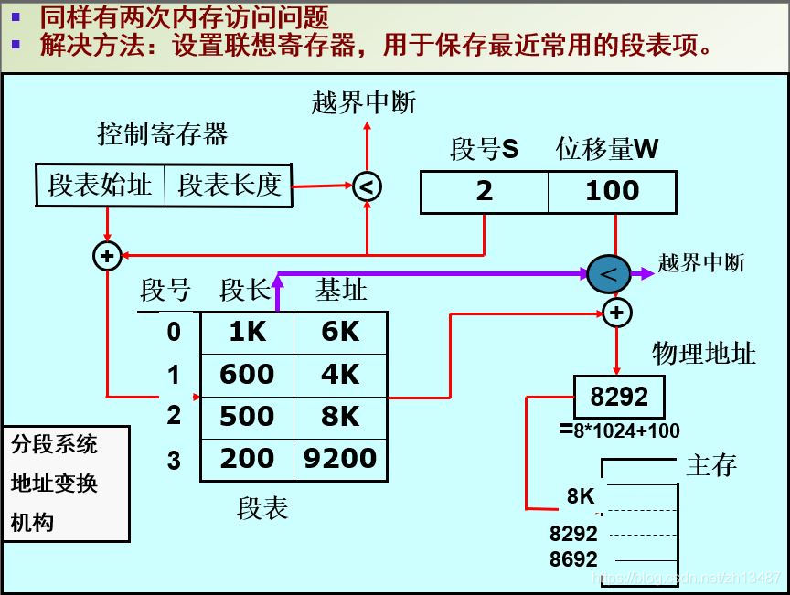

#### 内存管理

##### 页面置换算法

1. 最佳置换算法：从主存中移出永远不再需要的页面；如无这样的页面存在，则选择最长时间不需要访问的页面。于所选择的被淘汰页面将是以后永不使用的，或者是在最长时间内不再被访问的页面，这样可以保证获得最低的缺页率。 
2. 是最简单的页面置换算法。这种算法的基本思想是：当需要淘汰一个页面时，总是选择驻留主存时间最长的页面进行淘汰，即先进入主存的页面先淘汰。其理由是：最早调入主存的页面不再被使用的可能性最大。
3. 最近最久未使用（LRU）算法：这种算法的基本思想是：利用局部性原理，根据一个作业在执行过程中过去的页面访问历史来推测未来的行为。它认为过去一段时间里不曾被访问过的页面，在最近的将来可能也不会再被访问。所以，这种算法的实质是：当需要淘汰一个页面时，总是选择在最近一段时间内最久不用的页面予以淘汰。 
4. 时钟置换算法：简单的CLOCK算法是给每一帧关联一个附加位，称为使用位。当某一页首次装入主存时，该帧的使用位设置为1;当该页随后再被访问到时，它的使用位也被置为1。对于页替换算法，用于替换的候选帧集合看做一个循环缓冲区，并且有一个指针与之相关联。当某一页被替换时，该指针被设置成指向缓冲区中的下一帧。当需要替换一页时，操作系统扫描缓冲区，以查找使用位被置为0的一帧。每当遇到一个使用位为1的帧时，操作系统就将该位重新置为0；如果在这个过程开始时，缓冲区中所有帧的使用位均为0，则选择遇到的第一个帧替换；如果所有帧的使用位均为1,则指针在缓冲区中完整地循环一周，把所有使用位都置为0，并且停留在最初的位置上，替换该帧中的页。由于该算法循环地检查各页面的情况，故称为CLOCK算法，又称为最近未用(Not Recently Used, NRU)算法。

##### 基本分页存储管理方式

​	在分页系统中，允许将进程的各个页离散地存储在内存的任一物理块中，为保证进程仍然能够正确地运行，即能在内存中找到每个页面所对应的物理块，系统又为每个进程建立了一张页面映像表，简称页表。

​	

> CPU要想获取一个数据时，必须两次访问内存：
>
> 1. 从内存中的页表中，寻找对应的物理块号，将物理块号与页内地址组合成物理地址。
> 2. 根据组合成的物理地址，来获取数据。

​	为了提高效率呢，增设一个具有并行查寻能力的特殊高速缓冲寄存器，称为“联想存储器”或“快表”。在引入快表的分页存储管理方式中，通过快表查询，可以直接得到逻辑页所对应的物理块号，由此拼接形成实际物理地址，减少了一次内存访问，缩短了进程访问内存的有效时间。但是，由于快表的容量限制，不可能将一个进程的整个页表全部装入快表，所以在快表中查找到所需表项存在着命中率的问题，。总体上来说，还是减少了访问内存的时间。

##### 请求分页存储管理

> 请求分页存储管理与基本分页存储管理的主要区别：
>
> 1. 当所访问的信息不在内存时，由操作系统负责将所需信息从外存调入内存，然后继续执行程序。
> 2. 若内存空间不够，由操作系统负责将内存中暂时用不到的信息换出到外存。

###### 请求页表

与基本分页管理相比，请求分页管理中，为了实现“请求调页”，操作系统需要知道每个页面是否已经调入内存；如果还没调入，那么也需要知道该页面在外存中存放的位置。
当内存空间不够时，要实现“页面置换"，操作系统需要通过某些指标来决定到底换出哪个页面；有的页面没有被修改过，就不用再浪费时间写回外存。有的页面修改过，就需要将外存中的旧数据覆盖。

1. 内存块号
2. 状态位:是否已经调入内存
3. 访问字段:可记录最近被访问过几次，或记录上次访问的时间，供置换算法选择换出页面时参考
4. 修改位:页面调入内存后是否被修改过
5. 外存地址:页面在外存中的存放位置

###### 缺页中断

在请求分页系统中，每当要访问的页面不在内存时，便产生一个缺页中断，然后由操作系统的缺页中断处理程序处理中断。此时缺页的进程阻塞，放入阻塞队列，调页完成后再将其唤醒，放回就绪队列。

- 如果内存中有空闲块，则为进程分配一个空闲块，将所缺页面装入该块，并修改页表中相应的页表项。
- 如果内存中没有空闲块，则由页面置换算法选择一个[页面淘汰](#页面置换算法)，若该页面在内存期间被修改过，则要将其写回外存。未修改过的页面不用写回外存。
  

###### 地址变换

1. 根据逻辑地址得到页号和页内偏移量

2. 对页号进行越界判断。

3. 访问页表判断页是否在内存中，如果在继续执行程序。

4. 如果访问的页不在内存中，产生缺页中断请求，当前进程阻塞，缺页中断程序从根据页表从外存找到缺失的页。

5. 判断内存空间是否已满，未满，将缺页调入内存，修改页表。如果已满，从内存中选择一个页面置换，如果页面发生修改，需要将修改写回外存，然后再将缺页调入内存，并修改页表。

6. 页面调入后，阻塞的进程会处于就绪态等待处理机调度。

   > 只有“写指令”页表才需要修改“修改位”。并且如果有快表机构，一般来说只需要修改快表中的数据，只有要将快表项删除时才需要写回内存中的慢表。这样可以减少访问内存次数。
   > 这也就是说，如果存在快表机构，当修改了一个页面时，只需要修改快表中的相应的页表项，而不需要修改内存中的页表，一方面快表操作更快，另一方面还减少了访问内存次数，否则一次修改要修改两个表。

##### 基本分段存储管理方式

###### 基本原理

1. 按照程序**自身的逻辑**关系**划分为若干个段**，每个段都有一个段名( 在低级语言中，程序员使用段名来编程)，每段从0开始编址。如代码段（主程序段main，子程序段X）、数据段D、栈段S等。
2. 每段有自己的名字（一般用段号做名），都从0编址，可分别编写和编译。
3. 装入内存时，每段赋予各段一个段号。
4. 每段占据一块连续的内存。（即有离散的分段，又有连续的内存使用）。各段大小不等
5. 地址结构：段号 + 段内地址 段表：记录每段实际存放的物理地址

###### 地址变换

###### 基本段式、页式的区别

1. **页是信息的物理单位**。分页的主要目的是为了实现离散分配,提高内存利用率。分页仅是系统管理上的需要，完全是系统行为，**对用户是不可见的**。
   **段是信息的逻辑单位**。分段的主要目的是更好地满足用户需求.一个段通常包含着一组属于一个逻辑模块的信息。**分段对用户是可见的**，用户编程时需要显式地给出段名。
   **页的大小固定且由系统决定。段的长度却不固定，决定于用户编写的程序。**
2. **分段比分页更容易实现信息的共享和保护**。不能被修改的代码称为纯代码或可重入代码(不属于临界资源)，这样的代码是可以共享的。可修改的代码是不能共享的

##### 请求段氏存储管理

###### 请求段表

1. 存取方式：用于标识本分段的存取属性是只执行、只读，还是允许读/写。
2. 访问字段A：其含义与请求分页的相应字段相同，用于记录该段被访问的频繁程度。
3. 修改位M：用于表示该页在进入内存后是否已被修改过，供置换页面时参考。
4. 存在位P：指示本段是否已调入内存，供程序访问时参考。
5. 增补位：这是请求分段式管理中所特有的字段，用于表示本段在运行过程中是否做过动态增长。
6. 外存始址：指示本段在外存中的起始地址，即起始盘块号。

###### 缺段中断机制

​	在请求分段系统中，每当发现运行进程所要访问的段尚未调入内存时，便由缺段中断机构产生一缺段中断信号，进入OS后由缺段中断处理程序将所需的段调入内存。缺段中断机构与缺页中断机构类似，它同样需要在一条指令的执行期间，产生和处理中断，以及在一条指令执行期间，可能产生多次缺段中断。但由于分段是信息的逻辑单位，因而不可能出现一条指令被分割在两个分段中和一组信息被分割在两个分段中的情况。缺段中断的处理过程如下图所示。由于段不是定长的，这使对缺段中断的处理要比对缺页中断的处理复杂。

###### 地址变换机构

​	请求分段系统中的地址变换机构是在分段系统地址变换机构的基础上形成的。因为被访问的段并非全在内存，所以在地址变换时，若发现所要访问的段不在内存，必须先将所缺的段调入内存，并修改段表，然后才能再利用段表进行地址变换。为此，在地址变换机构中又增加了某些功能，如缺段中断的请求及处理等。下图示出了请求分段系统的地址变换过程。

##### 基本段页式存储管理

##### 请求段页式存储管理

