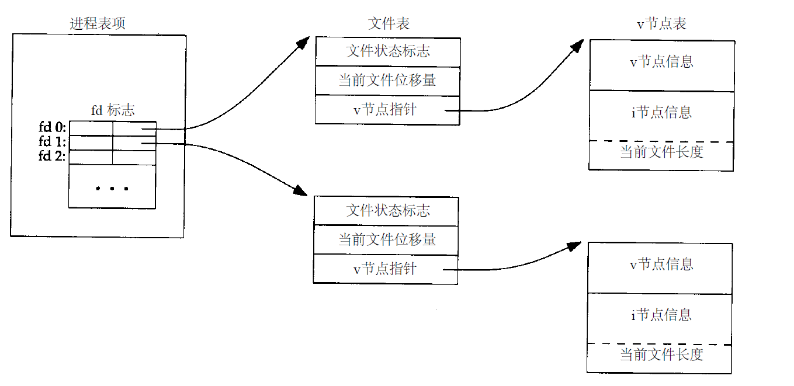
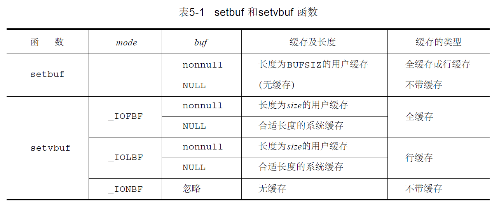
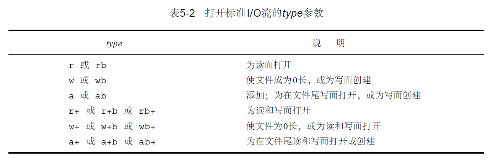

### C文件I/O

#### open函数

```c
#include <sys/types.h>
#include <sys/stat.h>
#include <fcntl.h>
int open(const char*pathname,int oflags,mode_t mode);
```

- `pathname`需要打开或者创建文件的名字

- `oflags`：可用来说明此函数的多个选择项

  - `O_RDONLY` 只读打开
  - `O_WRONLY` 只写打开
  - `O_RDWR` 读、写打开

  > `NAMEMAX`是14，而我们却试图在当前目录中创建一个其文件名包含1 5个字符的新文件，按照传统，早期的系统V版本，允许这种使用方法，但是总是将文件名截短为14个字符，而`BSD`类的系统则返回出错`ENAMETOOLONG`

#### creat函数

```C
#include <sys/types.h>
#include <sys/stat.h>
#include <fcntl.h>
int creat(const char pathname,mode_t mode);
// 以只写方式打开所创建的文件
// 若成功为只写打开的文件描述符，若出错为-1
// 等价于下面的
int open(pathname,O_WRONLY|O_CREAT|O_TRUNC,mode);
```

#### close函数

```C
#include <unistd.h>
int close(int filedes);
```

关闭一个文件时也释放该进程加在该文件上的所有记录锁，而当一个进程终止时，它所有的打开文件都由内核自动关闭。很多程序都使用这一功能而不显式地用`close`关闭打开的文件

#### lseek函数

```C
#include <sys/types.h>
#include <unistd.h>
off_t lseek(int fildes, off_t offset, int whence);
```

参数`whence`

- `SEEK_SET`：则将该文件的位移量设置为距文件开始处`offset`个字节处
- `SEEK_CUR`：则将该文件的位移量设置为当前值加`offset`，`offset`可正可负
- `SEEK_END`：则将该文件的位移量设置为文件长度加`offset`, `offset`可为正或负

若`lseek`成功执行，则返回新的文件位移量

#### raed函数

```C
#include <unistd.h>
ssize_t read(int filedes, void *buff, size_t nbytes);
// 返回：读到的字节数，若已到文件尾为0，若出错为- 1
```

- 读普通文件时，在读到要求字节数之前已到达了文件尾端。例如，若在到达文件尾端之前还有30个字节，而要求读100个字节，则`read`返回30，下一次再调用`read`时，它将返回0

- 当从终端设备读时，通常一次最多读一行
- 当从网络读时，网络中的缓冲机构可能造成返回值小于所要求读的字节数
- 某些面向记录的设备，例如磁带，一次最多返回一个记录

#### write函数

```C
#include <unistd.h>
ssize_t write(int filedes, const void *buff, size_t nbytes);
// 返回：若成功为已写的字节数，若出错为- 1
```

对于普通文件，写操作从文件的当前位移量处开始。如果在打开该文件时，指定了`O_APPEND`选择项，则在每次写操作之前，将文件位移量设置在文件的当前结尾处。在一次成功写之后，该文件位移量增加实际写的字节数。

#### Unix文件共享&&原子操作



原子操作：如果该操作原子地执行，则或者执行完所有步，或者一步也不执行，不可能只执行所有步的一个子集

```c
if (lseek(fd, 0L, 2) < 0) /*position to EOF*/
err_sys("lseek error");
if (write(fd, buff, 100) != 100) /*and write*/
err_sys("write error");
```

假设A与B拥有自己的文件表项，但是共享一个V节点表项（我将其理解为不同的进程同时打开同一个文件），A首先调用`lseek`改变文件偏移量，然后内核切换到B，B也`lseek`改变文件偏移量，A随后的修改将会覆盖部分或者全部B的修改，所以将改变文件偏移量和写入作为一个操作，也就是`open`的`O_APPEND`标志，为原子操作

#### dup和dup2函数

```C
#include <unistd.h>
int dup(int filedes) ;
int dup2(int filedes,int filedes2) ;
// 复制一个显存的文件描述符
```

由`dup`返回的新文件描述符一定是当前`filedes2`可用文件描述符中的最小数值。用`dup2`则可以用`filedes2`参数指定新描述符的数值。如果`filedes2`已经打开，则先将其关闭。如若`filedes`等于`filedes2`，则`dup2`返回`filedes2`，而不关闭它。这些函数返回的新文件描述符与参数`filedes`共享同一个文件表项

#### fcntl函数

```C
#include <sys/types.h>
#include <unistd.h>
#include <fcntl.h>
int fcntl(int filedes,int cmd,.../* inta rg * / ) ;
```

`fcntl`可以改变已经打开文件的性质

- `cmd=F_DUPFD` 复制现存的描述符
- `cmd=F_GETFD或者F_SETFD` 获得/设置文件描述符标记
- `cmd=F_GETFL或者F_SETFL` 获得/设置文件状态标志
- `cmd=F_GETWN或者F_SETWN` 获得/设置异步I / O有权
- `cmd=F_GETLK或者F_SETLK或者F_SETLKW` 获得/设置记录锁

#### ioctl函数

```C
#include <unistd.h> 
#include <sys/ioctl.h>
int ioctl(int filedes,int request,...);
```

### 文件和目录

#### `stat` `lstat` `fstat`获取文件属性

```C
#include <sys/types.h>
#include <sys/stat.h>
int stat(const char *path, struct stat *buf);
int fstat(int fd, struct stat *buf);
int lstat(const char *path, struct stat *buf);
/****************************************************
*	path:文件名称或者目录名
*	fd:文件描述符
*	stat:见下面的结构体说明
****************************************************/
struct stat {
        dev_t     st_dev;               /* ID of device containing file */         // 文件的设备编号
        ino_t     st_ino;               /* inode number */                         // 结点
        mode_t    st_mode;              /* protection */                           // 文件的类型和存取的权限
        nlink_t   st_nlink;             /* number of hard links */                 // 连到该文件的硬链接数目，新建的文件则硬连接数为 1
        uid_t     st_uid;               /* user ID of owner */                     // 用户ID
        gid_t     st_gid;               /* group ID of owner */                    // 组ID
        dev_t     st_rdev;              /* device ID (if special file) */          // 若此文件为设备文件，则为其设备的编号
        off_t     st_size;              /* total size, in bytes */                 // 文件字节数(文件大小)
        blksize_t st_blksize;           /* blocksize for filesystem I/O */         // 块大小
        blkcnt_t  st_blocks;            /* number of 512B blocks allocated */      // 块数
        time_t    st_atime;             /* time of last access */                  // 最后一次访问时间
        time_t    st_mtime;             /* time of last modification */            // 最后一次修改时间
        time_t    st_ctime;             /* time of last status change */           // 最后一次改变时间
};
/*
st_mtime:指的是文件最后一次被修改的时间
st_ctime:指的是i节点最后一次被改变的时间（有很多操作可以改变i节点，比文件的存取权限、用户ID、连接数等等）
*/
// mode_t其实就是普通的unsigned int。其中，最低的9位(0-8)是权限，9-11是id，12-15是类型。
S_IFMT     0170000   bitmask for the file type bitfields
S_IFSOCK   0140000   socket
S_IFLNK    0120000   symbolic link
S_IFREG    0100000   regular file
S_IFBLK    0060000   block device
S_IFDIR    0040000   directory
S_IFCHR    0020000   character device
S_IFIFO    0010000   fifo
S_ISUID    0004000   set UID bit
S_ISGID    0002000   set GID bit (see below)
S_ISVTX    0001000   sticky bit (see below)
S_IRWXU    00700     mask for file owner permissions
S_IRUSR    00400     owner has read permission
S_IWUSR    00200     owner has write permission
S_IXUSR    00100     owner has execute permission
S_IRWXG    00070     mask for group permissions
S_IRGRP    00040     group has read permission
S_IWGRP    00020     group has write permission
S_IXGRP    00010     group has execute permission
S_IRWXO    00007     mask for permissions for others (not in group)
S_IROTH    00004     others have read permission
S_IWOTH    00002     others have write permisson
S_IXOTH    00001     others have execute permission
```


三个函数均是获取文件属性的函数，成功返回0；否则返回-1

- `fstat`：调用`open`函数返回的文件描述符
- `stat`&`lstat`：当文件是符号链接（软链接）是，`lstat`返回是符号链接本身的信息，`stat`返回的是符号链接指向的文件信息

#### 文件类型

1. 普通文件(regular file)：这是最常见的文件类型，这种文件包含了某种形式的数据。
2. 目录文件(directory file)：这种文件包含了其他文件的名字以及指向与这些文件有关信 息的指针。对一个目录文件具有读许可权的任一进程都可以读该目录的内容，但**只有内核**可以写目录文件
3. 字符特殊文件(character special file)：这种文件用于系统中某些类型的设备。
4. 块特殊文件(block special file)：这种文件典型地用于磁盘设备。系统中的所有设备或者 是字符特殊文件，或者是块特殊文件。
5. FIFO：这种文件用于进程间的通信，有时也将其称为命名管道。
6. 套接口(socket)：这种文件用于进程间的网络通信。套接口也可用于在一台宿主机上的进程之间的非网络通信
7. 符号连接(symbolic link)：这种文件指向另一个文件。

#### `access`函数$\times$

```C
#include <stdio.h>
#include <unistd.h>
int access(const char * pathname, int mode)
/*******************************************
R_OK      测试读许可权
W_OK      测试写许可权
X_OK      测试执行许可权
F_OK      测试文件是否存在
*******************************************/
```

`access`函数是按实际用户ID和实际组ID进行存取许可权测试的

#### <span id="umask">`umask`函数</span>

```C
#include <sys/stat.h>
mode_t umask( mode_t cmask);
// 以前文件模式创建屏蔽字
int a = umask(0066);// 当前为0066返回默认0022
int fd = open("test.txt", O_RDWR|O_CREAT, 0666)
// 在创建文件test.txt的时候，设置权限0666(八进制)首先要与0066取反相与，即0666&~0066，得到0600，对应九位权限是“rw-------”
```

函数的主要作用就是创建文件时设置或者屏蔽掉文件权限，一般与`open`函数配合使用

#### `chmod`和`fchmod`函数

```C
#include <sys/types.h>
#include <sys/stat.h>
int chmod( const char *pathname, mode_t mode );
int fchmod( int filedes, mode_t mode );
// 两个函数返回值：若成功则返回0，若出错则返回-1
mode	说明
S_ISUID	执行时设置用户ID
S_ISGID	执行时设置组ID
S_ISVTX	保存正文
S_IRWXU	用户读、写、执行
S_IRUSR	用户读
S_IWUSR	用户写
S_IXUSR	用户执行
S_IRWXG	组读、写、执行
S_IRGRP	组读
S_IWGRP	组写
S_IXGRP	组执行
S_IRWXO	其他读、写、执行
S_IROTH	其他读
S_IWOTH	其他写
S_IXOTH	其他执行
```

`chmod`函数在指定的文件上进行操作，而fchmod函数则对已打开的文件进行操作。为了改变一个文件的许可权位，**进程的有效用户ID必须等于文件的所有者**，或者该进程必须具有超级用户许可权。

#### `chown`,`fchown`和`lchown`函数

```C
#include <sys/types.h>
#include <unistd.h>
int chown(const char *pathname,uid_t owner,gid_t group);
int fchown(int fd,uid_t owner,gid_t group);
int fchownat(int fd,const char *pathname,uid_t owner,gid_t group,int flag);
```

除了所引用的文件是符号连接以外，这三个函数的操作相类似。在符号连接情况下， `lchown`更改符号连接本身的所有者，而不是该符号连接所指向的文件。

#### `truncate`和`ftruncate`

```C
#include <sys/types.h>
#include <unistd.h>
int truncate(const char *pathname,off_t length)
int ftruncate(int fd,off_t length);
```

这两个函数将由路径名`pathname`或打开文件描述符`filedes`指定的一个现存文件的长度截短为`length`。如果该文件以前的长度大于`length`，则超过`length`以外的数据就不再能存取。如果以前的长度短于`length`，则其后果与系统有关

#### 文件系统

一个文件系统的结构包括**引导块（boot block）**、**超级块（super block）**、**索引节点表（inode list）**以及**数据块（data blocks）**

- 引导块：在文件系统的开头，典型地一般为一个扇区。如果操作系统装在该文件系统中，则该块包含了引导或初启操作系统的引导代码。如果没该文件系统没安装操作系统，则这个块的内容可能是空的
-  超级块：文件系统中第一块被称为超级块。这个块存放文件系统本身的结构信息，比如每个区域的大小，未被使用的磁盘块的信息。
-  i节点： 超级块的下一个部分就是i节点表，文件系统中的每个文件在该表中都对应一个i节点。i节点是固定长度的记录项，它包含有关文件的大部分信息。Linux文件系统使用 索引节点i 来记录文件信息，索引节点是一个结构，用固定长度，它包含了一个文件的长度、创建及修改时间、权限、所属关系、磁盘中的位置等信息。
-  数据区： 文件的内容保存在这个区域上，磁盘上所有块的大小都一样，如果文件包含了超过一个块的内容，则文件内容会存放在多个磁盘块中，并把磁盘块的分配情况记录在文件的i节点中的磁盘序列表中

#### `link`,`unlink`,`remove`和`rename`函数

```C
#include <unistd.h>
int link(const char *existingpath,const char* newpath);
int unlink(const char *pathname);
```

`link`此函数创建一个新目录项`newpath`，它引用现存文件`existingpath`。如若`newpath`已经存在，则返回出错。只有**超级用户进程**可以创建指向一个目录的新连接

`unlink`删除现存目录项，会真正的删除文件，它先会检查文件系统中此文件的连接数是否为1，如果不是1说明此文件还有其他链接对象，因此只对此文件的连接数进行减1操作（文件连接数为0时，文件在文件系统中被删除）。若连接数为1，并且在此时没有任何进程打开该文件，此内容才会真正地被删除掉。`unlink`这种特性经常被程序用来确保即使是在程序崩溃时，它所创建的临时文件也不会遗留下来

```C
#include <stdio.h>
int remove(const char *pathname);
```

`remove`解除对一个文件或目录的连接。对于文件，`remove`的功能与`unlink`相同。对于目录，`remove`的功能与`rmdir`相同

```C
#include <stdio.h>
int rename(const char *oldname,const char *newname);
```

1. `oldname`是一个文件
   - `newname`已存在，则它不能引用一个目录。如果`newname`已存在而且不引用目录，那么先将该目录项删除然后讲`oldname`改为`newname`
2. `oldname`是一个目录
   - `newname`已存在，并且引用的是空目录，先将这个`newname`删除，并修改`oldname`，同时`newname`不能包含`oldname`作为路径前缀，因为这样`newname`不能删除

#### `symlink`和`readlink`函数

```C
#include <unistd.h>
int symlink(const char *actualpath,const chars *sympath);
int readlink(const char *pathname,char *buf,int bufsize);
```

该函数创建了一个指向`actualpath`的新目录项`sympath`，在创建此符号连接时，并不要求`actualpath`已经存在

因为`open`函数跟随符号连接，所以需要有一种方法打开该连接本身，并读该连接中的名字，`readlink`函数提供了这种功能

#### 文件时间

```C
struct stat {
        dev_t     st_dev;               /* ID of device containing file */         // 文件的设备编号
        ino_t     st_ino;               /* inode number */                         // 结点
        mode_t    st_mode;              /* protection */                           // 文件的类型和存取的权限
        nlink_t   st_nlink;             /* number of hard links */                 // 连到该文件的硬链接数目，新建的文件则硬连接数为 1
        uid_t     st_uid;               /* user ID of owner */                     // 用户ID
        gid_t     st_gid;               /* group ID of owner */                    // 组ID
        dev_t     st_rdev;              /* device ID (if special file) */          // 若此文件为设备文件，则为其设备的编号
        off_t     st_size;              /* total size, in bytes */                 // 文件字节数(文件大小)
        blksize_t st_blksize;           /* blocksize for filesystem I/O */         // 块大小
        blkcnt_t  st_blocks;            /* number of 512B blocks allocated */      // 块数
        time_t    st_atime;             /* time of last access */                  // 最后一次访问时间
        time_t    st_mtime;             /* time of last modification */            // 最后一次修改时间
        time_t    st_ctime;             /* time of last status change */           // 最后一次改变时间
};
/*
st_atime:文件数据的最后存取时间 read
st_mtime:指的是文件最后一次被修改的时间
st_ctime:指的是i节点最后一次被改变的时间（有很多操作可以改变i节点，比文件的存取权限、用户ID、连接数等等）
*/
```

目录是包含目录项（文件名和相关的i节点编号）的文件，增加、删除或修改**目录项**会影响到与其所在目录相关的三个时间；但是，读或写一个文件只影响该
文件的i节点，而对父目录则无影响

#### `utime`函数

```C
#include <utime.h>
int utime( const char *pathname, const struct utimbuf *times );
// 返回值：若成功则返回0，若出错则返回-1
```

- 如果`times`是一个空指针，则存取时间和修改时间两者都设置为当前时间。为了执行此操作必须满足下列两条件之一：
  - 进程的有效用户ID必须等于该文件的所有者ID
  - 进程对该文件必须具有写许可权
- 如果`times`是一个非空指针则存取时间和修改时间被设置为times所指向的结构中的值。进程的有效用户ID必须等于该文件的所有者ID，或者进程必须是一个超级用户进程。对文件只具有写许可权是不够的。

#### `mkdir`和`rmdir`函数

```C
#include <sys/types.h>
#include <sys/stat.h>
int mkdir(const char *pathname, mode_t mode);
int rmdir(const char *pathname);
```

`mkdir`函数创建一个新的空目录。.和..目录项是自动创建的。所指定的文件存取许可权`mode`由进程的文件方式创建屏蔽字修改([umask](#umask)相关)

如果此调用使目录的连接计数成为0，并且也没有其他进程打开此目录，则释放由此目录占用的空间。如果在连接计数达到0时，有一个或几个进程打开了此目录，则在此函数返回前删除最后一个连接及`.`和`..`项。另外，在此目录中不能再创建新文件。但是在最后一个进程关闭它之前并不释放此目录

#### 读目录

```C
#include <sys/types.h>
#include <dirent.h>
DIR *opendir(const char *pathname); // 若成功则为指针，若出错则为NULL
struct dirent *readdir(DIR *dp);    // 返回：若成功则为指针，若在目录尾或出错则为NULL
void rewinddir(DIR *dp);            
int closedir(DIR *dp);              // 若成功则为0，若出错则为-1
```

[dirent结构体](https://www.cnblogs.com/beauty/archive/2010/09/09/1822535.html)

```C
struct dirent {
    ino_t          d_ino;          /* inode number */
    off_t          d_off;          /* offset to the next dirent */
    unsigned short d_reclen;       /* length of this record */
    unsigned char  d_type;         /* type of file */
    char           d_name[256];    /* filename */
};
```

1. `inode`表示存放的是该文件的结点数目
2. `d_off` 是文件在目录中的编移
3. `d_type`表示档案类型
4. `d_reclen`认为是纪录的长度
5. `d_name`表示<font color=Red>目录名</font>

#### `chdir`,`fchdir`和`getcwd`函数

```C
#include <unistd.h>
int chdir(const char *pathname);
int fchdir(int fildes);
// 若成功则为0，若出错则为-1
```

当前工作目录是一个进程的属性，所以它只影响调用`chdir`的进程本身，而不影响其他进程

```c
#include<unistd.h>
char *getcwd(char *buf, size_t size);
// 返回：若成功则为buf,若出错则为NULL
```

从当前工作目录开始，找到其上一级的目录，然后读其目录项，直到该目录项中的i节点编号数与工作目录i节点编号数相同，这样地就找到了其对应的文件。按照这种方法，逐层上移，直到遇到根，这样就得到了当前工作目录的绝对路径名

向此函数传递两个参数，一个是缓存地址`buf`，另一个是缓存的长度`size`。该缓存必须有足够的长度以容纳绝对路径名再加上一个`null`终止字符，否则返回出错

#### <font color=Red>特殊设备文件</font>

- `st_dev`代表的是该文件，所在的设备的主设备号和次设备号信息。

- `st_rdev`代表的是，这个文件所代表的设备的设备号，当然前提是这个文件必须是特殊文件

#### `sync`和`fsync`函数

```C
#include <unistd.h>
void sync(void);
int fsync(int filedes) ;
// 返回：若成功则为0，若出错则为-1
```

`sync`只是将所有修改过的块的缓存排入写队列，然后就返回，它并不等待实际I/O操作结束。

函数`fsync`只引用单个文件(由文件描述符`filedes`指定)，它等待I/O结束，然后返回。`fsync`可用于数据库这样的应用程序，它确保修改过的块立即写到磁盘上。

#### 文件存取许可权位

|  常数   |     说明     |                      对普通文件的影响                      |                 对目录的影响                 |
| :-----: | :----------: | :--------------------------------------------------------: | :------------------------------------------: |
| S_ISUID | 设置—用户—ID |                    执行时设置有效用户ID                    |                  （不使用）                  |
| S_ISGID |  设置-组-ID  | 若组执行位设置，则执行时设置有效组ID，否则使强制性锁起作用 | 将在目录中创建的新文件的组ID设置为目录的组ID |
| S_ISVTX |    粘住位    |               在交换区保存程序正文（若支持）               |          禁止在目录中删除和更名文件          |
| S_ISUSR |    用户读    |                       许可用户读文件                       |               许可用户读目录项               |
| S_IWUSR |    用户写    |                       许可用户写文件                       |        许可用户在目录中删除或创建文件        |
| S_IXUSR |   用户执行   |                      许可用户执行文件                      |        许可用户在目录中搜索给定路径名        |
| S_IRGRP |     组读     |                        许可组读文件                        |                许可组读目录项                |
| S_IWGRP |     组写     |                        许可组写文件                        |         许可组在目录中删除或创建文件         |
| S_IXGRP |    组执行    |                       许可组执行文件                       |         许可组在目录中搜索给定路径名         |
| SI_ROTH |    其他读    |                       许可其他读文件                       |               许可其他读目录项               |
| SI_WOTH |    其他写    |                       许可其他写文件                       |        许可其他在目录中删除或创建文件        |
| SI_XOTH |   其他执行   |                      许可其他执行文件                      |        许可其他在目录中搜索给定路径名        |

```C
S_IRWXU=S_ISUSR|S_ISUSW|S_ISUSX
S_IRWXG=S_IRGRP|S_IWGRP|S_IXGRP
S_IRWXO=SI_ROTH|SI_WOTH|SI_XOTH  
```

### 标准`I/O`库

#### 缓存

1. 全缓存，在这种情况下，当填满标准I/O缓存后才进行实际I/O操作。对于驻在磁盘上的文件通常是由标准I/O库实施全缓存的。在一个流上执行第一次I/O操作时，相关标准I/O函数通常调用`malloc`获得需使用的缓存

   > 在标准I/O库方面，刷新意味着将缓存中的内容**写到磁盘**上（该缓存可以只是局部填写的）。在终端驱动程序方面，刷新表示**丢弃**已存在缓存中的数据。

2. 行缓存，在这种情况下，当在输入和输出中遇到新行符时，标准I/O库执行I/O操作。这允许我们一次输出一个字符（用标准I/O `fputc`函数），但只有在写了一行之后才进行实际I/O操作。

3. 不带缓存，标准I/O库不对字符进行缓存。如果用标准I/O函数写若干字符到不带缓存的流中，则相当于用write系统调用函数将这些字符写至相关联的打开文件上。

```C
int setvbuf(FILE *stream, char *buf, int type, size_t size);
int setbuf(FILE *stream, char *buf)
```

使用`setvbuf`打开或者关闭缓存机制，参数`buf`指向长度为`BUFSIZ`的缓存，关闭缓存将`buf`设置为`NULL`

使用`setvbuf`，我们可以精确地说明所需的缓存类型。这是依靠`mode`参数实现的

1. _IOFBF 全缓存
2. _IOLBF 行缓存
3. _IONBF 不带缓存

如果指定一个不带缓存的流，则忽略`buf`和`size`参数。如果指定全缓存或行缓存，则`buf`和`size`可以可选择地指定一个缓存及其长度。如果该流是带缓存的，而`buf`是`NULL`，则标准I/O库将自动地为该流分配适当长度的缓存



```C
#include <stdio.h>
int fflush(FILEf *p) ;
```

`fflush`强制刷新一个流，若`fp`是`NULL`，则函数刷新所有输出流

#### 打开流

```C
#include <stdio.h>
FILE *fopen(const char *pathname, const char *type);
FILE *freopen(const char *pathname, const char *type, FILE *restrict fp);
FILE *fdopen(int filedes, cosnt char *type);
int fclose(FILE *fp);
```

- `fopen`打开路径名由`pathname`指示的一个文件。
- `freopen`在一个特定的流上(由`fp`指示)打开一个指定的文件（其路径名由`pathname`指示），如若该流已经打开，则先关闭该流。此函数一般用于将一个指定的文件打开为一个预定义的流：标准输入、标准输出或标准出错。

- `fdopen`取一个现存的文件描述符（我们可能从`open,dup,dup2,fcntl`或`pipe`函数得到此文件描述符），并使一个标准的`I/O`流与该描述符相结合。此函数常用于由创建管道和网络通信通道函数获得的插述符



#### 读、写流

1. 每次一个字符的I/O。一次读或写一个字符，如果流是带缓存的，则标准I/O函数处理所有缓存
2. 每次一行的I/O。使用`fgets`和`fputs`一次读或写一行。每行都以一个新行符终止。当调用`fgets`时，应说明能处理的最大行长
3. 直接I/O，`fread`和`fwrite`函数支持这种类型的I/O。每次I/O操作读或写某种数量的对象，而每个对象具有指定的长度。

```C
#include <stdio.h>
int getc(FILE *fp) ;
int fgetc(FILE *fp) ;
int getchar(void);
```

- `fgetc`,从读取文件流中读取下一个字符，并将其以无符号数返回，或者返回文件末尾标志或错误标志。

- `getc`，和fgetc差不多，只是在读取的时候会检查文件流。

- `getchar`，和`getc(stdin)`等效。

  > 如果读取成功返回的是读取到的字符，并且将字符转换为无符号数或是文件末尾，读取失败则返回错误值

```C
#include <stdio.h>
int ferror(FILE *fp) ;
int feof(FILE *fp) ;
// 若条件为真则为非0（真），否则为0（假）
```

由于`getc, fgetc, getchar`在出错和文件结束是返回值相同，所以需要调用`ferror`或者`feof`判断

#### 行IO

```C
#include <stdio.h>
char *fgets(char *buf, int n，FILE *fp) ;
char *gets(char *buf) ;
```

这两个函数都指定了缓存地址，读入的行将送入其中。`gets`从标准输入读，而`fgets`则从指定的流读

对于`fgets`，必须指定缓存的长度n。此函数一直读到下一个新行符为止，但是不超过`n－1`个字符，读入的字符被送入缓存。该缓存以`null`字符结尾。如若该行，包括最后一个新行符的字符数超过`n－1`，则只返回一个不完整的行，而且缓存总是以`null`字符结尾。对`fgets`的下一次调用会继续读该行。

```C
#include <stdio.h>
int fputs(const char *str, FILE *fp) ;
int puts(const char *str) ;
```

函数`fputs`将一个以`null`符终止的字符串写到指定的流，终止符`null`不写出。注意，这并不一定是每次输出一行，因为它并不要求在`null`符之前一定是新行符。通常，在`null`符之前是一个新行符，但并不要求总是如此。
`puts`将一个以`null`符终止的字符串写到标准输出，终止符不写出。但是，`puts`然后又将一个新行符写到标准输出。

#### 二进制IO

```C
#include<stdio.h>
size_t fread(void*buffer,size_t size,size_t count,FILE *stream);
/**************************************************************
1.buffer:  是读取的数据存放的内存的指针，
        （可以是数组，也可以是新开辟的空间）
    ps:   是一个指向用于保存数据的内存位置的指针（为指向缓冲区
          保存或读取的数据或者是用于接收数据的内存地址）
2.size:   是每次读取的字节数
3.count:  是读取的次数
4.stream:  是要读取的文件的指针
      ps： 是数据读取的流（输入流）
**************************************************************/
size_t fwrite(void*buffer,size_ size,size_t count,FILE *stream)
/**************************************************************
1.buffer：是一个指向用于保存数据的内存位置的指针
       (是一个指针，对于fwrite来说，是要获取数据的地址）
2.size：   是每次读取的字节数
3.count：  是读取的次数
4.stream： 是数据写入的流（目标指针的文件）
**************************************************************/
```

#### 定位流

```C
#include <stdio.h>
long ftell(FILE *fp);// 若成功则为当前文件位置指示，若出错则为－1L
int fseek(FILE *fp, long offset, int whence);
void rewind(FILE *fp);
```

为了用`fseek`定位一个二进制文件，必须指定一个字节`offset`，以及解释这种位移量的方式。whence的值与lseek函数的相同：**SEEKSET**表示从文件的起始位置开始，**SEEKCUR**表示从当前文件位置，**SEEKEND**表示从文件的尾端。

```C
int fgetpos(FILE *stream, fpos_t *pos);
int fsetpos(FILE *stream, const fpos_t *pos);
// 两个函数返回：若成功则为0，若出错则为非0
```

`fgetpos`将文件位置指示器的当前值存入由`pos`指向的对象中

#### 格式化输出

```C
int printf(const char *format, ...);                // 发送格式化输出到标准输出 stdout
int fprintf(FILE *stream, const char *format, ...); // 发送格式化输出到流stream中
int sprintf(char *str, const char *format, ...);    // 发送格式化输出到 str 所指向的字符串。
```

#### 格式化输入

```C
int fscanf(FILE *stream, const char *format, ...);     // 从流 stream 读取格式化输入。
int scanf(const char *format, ...);                    // 从标准输入 stdin 读取格式化输入
int sscanf(const char *str, const char *format, ...);  // 从字符串读取格式化输入
```

