#### 数据结构

##### 红黑树相关

插入时：旋转和颜色变换规则，所有插入的点默认为红色

1. 变颜色的情况：当前结点的父亲是红色，且它的祖父结点的另一个子结点也是红色. （叔叔结点） ：

   1. 把父节点设为黑色
   2. 把叔叔也设为黑色
   3. 把祖父也就是父亲的父亲设为红色（爷爷）
   4. 把指针定义到祖父结点设为当前要操作的（爷爷）分析的点变换的规则

2. 左旋：当前父结点是红色，叔叔是黑色的时候，且当前的结点是右子树，左旋以父结点作为左旋。

3. 右旋：当前父结点是红色，叔叔是黑色的时候，且当前的结点是左子树.右旋

   1. 把父结点变为黑色
   2. 把祖父结点变为红色（答爷）
   3. 以祖父结点旋转（爷爷）

#### 计算机网络

##### <span id="OSI七层模型"> OSI七层模型</span>

| OSI七层模型 |                             功能                             |
| :---------: | :----------------------------------------------------------: |
|   应用层    | 它是计算机用户，以及各种应用程序和网络之间的接口，其功能是直接向用户提供服务，完成用户希望在网络上完成的各种工作。它在其他6层工作的基础上，负责完成网络中应用程序与网络操作系统之间的联系，建立与结束使用者之间的联系，并完成网络用户提出的各种网络服务及应用所需的监督、管理和服务等各种协议。此外，该层还负责协调各个应用程序间的工作 |
|   表示层    |    处理用户信息的表示问题，如编码、数据格式转换和加密解密    |
|   会话层    | 向两个实体的表示层提供建立和使用连接的方法。将不同实体之间的表示层的连接称为会话。因此会话层的任务就是组织和协调两个会话进程之间的通信，并对数据交换进行管理。 |
|   传输层    | 向用户提供可靠的端到端的差错和流量控制，保证报文的正确传输。传输层的作用是向高层屏蔽下层数据通信的细节，即向用户透明地传送报文。 |
|   网络层    | 通过路由选择算法，为报文或分组通过通信子网选择最适当的路径。该层控制数据链路层与传输层之间的信息转发，建立、维持和终止网络的连接。具体地说，数据链路层的数据在这一层被转换为数据包，然后通过路径选择、分段组合、顺序、进/出路由等控制，将信息从一个网络设备传送到另一个网络设备。 |
| 数据链路层  | 通过各种控制协议，将有差错的物理信道变为无差错的、能可靠传输数据帧的数据链路,通过差错控制、流量控制方法，使有差错的物理线路变为无差错的数据链路 |
|   物理层    |  利用传输介质为数据链路层提供物理连接，实现比特流的透明传输  |

- 各层模型中常见设备
  - 物理层：网卡，网线，集线器(广播的形式来传输信息)，中继器，调制解调器
  - 数据链路层：网桥，交换机(用来进行报文交换的机器。多为链路层设备(二层交换机)，能够进行地址学习，采用存储转发的形式来交换报文)
  - 网络层：路由器(的一个作用是连通不同的网络，另一个作用是选择信息传送的线路。选择通畅快捷的近路，能大大提高通信速度，减轻网络系统通信负荷，节约网络系统资源，提高网络系统畅通率)
  - 网关：工作在第四层传输层及其以上

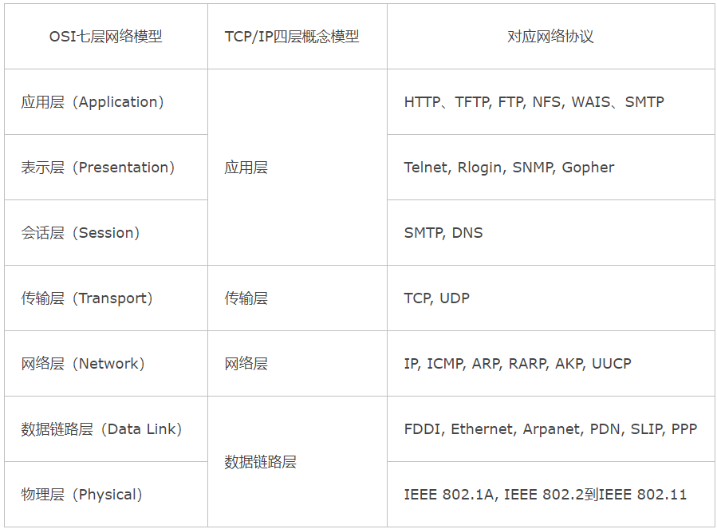

##### TCP

###### TCP报头

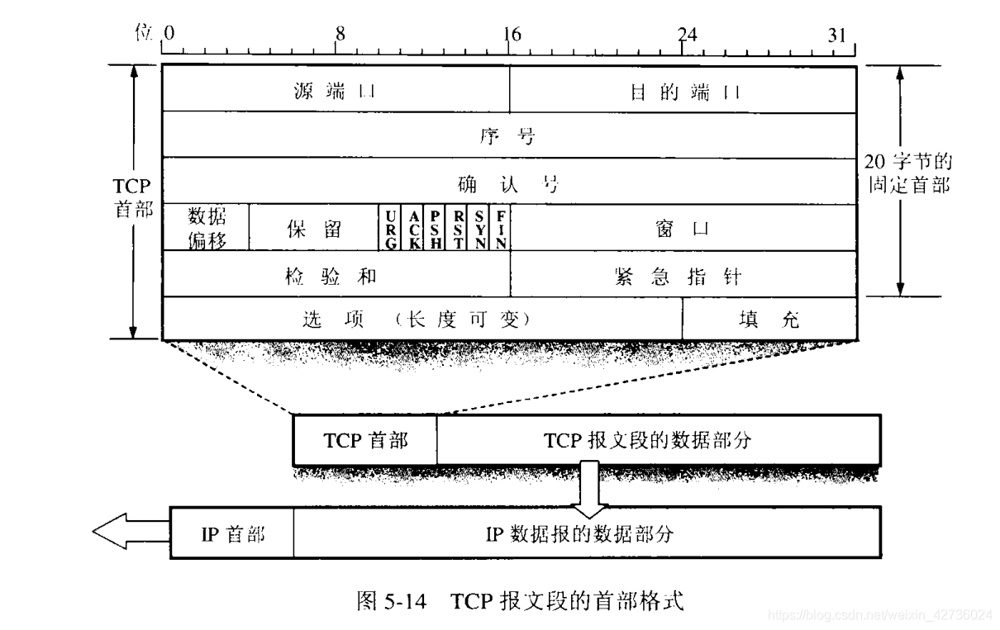

- 源端口，目的端口
- 序列号`seq`：占4个字节，用来标记数据段的顺序，TCP把连接中发送的所有数据字节都编上一个序号，第一个字节的编号由本地随机产生；给字节编上序号后，就给每一个报文段指派一个序号；序列号seq就是这个报文段中的第一个字节的数据编号。
- 确认号`ack`：占4个字节，期待收到对方下一个报文段的第一个数据字节的序号；序列号表示报文段携带数据的第一个字节的编号；而确认号指的是期望接收到下一个字节的编号；因此当前报文段最后一个字节的编号+1即为确认号。
- 数据偏移：指明TCP头部共有多少4字节长的字，头部的长度可以在40-60之间，这个字段的值在5~15之间
- 控制字段

| 字段 |                             含义                             |
| :--: | :----------------------------------------------------------: |
| URG  |       紧急指针是否有效。为1，表示某一位需要被优先处理        |
| ACK  |                 确认号是否有效，一般置为1。                  |
| PSH  |        提示接收端应用程序立即从TCP缓冲区把数据读走。         |
| RST  |                 对方要求重新建立连接，复位。                 |
| SYN  | 请求建立连接，并在其序列号的字段进行序列号的初始值设定。建立连接，设置为1 |
| FIN  |                         希望断开连接                         |

###### <span id="TCP三次握手">TCP三次握手</span>

1. 建立连接时，客户端发送`SYN`包（syn=x）到服务器，并进入**SYN_SENT**状态，等待服务器确认；SYN：同步序列编号。随机产生一个序号置为`x`

   > SYN帧中携带信息：
   >
   > 1. MSS：告知对端本端在本连接中得每个TCP分节中愿意接受的最大数据量，发送端TCP使用接收端的MSS作为所发送分节的最大大小，我们可以通过TCP_MAXSEG套接字选项提取和设置这个TCP选项，TCP_MAXSEG选项原本是只读选项，4.4BSD限制应用进程只能减少其值，不能增加其值。
   > 2. 窗口规模选项：TCP连接任何一端能够通告对端的最大窗口大小是65535，因为在TCP首部中，相应地字段占16位；SO_RCVBUF套接字选项影响这个TCP选项，套接字接收缓冲区中可用空间的大小限定了TCP通告对端的窗口大小；
   > 3. 时间戳选项：这个选项对于高速网络连接是必要的，它可以防止由失而复得的分组可能造成的数据损坏，这个失而复得是指由暂时的路由原因造成的迷途，路由稳定后又正常到达目的地，高速网络中32位的序列号很快就可能循环一轮重新使用，如果不用时间戳选项，失而复得的分组所承载的分节可能与再次使用相同序列号的真正分节发生混淆；

2. 服务器收到syn包，必须确认客户的SYN（ack=x+1），同时自己也发送一个SYN包（syn=y），即SYN+ACK包，此时服务器进入SYN_RECV状态；

3. 客户端收到服务器的SYN+ACK包，向服务器发送确认包ACK(ack=y+1），此包发送完毕，客户端和服务器进入**ESTABLISHED**（TCP连接成功）状态，完成三次握手。

   

###### TCP四次挥手

1. 客户端进程发出连接释放报文，并且停止发送数据。释放数据报文首部，FIN=1，其序列号为seq=u（等于前面已经传送过来的数据的最后一个字节的序号加1），此时，客户端进入FIN-WAIT-1（终止等待1）状态。 TCP规定，FIN报文段即使不携带数据，也要消耗一个序号。

2. 服务器收到连接释放报文，发出确认报文，ACK=1，ack=u+1，并且带上自己的序列号seq=v，此时，服务端就进入了CLOSE-WAIT（关闭等待）状态。TCP服务器通知高层的应用进程，客户端向服务器的方向就释放了，这时候处于半关闭状态，即客户端已经没有数据要发送了，但是服务器若发送数据，客户端依然要接受。这个状态还要持续一段时间，也就是整个CLOSE-WAIT状态持续的时间。

3. 客户端收到服务器的确认请求后，此时，客户端就进入FIN-WAIT-2（终止等待2）状态，等待服务器发送连接释放报文（在这之前还需要接受服务器发送的最后的数据）

4. 服务器将最后的数据发送完毕后，就向客户端发送连接释放报文，FIN=1，ack=u+1，由于在半关闭状态，服务器很可能又发送了一些数据，假定此时的序列号为seq=w，此时，服务器就进入了LAST-ACK（最后确认）状态，等待客户端的确认。

5. 客户端收到服务器的连接释放报文后，必须发出确认，ACK=1，ack=w+1，而自己的序列号是seq=u+1，此时，客户端就进入了TIME-WAIT（时间等待）状态。注意此时TCP连接还没有释放，必须经过2∗∗MSL（最长报文段寿命）的时间后，当客户端撤销相应的TCB后，才进入CLOSED状态。

6. 服务器只要收到了客户端发出的确认，立即进入CLOSED状态。同样，撤销TCB后，就结束了这次的TCP连接。可以看到，服务器结束TCP连接的时间要比客户端早一些。

   

###### TCP为什么不是四次握手，三次挥手

[三次握手原因](https://www.zhihu.com/question/24853633)、[三次握手四次挥手详解](https://blog.csdn.net/qzcsu/article/details/72861891)

谢希仁版《计算机网络》中的例子：“已失效的连接请求报文段” 的产生在这样一种情况下：client 发出的第一个连接请求报文段并没有丢失，而是在某个网络结点长时间的滞留了，以致延误到连接释放以后的某个时间才到达 server。本来这是一个早已失效的报文段。但 server 收到此失效的连接请求报文段后，就误认为是 client 再次发出的一个新的连接请求。于是就向 client 发出确认报文段，同意建立连接。假设不采用 “三次握手”，那么只要 server 发出确认，新的连接就建立了。由于现在 client 并没有发出建立连接的请求，因此不会理睬 server 的确认，也不会向 server 发送数据。但 server 却以为新的运输连接已经建立，并一直等待 client 发来数据。这样，server 的很多资源就白白浪费掉了。采用 “三次握手” 的办法可以防止上述现象发生。例如刚才那种情况，client 不会向 server 的确认发出确认。server 由于收不到确认，就知道 client 并没有要求建立连接。”

- 两次握手：两次握手的机制将会让客户端和服务器再次建立连接，这将导致不必要的错误和资源的浪费。
- 四次握手：多余，也是对资源的浪费

三次握手（A three way handshake）是必须的， 因为 sequence numbers（序列号）没有绑定到整个网络的全局时钟（全部统一使用一个时钟，就可以确定这个包是不是延迟到的）以及 TCPs 可能有不同的机制来选择 ISN（初始序列号）。接收方接收到第一个 SYN 时，没有办法知道这个 SYN 是是否延迟了很久了，除非他有办法记住在这条连接中，最后接收到的那个sequence numbers（然而这不总是可行的）。
这句话的意思是：一个 seq 过来了，跟现在记住的 seq 不一样，我怎么知道他是上条延迟的，还是上上条延迟的呢？——所以，接收方一定需要跟发送方确认 SYN。

###### TCP如何保证可靠性

​	[参考](https://www.jianshu.com/p/42dbcd39c3e7)

1. 校验和，计算方法为：在发送方将整个报文段分为多个16位的段，然后将所有段进行反码相加，将结果存放在检验和字段中，接收方用相同的方法进行计算，如最终结果为检验字段所有位是全1则正确（UDP中为0是正确），否则存在错误。

2. 确认应答和序列号：多次发送一次确认

3. 超时重传

4. 连接管理：三次握手与四次挥手

5. 流量控制

   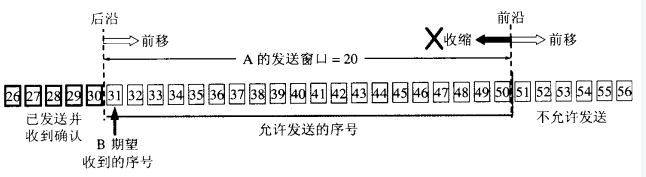
   
   窗口大小=$\min(rwnd,cwnd)$，其中`rwnd`是接受方窗口大小，`cwnd`是拥塞窗口的大小
   
   接收方每次收到数据包，可以在发送确定报文的时候，同时告诉发送方自己的缓存区还剩余多少是空闲的，我们也把缓存区的剩余大小称之为接收窗口大小，用变量win来表示接收窗口的大小。发送方收到之后，便会调整自己的发送速率，也就是调整自己发送窗口的大小，当发送方收到接收窗口的大小为0时，发送方就会停止发送数据，防止出现大量丢包情况的发生。当发送方收到接受窗口 win = 0 时，这时发送方停止发送报文，并且同时开启一个**定时器，每隔一段时间就发个测试报文去询问接收方**，打听是否可以继续发送数据了，如果可以，接收方就告诉他此时接受窗口的大小；如果接受窗口大小还是为0，则发送方再次刷新启动定时器。
   
   > TCP滑动窗口和数据链路层滑动窗口有什么区别
   >
   > 1. TCP的滑动窗口是面向字节的，而数据链路层讨论的滑动窗口是面向帧的
   > 2. TCP的滑动窗口是可变大小的，而数据链路层讨论的滑动窗口大小是固定的
   
6. 拥塞控制

   
   
   1. 慢速启动：再开始时设置拥塞窗口大小(cwnd)为一个最大段长度，窗口是慢速启动的，但是按照指数规则增长的，当达到阈值是必须停止该阶段
   2. 拥塞避免，加性增加：当拥塞窗口达到阈值后，慢速启动阶段停止，加性增加阶段开始，每一个窗口中所有段都被确认时，cwnd增加1；
   3. 拥塞检测，乘性减少：重传计时器到时或者或者接受到了三个ACK，这两种情况TCP做出两种反应
      - 重传计时器到时
        1. 设置阈值为当前拥塞窗口的一半
        2. 设置一个cwnd为一个段的大小
        3. 启动慢速启动阶段
      - 接收到三个ACK
        1. 设置阈值为当前拥塞窗口的一半
        2. 设置cwnd为阈值
        3. 启动拥塞避免阶段 

###### TCP是百分之百可靠的吗

TCP协议为了实现可靠传输，在三次握手的实现过程中设置了一些异常处理机制。比如说，在三次握手的第三步，如果服务器一直没有收到客户端的ACK报文，服务器一般会进行重试，也就是再次发送SYN+ACK报文给客户端，并且一直处于SYN-RECV状态，将客户端加入等待列表（半连接队列）。重发一般会进行3~5次，大概每隔30秒会轮询一次半连接队列，重试所有的客户端。此外，服务器在发送SYN+ACK报文后，会预留一部分资源给即将建立的TCP连接，这个资源在等待重试期间会一直保留。

然而，服务器的资源是有限的，可维护的等待列表大小超过一定限度后，服务器就不在接受新的SYN报文了，也就是说服务器拒绝建立新的TCP连接了。

攻击者可以伪造大量的IP地址给服务器发送SYN报文，由于伪造的IP地址几乎不可能存在，服务器也就收不到从伪造的IP地址发来的任何回应，因此服务器将会维护一个很大的等待列表，并不断地尝试向等待列表中的IP地址发送SYN+ACK，这样不仅会占用很大的系统资源，而且由于服务器等待队列已满，服务器拒绝建立新的TCP连接，这样正常的客户端想要建立连接时，反而不能成功。

###### 端口数为什么是65535个

在TCP、UDP协议的开头，会分别有16位来存储源端口号和目标端口号，所以端口个数是2^16-1=65535个

###### TCP粘包问题

[参考](https://www.cnblogs.com/kex1n/p/6502002.html)

- 出现原因

  1. 发送方引起的粘包是由TCP协议本身造成的，TCP为提高传输效率，发送方往往要收集到足够多的数据后才发送一包数据。若连续几次发送的数据都很少，通常TCP会根据优化算法把这些数据合成一包后一次发送出去，这样接收方就收到了粘包数据。
  2. 接收方引起的粘包是由于接收方用户进程不及时接收数据，从而导致粘包现象。这是因为接收方先把收到的数据放在系统接收缓冲区，用户进程从该缓冲区取数据，若下一包数据到达时前一包数据尚未被用户进程取走，则下一包数据放到系统接收缓冲区时就接到前一包数据之后，而用户进程根据预先设定的缓冲区大小从系统接收缓冲区取数据，这样就一次取到了多包数据。

- 避免粘包问题

  1. 对于发送方引起的粘包现象，用户可通过编程设置来避免，TCP提供了强制数据立即传送的操作指令push，TCP软件收到该操作指令后，就立即将本段数据发送出去，而不必等待发送缓冲区满；

  2. 对于接收方引起的粘包，则可通过优化程序设计、精简接收进程工作量、提高接收进程优先级等措施，使其及时接收数据，从而尽量避免出现粘包现象；

  3. 由接收方控制，将一包数据按结构字段，人为控制分多次接收，然后合并，通过这种手段来避免粘包。

     > 较为周全的对策：在接受方创建预处理线程，将粘在一起的包分开

###### TCP UDP数据包大小限制

在链路层，以太网特性决定了数据帧的内容最长为1500(**不包含帧头和帧尾**)，在网络层IP包首部要占20个字节，$MTU_{网络层}=1500-20=1480$，同样在传输层UDP头部$MTU_{UDP}=1500-20-8=1472$，而TCP的头部占20个字节，所以$MTU_{TCP}=1500-20-20=1460$

###### TCP和UDP的区别

1. 基于连接和无连接
2. 对系统资源要求
3. UDP程序结构较为简单
4. 流模式和数据报模式
5. TCP保证数据的正确性，UDP则有可能丢包

###### TCP的缓冲区相关知识

[参考](https://www.cnblogs.com/ellisonzhang/p/10412027.html)

- MTU(maximum transmission unit)：许多网络有一个可由硬件规定的MTU。以太网的MTU为1500字节。有一些链路的MTU的MTU可以由认为配置。IPv4要求的最小链路MTU为68字节。这允许最大的IPv4首部（包括20字节的固定长度部分和最多40字节的选项部分）拼接最小的片段（IPv4首部中片段偏移字段以8个字节为单位）IPv6要求的最小链路MTU为1280字节。

- MSS(maximun segment size)：TCP有一个最大分段大小，用于对端TCP通告对端每个分段中能发送的最大TCP数据量。MSS的目的是告诉对端其重组缓冲区大小的实际值，从而避免分片。MSS经常设计成MTU减去IP和TCP首部的固定长度。以太网中使用IPv4MSS值为1460，使用IPv6的MSS值为1440

- 最小重组缓冲区大小(minimum reassembly buffer size)：IPv4和IPv6都定义了最小缓冲区大小，它是IPv4或IPv6任何实现都必须保重支持的最小数据报大小。其值对**IPv4为576字节**，对于IPv6为1500字节。例如，对于IPv4而言，我们不能判定某个给定的目的能否接受577字节的数据报，为此很多应用避免产生大于这个大小的数据报。

- TCP发送缓冲区：每个TCP套接字有一个发送缓冲区，我们可以用`SO_SNDBUF`套接字选项来更改该缓冲区的大小。当某个应用进程调用write时，内核从该应用进程的缓冲区复制所有数据到缩写套接字的发送缓冲区。如果该套接字的发送缓冲区容不下该应用进程的所有数据（或是应用进程的缓冲区大于套接字的发送缓冲区，或是套接字的发送缓冲区中已有其他数据），该应用进程将被投入睡眠。这里假设该套接字是阻塞的，它通常是默认设置。内核将不从write系统调用返回，直到应用进程缓冲区中的所有数据都复制到套接字发送缓冲区。因此，从写一个TCP套接字的write调用成功返回仅仅表示我们可以重新使用原来的应用进程缓冲区，并不表明对端的TCP或应用进程已接受到数据。完成后write函数返回，之后的事情完全按照TCP传输协议去做。
  这一端的TCP提取套接字发送缓冲区中的数据并把它发送给对端的TCP，其过程基于TCP数据传送的所有规则。对端TCP必须确认收到的数据，伴随来自对端的ACK的不断到达，本段TCP至此才能从套接字发送缓冲区中丢弃已确认的数据。TCP必须为已发送的数据保留一个副本，直到它被对端确认为止。本端TCP以MSS大小或是更小的块把数据传递给IP，同时给每个数据块安上一个TCP首部以构成TCP分节，**其中MSS或是由对端告知的值，或是536（若未发送一个MSS选项为576-TCP首部-IP首部）**。IP给每个TCP分节安上一个IP首部以构成IP数据报，并按照其目的的IP地址查找路由表项以确定外出接口，然后把数据报传递给相应的数据链路。每个数据链路都有一个数据队列，如果该队列已满，那么新到的分组将被丢弃，并沿协议栈向上返回一个错误：从数据链路到IP，在从IP到TCP。TCP将注意到这个错误，并在以后某个时候重传相应的分节。应用程序不知道这种暂时的情况。

- UDP发送缓冲区：任何UDP套接字都有发送缓冲区大小（我们可以用`SO_SNDBUF`套接字选项更改它），不过它仅仅是可写道套接字UDP数据报大小上限。如果一个应用进程写一个大于套接字发送缓冲区大小的数据报，内核将返回该进程一个`EMSGSIZE`错误。既然UDP是不可靠的，它不必保存应用进程数据的一个副本，因此无需一个真正的发送缓冲区。（应用进程的数据在沿协议栈向下传递时，通常被复制到某种格式的一个内核缓冲区中，然而当该数据被发送之后，这个副本被数据链路层丢弃了。）

- **当在超出输入超出缓冲区时**

  | TCP协议，socket阻塞       | 程序睡眠，直到所有的数据被写入套接字发送缓冲区，超出MSS自动分片 |
  | :------------------------ | :----------------------------------------------------------: |
  | **TCP协议，socket非阻塞** |                   **返回-1，errno=EAGAIN**                   |
  | **UDP协议，socket阻塞**   |       **会阻塞，如果超过UDP最大包限制将会出错返回-1.**       |
  | **UDP协议，socket非阻塞** | **网卡满返回-1,errno=EAGAIN. 超过UDP最大包限制一样会出错。** |


###### TIME_WAIT为了解决什么问题

**OR** 为什么需要接收方最后需要等待2MSL 

1. 为实现TCP全双工连接的可靠释放

   由TCP状态变迁图可知，假设发起主动关闭的一方（client）最后发送的ACK在网络中丢失，由于TCP协议的重传机制，执行被动关闭的一方（server）将会重发其FIN，在该FIN到达client之前，client必须维护这条连接状态，也就说这条TCP连接所对应的资源（client方的local_ip,local_port）不能被立即释放或重新分配，直到另一方重发的FIN达到之后，client重发ACK后，经过2MSL时间周期没有再收到另一方的FIN之后，该TCP连接才能恢复初始的CLOSED状态。如果主动关闭一方不维护这样一个TIME_WAIT状态，那么当被动关闭一方重发的FIN到达时，主动关闭一方的TCP传输层会用RST包响应对方，这会被对方认为是有错误发生，然而这事实上只是正常的关闭连接过程，并非异常。

2. 为使旧的数据包在网络因过期而消失
   因某些原因，我们先关闭，接着很快以相同的四元组建立一条新连接。本文前面介绍过，TCP连接由四元组唯一标识，因此，在我们假设的情况中，TCP协议栈是无法区分前后两条TCP连接的不同的，在它看来，这根本就是同一条连接，中间先释放再建立的过程对其来说是“感知”不到的。这样就可能发生这样的情况：前一条TCP连接由local peer发送的数据到达remote peer后，会被该remot peer的TCP传输层当做当前TCP连接的正常数据接收并向上传递至应用层，从而引起数据错乱进而导致各种无法预知的诡异现象。作为一种可靠的传输协议，TCP必须在协议层面考虑并避免这种情况的发生，这正是TIME_WAIT状态存在的第2个原因。

###### 服务器出现大量TIME_WAIT和CLOSE_WAIT

- TIME_WAIT：这种情况比较常见，一些爬虫服务器或者WEB服务器（如果网管在安装的时候没有做内核参数优化的话）上经常会遇到这个问题。TIME_WAIT是主动关闭连接的一方保持的状态，对于爬虫服务器来说他本身就是“客户端”，在完成一个爬取任务之后，他就 会发起主动关闭连接，从而进入TIME_WAIT的状态，然后在保持这个状态2MSL(max segment lifetime)时间之后，彻底关闭回收资源。

  > 解决思路很简单，就是让服务器能够快速回收和重用那些TIME_WAIT的资源，修改服务器/etc/sysctl.conf中参数     [参考](https://www.cnblogs.com/whx7762/p/9413787.html)

- CLOSE_WAIT：如果一直保持在CLOSE_WAIT状态，那么只有一种情况，就是在对方关闭连接之后服务器程 序自己没有进一步发出ack信号。换句话说，就是在对方连接关闭之后，程序里没有检测到，或者程序压根就忘记了这个时候需要关闭连接，于是这个资源就一直 被程序占着。个人觉得这种情况，通过服务器内核参数也没办法解决，服务器对于程序抢占的资源没有主动回收的权利，除非终止程序运行。

###### SYN洪泛攻击解决方式

1. 比如**降低SYN timeout时间**，使得主机尽快释放半连接的占用。
2. 或者采用**SYN cookie设置**，就是给每一个请求连接的IP地址分配一个Cookie，如果短时间内连续受到某个IP的重复SYN报文，就认定是受到了攻击，以后从这个IP地址来的包会被丢弃。Cookie是当浏览某网站时，由Web服务器置于硬盘上一个非常小的文本文件，用来记录用户ID，密码，浏览过的网页，停留时间等信息。当我们认为受到了攻击，合理的采用防火墙设置等外部网络进行拦截。
3. 使用长连接：使用长连接的情况下，当一个网页打开完成后，客户端和服务器之间用于传输HTTP数据的 TCP连接不会关闭，如果客户端再次访问这个服务器上的网页，会继续使用这一条已经建立的连接。

###### IPv4和IPv6的最大数据报长度

- IPv4的数据报最大大小是64KB
- IPv6的数据报最大大小是64KB或4GB(Jumbogram)

###### 实现可靠的UDP

传输层无法保证数据的可靠传输，只能通过应用层来实现了。实现的方式可以参照tcp可靠性传输的方式，只是实现不在传输层，实现转移到了应用层。实现**确认机制、重传机制、窗口确认机制**。

###### 有了IP地址为什么还需要MAC地址

[参考](https://www.zhihu.com/question/21546408/answer/53576595)

1. 区别
   1. 对于网络上的某一设备，如一台计算机或一台路由器，其IP地址可变（但必须唯一），而MAC地址不可变。我们可以根据需要给一台主机指定任意的IP地址，如我们可以给局域网上的某台计算机分配IP地址为192.168.0.112 ，也可以将它改成192.168.0.200。而任一网络设备（如网卡，路由器）一旦生产出来以后，其MAC地址永远唯一且不能由用户改变。
   2. 长度不同。IP地址为32位，MAC地址为48位。
   3. 分配依据不同。IP地址的分配是基于网络拓朴，MAC地址的分配是基于制造商。
   4. 寻址协议层不同。IP地址应用于OSI第三层，即网络层，而MAC地址应用在OSI第二层，即数据链路层。 数据链路层协议可以使数据从一个节点传递到相同链路的另一个节点上（通过MAC地址），而网络层协议使数据可以从一个网络传递到另一个网络上（ARP根据目的IP地址，找到中间节点的MAC地址，通过中间节点传送，从而最终到达目的网络）。
2. [OSI七层模型](#OSI七层模型)，TCP/IP对应第三层第四层，是运行在物理层和数据链路层之上的层次，层次之间互相独立，互不透明


##### http

###### SSL握手过程

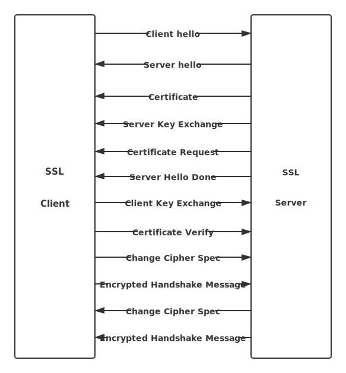

1. Client Hello：客户端发起请求，以明文传输请求信息，包含版本信息，加密套件候选列表，压缩算法候选列表，随机数，扩展字段等信息

2. Server Hello ：服务端返回协商的信息结果，

   - version：包括选择使用的协议版本 
   - cipher suite：选择的加密套件
   - compression method：选择的压缩算法
   - random_S随机数等，其中随机数用于后续的密钥协商;

3. Certificate：服务器发送一个证书或一个证书链到客户端，一个证书链开始于服务器公共钥匙证书并结束于证明权威的根证书。这个消息是可选的，但服务器证书需要时，必须使用它。主要目的是验证服务器是否合法。

4. Server Key Exchange：**该帧只存在于秘钥交换算法（Key Exchange）为 DH 或 ECDH 的帧中。如果秘钥交换算法为 RSA，那么此帧不存在**。

5. Certificate Request：该帧存在于双向验证过程中，用于请求客户端证书。

6. Server Hello Done ：通知客户端 server_hello 信息发送结束;

7. Client Key Exchange 

   - RSA key exchange：
     1. 客户端产生预主秘钥（*pre-master secret*)，使用从服务器证书中得到的公钥（*public key*）加密预主秘钥后发往服务器；
     2. 服务器收到加密后的预主秘钥后，使用其私钥将其解密。
     3. 此时，客户端和服务器都有**客户端随机数，服务器随机数，预主秘钥**。双方使用这三者产生通信过程中的主秘钥（*master secret*）；
     4. 双方互相发送 `Change Cipher Spec` 和 `Encrypted Handshake Message`。
   - DH（ECDH）Key Exchange：
     1. 服务器使用其私钥将客户端随机数，服务器随机数，服务器 DH（ECDH）参数签名，生成服务器签名，发向客户端（`Server Key Exchange`）；
     2. 客户端使用服务器发送过来的公钥和签名得到服务器 DH 参数；
     3. 客户端向服务器发送 DH 参数（`Client Key Exchange`)；
     4. 双方使用客户端 DH 参数，服务器 DH 参数生成预主秘钥。然后使用客户端随机数，服务器随机数，预主秘钥产生主秘钥；
     5. 双方互相发送 `Change Cipher Spec` 和 `Encrypted Handshake Message`。

8. Certificate Verify：

   该帧存在于双向验证过程中，用于客户端自证该证书属于客户端。

9. Change Cipher Spec

   客户端告知服务器，客户端已经生成了主秘钥，并且后续的通信将使用该秘钥进行加密。

10. Encrypted Handshake Message：
    这是客户端使用主秘钥加密的第一个数据，发向服务器。服务器使用此消息验证自身生成的主秘钥的正确性。

11. Change Cipher Spec
    服务器告知客户端，服务器已经生成了主秘钥，并且后续的通信将使用该秘钥进行加密。

12. Encrypted Handshake Message：
    这是服务器使用主秘钥加密的第一个数据，发向客户端。客户端使用此消息验证自身生成的主秘钥的正确性。

13. Application Data Protocol: http-over-tls：业务数据安全传输

###### http请求包含哪些内容

请求行（request line）、请求头部（headers）、空行（blank line）和请求数据（request body）4个部分组成。

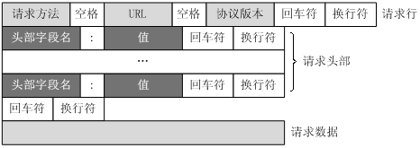

###### get和post的区别

1. get将数据放在url后面，post将数据放在报文体
2. url长度会受到特定的浏览器及服务器的限制，如IE对URL长度的限制是2083字节(2K+35)。而报文体长度没有限制
3. get将数据放在url后面，信息并不安全；post方法将数据放在报文体中，更安全。
4. get方法是申请获得资源，并不会对服务器数据产生任何影响，而POST可能会影响服务器端数据

###### http返回码

[参考](https://blog.csdn.net/kongxianglei5313/article/details/80636167)

- **1XX**：临时响应并需要请求者继续执行操作的状态代码

- **2XX**：成功处理了请求的状态代码

- **3XX**：表示要完成请求，需要进一步操作。 通常，这些状态代码用来重定向

- **4XX**：状态代码表示请求可能出错，妨碍了服务器的处理

- **5XX**：状态代码表示服务器在尝试处理请求时发生内部错误。 这些错误可能是服务器本身的错误，而不是请求出错。
  常见状态码

  | 状态码 | 意义                 | 解释                                                         |
  | :----- | -------------------- | ------------------------------------------------------------ |
  | 200    | OK                   | 表示从客户端发来的请求在服务器端被正确处理                   |
  | 301    | Permanently Moved    | 被请求的资源已永久移动到新位置，新的URL在Location头中给出，浏览器应该自动地访问新的URL。301为永久重定向。 |
  | 302    | Found                | 请求的资源现在临时从不同的URL响应请求。302为临时重定向。     |
  | 304    | Not Modified         | 告诉浏览器可以从缓存中获取所请求的资源。                     |
  | 400    | bad request          | 请求报文存在语法错误                                         |
  | 403    | forbidden            | 表示对请求资源的访问被服务器拒绝                             |
  | 404    | not found            | 表示在服务器上没有找到请求的资源                             |
  | 500    | internal sever error | 表示服务器端在执行请求时发生了错误                           |
  | 503    | service unavailable  | 表明服务器暂时处于超负载或正在停机维护，无法处理请求         |


###### [在浏览器中输入url后执行的全过程](https://www.cnblogs.com/wangxirui/p/12794765.html)

1. 域名解析，获取该域名的IP地址
2. 应用层-浏览器发送HTTP请求
3. 传输层TCP、UDP封装数据
4. 网络层，IP协议封装IP地址，获取目的MAC地址
5. 链路层，建立TCP连接

###### http和https的区别

首先**https=http+SSL**，https就是http加上SSL保护壳，信息的加密过程就是SSL中完成的，[参考](https://www.cnblogs.com/wqhwe/p/5407468.html)

1. https协议需要到ca申请证书，一般免费证书较少，因而需要一定费用。
2. http是超文本传输协议，信息是明文传输，https则是具有安全性的ssl加密传输协议。
3. http和https使用的是完全不同的连接方式，用的**端口**也不一样，前者是80，后者是443。
4. http的连接很简单，是无状态的；HTTPS协议是由SSL+HTTP协议构建的可进行加密传输、身份认证的网络协议，比http协议安全。

###### HTTP1.0和HTTP1.1的区别

1. 连接：**HTTP/1.0中，默认使用的是短连接**，也就是说每次请求都要重新建立一次连接；**HTTP 1.1起，默认使用长连接**,默认开启Connection： keep-alive。 **HTTP/1.1的持续连接有非流水线方式和流水线方式** 。流水线方式是客户在收到HTTP的响应报文之前就能接着发送新的请求报文。与之相对应的非流水线方式是客户在收到前一个响应后才能发送下一个请求
2. 错误状态响应码：在**HTTP1.1中新增了24个错误状态响应码**，如409（Conflict）表示请求的资源与资源的当前状态发生冲突；410（Gone）表示服务器上的某个资源被永久性的删除。 
3. 缓存处理：在HTTP1.0中主要使用header里的If-Modified-Since,Expires来做为缓存判断的标准，HTTP1.1则引入了更多的缓存控制策略例如Entity tag，If-Unmodified-Since, If-Match, If-None-Match等更多可供选择的缓存头来控制缓存策略
4. 带宽优化及网络连接的使用：HTTP1.0中，存在一些浪费带宽的现象，例如[客户端]()只是需要某个对象的一部分，而服务器却将整个对象送过来了，并且不支持断点续传功能，HTTP1.1则在请求头引入了range头域，它允许只请求资源的某个部分，即返回码是206（Partial Content），这样就方便了开发者自由的选择以便于充分利用带宽和连接
5. **HOST域**：在HTTP1.0中认为每台服务器都绑定一个唯一的IP地址，因此，请求消息中的URL并没有传递主机名（hostname），HTTP1.0没有host域。HTTP1.1的请求消息和响应消息都支持host域，且请求消息中如果没有host域会报告一个错误（400 Bad Request）。

###### HTTP1.1和HTTP2.0的区别

1. 多路复用允许单一的 HTTP/2 连接同时发起多重的请求-响应消息
2. **首部压缩**：http1.x的header由于cookie和user agent很容易膨胀，而且每次都要重复发送。http2.0使用encoder来减少需要传输的header大小
3. **服务端推送**：http2.0能通过push的方式将客户端需要的内容预先推送过去

###### 数字证书

服务器会给客户端发出数字证书来证明自己的身份。**客户端在接受到服务端发来的SSL证书时，会对证书的真伪进行校验**。证书中包含的具体内容有：

1. 证书的发布机构CA
2. 证书的有效期
3. 公钥
4. 证书所有者
5. 签名

这样我们通过数字证书，就可以安全交换对称秘钥了，**既解决了公钥获取问题，又解决了黑客冒充问题**，一箭双雕。

##### 其他

###### 网络故障的排查方法(字节)

1. 首先测试本地局域网下的两台机器是否可以连接，可以使用ping命令，排除DHCP动态分配IP地址用完的问题
2. 验证了源主机和目标主机的IP地址配置，可以验证域名解析是否正常工作，常用命令为`nslookup`命令，确保DNS服务器地址解析没有出现问题
3. 验证网络路径，最简单的为`tracert`命令，如果某些跃点被报告为“请求超时”，无需太担心，因为这只意味着主机配置为不响应ICMP消息。重要的是确保Tracert不会显示目的地无法到达
4. 测试远程主机的响应能力，可以使用建立远程连接的会话如xshell等测试远程主机的响应能力

###### 应对高并发场景

1. 负载均衡：我们可以建立很多很多服务器，组成一个服务器集群，当用户访问网站时，先访问一个中间服务器，再让这个中间服务器在服务器集群中选择一个压力较小的服务器，然后将该访问请求引入该服务器。如此以来，用户的每次访问，都会保证服务器集群中的每个服务器压力趋于平衡，分担了服务器压力，避免了服务器崩溃的情况。

   |     方式     |                             特点                             |
   | :----------: | :----------------------------------------------------------: |
   | 轮询（默认） |          负载访问不均匀，服务器之间需要session同步           |
   |   权重轮询   |                       需要session同步                        |
   |   IP-Hash    | 恶意攻击，会造成某台服务器压垮。提供的服务不同，面向的地区不同，IP可能会出现集中，造成不均匀，不可控。不需要session同步 |
   |     Fair     |  处理请求最早结束的，拿到下一个请求。需要进行session同步。   |
   |   URL-Hash   | 这种是根据URL进行hash，这样某些请求永远打某台服务器。利于利用服务器的缓存，但是可能由于URL的哈希值分布不均匀，以及业务侧重造成某些服务器压力大，某些负荷低。这种也需要进行session同步。 |

2. 异步IO

3. 消息队列： 将不需要实时返回的请求放入消息队列进行服务解耦和削峰。

4. 数据库读写分离，分库分表

5. 缓存： 引入缓存层来缓解数据库压力。

###### 网络调试工具

1. ping命令：利用网络上机器IP地址的唯一性，给目标IP地址发送一个数据包，通过对方回复的数据包来确定两台网络机器是否连接相通，时延是多少
2. Nslookup(name server lookup)是一个用于查询因特网域名信息或诊断DNS 服务器问题的工具.
3. Fiddler（中文名称：小提琴）是一个HTTP的调试代理，以代理服务器的方式，监听系统的Http网络数据流动，Fiddler可以也可以让你检查所有的HTTP通讯，设置断点，以及Fiddle所有的“进出”的数据
4. 网站压力测试工具——webbench

#### C++

##### 语言特性

###### C++三大特性

1. 封装
2. 继承
3. 多态

###### C和C++的区别

C++是面向对象的语言，而C是面向过程的结构化编程语言 

 语法上： 

 C++具有重载、继承和多态三种特性 

 C++相比C，增加多许多类型安全的功能，比如强制类型转换、 

 C++支持范式编程，比如模板类、函数模板等

###### C++ 11新特性

[参考博客](https://blog.csdn.net/jiange_zh/article/details/79356417)

1. 关键字以及语法
   - auto关键字：编译器根据上下文情况，确定auto变量的真正类型
   - nullptr：空指针，避免NULL所引起的歧义
   - for循环语法
2. STL容器：
   - std::array：跟数组并没有太大区别
   - std::forward_list：新增的线性表
   - std::unordered_map：内部是哈希表的实现方式
3. 多线程
   - std::thread
   - std::atomic：原子数据类型不会发生数据竞争，能直接用在多线程中而不必我们用户对其进行添加互斥资源锁的类型。从实现上，大家可以理解为这些原子类型内部自己加了锁。
   - std::condition_variable：可以让线程休眠，直到别唤醒，现在在从新执行。线程等待在多线程编程中使用非常频繁，经常需要等待一些异步执行的条件的返回结果
4. 智能指针内存管理
   - std::shared_ptr
   - std::weak_ptr

##### 内存管理

###### C++内存泄漏常见情况

内存泄漏也称作"存储渗漏"，用动态存储分配函数动态开辟的空间，在使用完毕后未释放，结果导致一直占据该内存单元，直到程序结束。[参考](https://www.cnblogs.com/zzdbullet/p/10478744.html)

1. 类的构造函数和析构函数中没有匹配的调用new和delete函数
   两种情况下会出现这种内存泄露：一是在堆里创建了对象占用了内存，但是没有显示地释放对象占用的内存；二是在类的构造函数中动态的分配了内存，但是在析构函数中没有释放内存或者没有正确的释放内存
   
2. 没有正确地清除嵌套的对象指针

3. 在释放对象数组时在delete中没有使用方括号
   方括号是告诉编译器这个指针指向的是一个对象数组，同时也告诉编译器正确的对象地址值并调用对象的析构函数，如果没有方括号，那么这个指针就被默认为只指向一个对象，对象数组中的其他对象的析构函数就不会被调用，结果造成了内存泄露。如果在方括号中间放了一个比对象数组大小还大的数字，那么编译器就会调用无效对象（内存溢出）的析构函数，会造成堆的奔溃。如果方括号中间的数字值比对象数组的大小小的话，编译器就不能调用足够多个析构函数，结果会造成内存泄露。
   
4. 指向对象的指针数组不等同于对象数组
   - 对象数组是指：数组中存放的是对象，只需要`delete []p`，即可调用对象数组中的每个对象的析构函数释放空间
   - 指向对象的指针数组是指：数组中存放的是指向对象的指针，不仅要释放每个对象的空间，还要释放每个指针的空间，`delete []p`只是释放了每个指针，但是并没有释放对象的空间，正确的做法，是通过一个循环，将每个对象释放了，然后再把指针释放了。
   
5. 缺少拷贝构造函数
   两次释放相同的内存是一种错误的做法，同时可能会造成堆的奔溃。
   按值传递会调用（拷贝）构造函数，引用传递不会调用。
   在C++中，如果没有定义拷贝构造函数，那么编译器就会调用默认的拷贝构造函数，会逐个成员拷贝的方式来复制数据成员，如果是以逐个成员拷贝的方式来复制指针被定义为将一个变量的地址赋给另一个变量。这种隐式的指针复制结果就是两个对象拥有指向同一个动态分配的内存空间的指针。当释放第一个对象的时候，它的析构函数就会释放与该对象有关的动态分配的内存空间。而释放第二个对象的时候，它的析构函数会释放相同的内存，这样是错误的。
   所以，如果一个类里面有指针成员变量，**要么必须显示的写拷贝构造函数和重载赋值运算符，要么禁用拷贝构造函数和重载赋值运算符**

   > 对象不存在，且没用别的对象来初始化，就是调用了构造函数；
   >
   > 对象不存在，且用别的对象来初始化，就是拷贝构造函数（上面说了三种用它的情况！）
   >
   > 对象存在，用别的对象来给它赋值，就是赋值函数。

6. 缺少重载赋值运算符
   上述问题类似，也是逐个成员拷贝的方式复制对象，如果这个类的大小是可变的，那么结果就是造成内存泄露

7. 没有将基类的析构函数定义为虚函数
   当基类指针指向子类对象时，如果基类的析构函数不是virtual，那么子类的析构函数将不会被调用，子类的资源没有正确是释放，因此造成内存泄露

###### 深拷贝和浅拷贝的区别

在对含有指针成员的对象进行拷贝时，必须要自己定义拷贝构造函数，使拷贝后的对象指针成员有自己的内存空间，即进行深拷贝，这样就避免了内存泄漏发生。

浅拷贝只是对指针的拷贝，拷贝后两个指针指向同一个内存空间，深拷贝不但对指针进行拷贝，而且对指针指向的内容进行拷贝，经深拷贝后的指针是指向两个不同地址的指针。

浅拷贝带来问题的本质在于析构函数释放多次堆内存，使用std::shared_ptr，可以完美解决这个问题。

[深拷贝与浅拷贝参考](https://blog.csdn.net/caoshangpa/article/details/79226270?utm_medium=distribute.pc_relevant_t0.none-task-blog-BlogCommendFromMachineLearnPai2-1.control&dist_request_id=1328603.58384.16151935998172127&depth_1-utm_source=distribute.pc_relevant_t0.none-task-blog-BlogCommendFromMachineLearnPai2-1.control)

###### C++内存管理

在C++中，内存分成5个区，他们分别是堆、栈、自由存储区、全局/静态存储区和常量存储区。[参考](https://www.cnblogs.com/findumars/p/5929831.html?utm_source=itdadao&utm_medium=referral)

- 栈：函数内局部变量存储单元均在栈上建立，函数执行结束存储单元自动释放
- 堆：new分配的内存块，释放由应用程序控制，new-delete对应，程序没有释放的话操作系统自动回收
- 自由存储区：就是那些由malloc等分配的内存块，他和堆是十分相似的，不过它是用free来结束自己的生命的
- 全局/静态存储区：全局变量和静态变量被分配到同一块内存中
- 常量存储区：这是一块比较特殊的存储区，他们里面存放的是常量，不允许修改。

##### STL库函数和常见函数

###### <span id="CAS">CAS技术</span>

由于自增`i++`操作并不是原子操作，而是有三个原子操作组合而成，`load i`、`i=i+1`、`store i`三部分构成，所以在多线程操作过程中，可能会出现如图所示的情况，衍生出CAS操作，CAS的基本形式是`CAS(&i, old, new)`，当$i==old,\ i=new$。在同一时间，多线程的对同一个变量的自增请求只能够成功一个，其余的需要循环请求`CAS(&i, i, i+1)`最终实现数据安全。

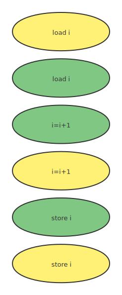

###### C++常见容器的优缺点

​    [参考](https://www.cnblogs.com/steamedbun/p/9376403.html)

###### strcopy的缺点

strcpy函数并不检查目的缓冲区的大小边界，而是将源字符串逐一的全部赋值给目的字符串地址起始的一块连续的内存空间，同时加上字符串终止符。(memcpy)

###### sizeof和strlen的区别

- sizeof：一个单目运算符，而不是一个函数。与函数 strlen 不同，它的参数可以是数组、指针、类型、对象、函数，sizeof不能用来返回动态分配内存空间的大小，包括结束字符‘\0’
- strlen：是一个函数，它用来计算指定字符串 str 的长度，但不包括结束字符

###### 常见解决hash冲突的方法

1. 开放定址法
   - 线性探测再散列
   - 二次探测在散列
   - 伪随机探测再散列
2. 再哈希法：同时构造多个不同的哈希函数：
3. 链地址法：本思想是将所有哈希地址为i的元素构成一个称为同义词链的单链表，并将单链表的头指针存在哈希表的第i个单元中，因而查找、插入和删除主要在同义词链中进行。链地址法适用于经常进行插入和删除的情况。
4. 建立公共溢出区：哈希表分为基本表和溢出表两部分，凡是和基本表发生冲突的元素，一律填入溢出表。

- vector：在内存中分配一块连续的内存空间进行存储。支持不指定vector大小的存储。STL内部实现时，首先分配一个非常大的内存空间预备进行存储，即capacituy（）函数返回的大小， 当超过此分配的空间时再整体重新放分配一块内存存储，这给人以vector可以不指定vector即一个连续内存的大小的感觉。
- list：实质上是一个双向链表，一个节点包括信息快Info、一个前驱指针Pre、一个后驱指针Post。可以不分配必须的内存大小方便的进行添加和删除操作。使用的是非连续的内存空间进行存储。

###### map、unordermap的底层实现结构

1. map：红黑树实现
2. unordermap：hash的方式实现，冲突的时候使用开链法解决冲突，产生哈希冲撞 的数据全部链到当前位置的下面，看上去就像是 在下面链上了一个一个的桶子，因此这样的方法我们有称作是哈希桶

###### 智能指针内存泄露，以及解决方案

1. 智能指针有没有内存泄露的情况？
   答：当两个对象同时使用一个shared_ptr成员变量指向对方，会造成循环引用，使引用计数失效，从而导致内存泄露。

1. 智能指针的内存泄漏如何解决？
   答：为了解决循环引用导致的内存泄漏，引入了弱指针weak_ptr，weak_ptr的构造函数不会修改引用计数的值，从而不会对对象的内存进行管理，其类似一个普通指针，但是不会指向引用计数的共享内存，但是可以检测到所管理的对象是否已经被释放，从而避免非法访问。

##### 关键字

###### const int *p，int *const p和int const *p的区别

- `const int *p`和`int const *p`是相同的含义，含义是p指向的是一个常量变量，不能够通过指针更改该变量的值

- 而`int *const p`含义是，这个指针本身是常量，即指针的指向不能更改，但是可以通过指针修改指向位置的数值

- 常指针不能够指向常量

  > 常量指针：const在*前，表示不能通过指针修改变量
  >
  > 常指针：const在*后，表示指针指向不能改变

###### `int(*p)[10]` 和`int *p[10]`的区别

由于结合优先级的问题，分别对两个分析

- `int *p[10]`

  首先在优先级上，`*`和`[]`优先级相同，平级在优先级中是遵循向右看齐的原则，所以p是离[]近，到此 我们可以确定p是一个数组，他有10个元素。将p[10]看作一个整体的的到 int *A;可知道数组p中的每一个元素是指向一个int 类型的变量的指针。所以int *p[10]是一个指向整形变量的指针数组。

- `int (*p)[10]`：我们声明了一个变量q，由于有()所以q离 *近，可以确定变量q是一个指针。我们把(*q)看成一个整体得 int A[10], 到此我们可以确定 q是一个指向一个int类型的数组的指针。所以int(* q)[10]是指向一个数组的指针，即数组指针。

###### malloc细节(需要补充)

1. 分配内存空间

2. 检查内存是否分配成功，成功返回内存首地址，失败返回NULL

3. 清空分配好的内存空间

4. 使用内存

5. 使用完后释放内存

6. 对指针置空，防止称为野指针

   > 大多数实现所分配的存储空间比所要求的要稍大一些，额外的空间用来记录管理信息——分配块的长度，指向下一个分配块的指针等等。在free空间之时，将指针指向当前可用空间的首地址，并将`is_available`标志置1

###### static关键字

1. 隐藏作用：编译多个文件时候，未加static前缀的全局变量和函数都有全局可见性，如果加了static，就会对其它源文件隐藏
2. 保持变量内容的持久：它的生存期为整个源程序，但是其作用域仍与自动变量相同
3. 默认初始化为0

###### const 关键字

const名叫常量限定符，用来限定特定变量，以通知编译器该变量是不可修改的。习惯性的使用const，可以避免在函数中对某些不应修改的变量造成可能的改动。

1. const修饰基本数据类型

   - const修饰一般常量及数组

     基本数据类型，修饰符const可以用在类型说明符前，也可以用在类型说明符后，其结果是一样的。在使用这些常量的时候，只要不改变这些常量的值便好。 

   - const修饰指针变量*及引用变量& 

     如果const位于星号*的左侧，则const就是用来修饰指针所指向的变量，即指针指向为常量；

     如果const位于星号的右侧，const就是修饰指针本身，即指针本身是常量。

2. const应用到函数中,  

   - 作为参数的const修饰符

     调用函数的时候，用相应的变量初始化const常量，则在函数体中，按照const所修饰的部分进行常量化,保护了原对象的属性。
     [注意]：参数const通常用于参数为指针或引用的情况; 

   - 作为函数返回值的const修饰符

     声明了返回值后，const按照"修饰原则"进行修饰，起到相应的保护作用。

3. const在类中的用法

   不能在类声明中初始化const数据成员。正确的使用const实现方法为：const数据成员的初始化只能在类构造函数的初始化表中进行
     类中的成员函数：A fun4()const; 其意义上是不能修改所在类的的任何变量。

4. const修饰类对象，定义常量对象 
   常量对象只能调用常量函数，别的成员函数都不能调用。

###### define和const

1. const 定义的常数是变量也带类型， #define 定义的只是个常数 不带类型。
2. define是在编译的预处理阶段起作用，而const是在 编译、运行的时候起作用。
3. define只是简单的字符串替换，没有类型检查。而const有对应的数据类型，是要进行判断的，可以避免一些低级的错误。
4. define占用代码段空间，而const占用数据段空间
5. const常量可以进行调试的，define是不能进行调试的，因为在预编译阶段就已经替换掉了
6. const不足的地方，是与生俱来的，const不能重定义，而#define可以通过#undef取消某个符号的定义，再重新定义。
7. define可以用来防止头文件重复引用，而const不能

###### define和inline

1. 内联函数在运行时可调试，而宏定义不可以;
2. 编译器会对内联函数的参数类型做安全检查或自动类型转换（同普通函数），而宏定义则不会；
3. 内联函数可以访问类的成员变量，宏定义则不能；  
4. 在类中声明同时定义的成员函数，自动转化为内联函数。

###### malloc和new的区别

[参考1](https://blog.csdn.net/nie19940803/article/details/76358673)，[参考2](https://blog.csdn.net/zhong29/article/details/80930919)

1. `new`/`delete`是C++关键字需要编译器支持，malloc/free是库函数需要头文件支持

2. 使用new操作符申请内存分配时无须指定内存块的大小，编译器会根据类型信息自行计算。而malloc则需要显式地指出所需内存的尺寸。

3. new内存分配失败时，会抛出bac_alloc异常。malloc分配内存失败时返回NULL。

4. new会先调用operator new函数，申请足够的内存，然后调用类型的构造函数，初始化成员变量，最后返回自定义类型指针。delete先调用析构函数，然后调用operator delete函数释放内存； malloc/free是库函数，只能动态的申请和释放内存，无法强制要求其做自定义类型对象构造和析构工作。

5. C++允许重载new/delete操作符，特别的，布局new的就不需要为对象分配内存，而是指定了一个地址作为内存起始区域，new在这段内存上为对象调用构造函数完成初始化工作，并返回此地址。而malloc不允许重载。

6. new操作符从自由存储区（free store）上为对象动态分配内存空间，而malloc函数从堆上动态分配内存。自由存储区是C++基于new操作符的一个抽象概念，凡是通过new操作符进行内存申请，该内存即为自由存储区。而堆是操作系统中的术语，是操作系统所维护的一块特殊内存，用于程序的内存动态分配，C语言使用malloc从堆上分配内存，使用free释放已分配的对应内存。自由存储区不等于堆，如上所述，布局new就可以不位于堆中。

   > delete/free释放的是什么内容?
   >
   > free/delet释放的是指针指向的内存，而不是指针本身，在经过释放之后指针指向空间随机，称为野指针，所以在释放之后记得将指针置NULL

###### NULL和nullptr的区别

- NULL：是一个宏，其实质是0。而nullptr是从C++11开始引入的关键字。在C语言中，NULL的定义为（void *）0，因为C语言可以隐式转换。但在C++中，int \*p = (void \*) 0这样的语句会报错，因为在C++中void\* 类型是不允许隐式转换成其他类型的，因此在C++中直接将**NULL定义为0**，一个int类型的变量。这样导致在出现重载函数的情况下，程序会出现问题：NULL在重载函数的时候会匹配到了参数为int的函数。

	[参考](https://www.sohu.com/a/379234840_505888)

###### `++i`和`i++`的区别、性能差距

1. i++ 返回原来的值，++i 返回加1后的值。

2. i++ 不能作为左值，而++i 可以。

   ```C++
   // 前缀形式：
   int& int::operator++() //这里返回的是一个引用形式，就是说函数返回值也可以作为一个左值使用
   {//函数本身无参，意味着是在自身空间内增加1的
     *this += 1;  // 增加
     return *this;  // 取回值
   }
   
   //后缀形式:
   const int int::operator++(int) //函数返回值是一个非左值型的，与前缀形式的差别所在。
   {//函数带参，说明有另外的空间开辟
     int oldValue = *this;  // 取回值
     ++(*this);  // 增加
     return oldValue;  // 返回被取回的值
   }
   ```

###### 指针和引用的区别和联系

时间：2021.7.26 京东提前批搜索部门

- 引用不能指向空值，引用使用时必须被初始化；而指针是可以指向空值的

- 引用由于不指向空值，在使用引用不需要对引用进行合法性检测

  > 总的来说我们在以下情况使用指针
  >
  > 1. 考虑到不指向任何对象的可能，即为空时
  > 2. 需要在不同的时刻指向不同的对象
  >
  > 在以下情况使用引用
  >
  > 1. 重载操作符时
  > 2. 确定指向对象不会改变时

###### [强制类型转换](https://www.cnblogs.com/Allen-rg/p/6999360.html)

1. `static_cast`：数据类型的强制转换，强制将一种数据类型转换为另一种数据类型。

   1. 数据类型的强制转换，强制将一种数据类型转换为另一种数据类型。
      - 进行上行转换（把派生类的指针或引用转换成基类表示）是安全的
      - 进行下行转换（把基类的指针或引用转换为派生类表示），由于没有动态类型检查，所以是不安全的
   2. 用于基本数据类型之间的转换，如把int转换成char。这种转换的安全也要开发人员来保证
   3. 把空指针转换成目标类型的空指针
   4. 把任何类型的表达式转换为void类型

2. `const_cast`：const_cast则正是用于强制去掉这种不能被修改的常数特性，但需要特别注意的是const_cast不是用于去除变量的常量性，而是去除指向常数对象的指针或引用的常量性，其去除常量性的对象必须为指针或引用。

   ```c++
   #include<iostream>
   using namespace std;
    
   int main()
   {
       const int a = 10;
       const int * p = &a;
       int *q;
       q = const_cast<int *>(p);
       *q = 20;    //fine
       cout << a <<" "<< *p <<" "<< *q <<endl;  // 10 20 20
       cout <<&a<<" "<<p<<" "<<q<<endl;         // 地址相同
       return 0;
   }
   ```

   变量a一开始就被声明为一个常量变量，不管后面的程序怎么处理，它就是一个常量，就是不会变化的

   ```c++
   #include<iostream>
   using namespace std;
    
   const int * Search(const int * a, int n, int val);
    
   int main()
   {
       int a[10] = {0,1,2,3,4,5,6,7,8,9};
       int val = 5;
       int *p;
       p = const_cast<int *>(Search(a, 10, val));
       if(p == NULL)
           cout<<"Not found the val in array a"<<endl;
       else
           cout<<"hvae found the val in array a and the val = "<<*p<<endl;
       return 0;
   }
    
   const int * Search(const int * a, int n, int val)
   {
       int i;
       for(i=0; i<n; i++)
       {
           if(a[i] == val)
               return &a[i];
       }
       return  NULL;
   }
   ```

   我们定义了一个函数，用于在a数组中寻找val值，如果找到了就返回该值的地址，如果没有找到则返回NULL。函数Search返回值是const指针，当我们在a数组中找到了val值的时候，我们会返回val的地址，最关键的是a数组在main函数中并不是const，因此即使我们去掉返回值的常量性有可能会造成a数组被修改，但是这也依然是安全的。

   了解了const_cast的使用场景后，**可以知道使用const_cast通常是一种无奈之举**，同时也建议大家在今后的C++程序设计过程中一定不要利用const_cast去掉指针或引用的常量性并且去修改原始变量的数值，这是一种非常不好的行为。

3. `reinterpret_cast`:**改变指针或引用的类型、将指针或引用转换为一个足够长度的整形、将整型转换为指针或引用类型**。

4. `dynamic_cast`：

   1. 其他三种都是编译时完成的，dynamic_cast是运行时处理的，运行时要进行类型检查。

   2. 不能用于内置的基本数据类型的强制转换。

   3. **dynamic_cast转换如果成功的话返回的是指向类的指针或引用，转换失败的话则会返回NULL。**

   4. 使用dynamic_cast进行转换的，基类中一定要有虚函数，否则编译不通过。
      需要检测有虚函数的原因：类中存在虚函数，就说明它有想要让基类指针或引用指向派生类对象的情况，此时转换才有意义。

   5. 在类的转换时，在类层次间进行上行转换时，dynamic_cast和static_cast的效果是一样的。在进行下行转换时，dynamic_cast具有类型检查的功能，比static_cast更安全。
      **在C++中，编译期的类型转换有可能会在运行时出现错误，特别是涉及到类对象的指针或引用操作时，更容易产生错误。Dynamic_cast操作符则可以在运行期对可能产生问题的类型转换进行测试。**
      **dynamic_cast还要求<>内部所描述的目标类型必须为指针或引用。**

      > **下行转换时，会发生什么事情，比如说父类中没有的成员变量？**

##### 面向对象相关

###### C++中类和结构体的区别

1. 类中，对于未指定访问控制属性的成员，其访问控制属性为私有类型（private）；结构体中，对于未指定任何访问控制属性的成员，其访问控制属性为公有类型（public）
2. 结构体不允许声明析构函数（Destructor），类则无此限制
3. 构造函数是为了初始化类的字段而存在的，而结构体并不需要初始化就能使用，因此，结构体中并不存在默认的构造函数。

###### public、protect、private继承的区别


​    不管是那种继承方式，父类的私有成员都是不可访问的，只有间接的通过公有成员才能获取到私有成员的值；protected存在的意义是当我**不想向外部暴露某个函数或者成员变量，但是我又想让派生类知道和访问这个成员，就将其用protected标志。**

###### 构造函数不能是析构函数，析构函数可以是虚函数

1. 构造函数不能是虚函数，因为虚函数是基于对象的，构造函数是用来产生对象的，若构造函数是虚函数，则需要对象来调用，但是此时构造函数没有执行，就没有对象存在，产生矛盾，所以构造函数不能是虚函数。
2. 析构函数是虚函数，因为若有父类指针指向子类对象存在，需要析构的是子类对象，但父类析构函数不是虚函数，则只析构了父类，造成子类对象没有及时释放，引起内存泄漏。

###### 类内存分布以及虚函数表

[参考1](https://www.cnblogs.com/jerry19880126/p/3616999.html)、[gdb分析C++对象内存布局(一)](https://zhuanlan.zhihu.com/p/90726313)、[gdb分析C++对象内存布局(二)](https://zhuanlan.zhihu.com/p/90770282)

###### 虚函数表的存储位置

- 微软的编译器将虚函数表存放在了目标文件或者可执行文件的常量段中
- 在gcc编译器的实现中虚函数表vtable存放在可执行文件的只读数据段.rodata中。

###### 多态

在面向对象方法中，所谓多态性就是不同对象收到相同消息，产生不同的行为。在C++程序设计中，**多态性是指用一个名字定义不同的函数，这些函数执行不同但又类似的操作，这样就可以用同一个函数名调用不同内容的函数**。换言之，可以用同样的接口访问功能不同的函数，从而实现“一个接口，多种方法”。

###### [左值引用和右值引用](https://zhuanlan.zhihu.com/p/97128024)

从本质上理解，创建和销毁由编译器幕后控制，程序员只能确保在本行代码有效的，就是右值(包括立即数)；而用户创建的，通过作用域规则可知其生存期的，就是左值(包括函数返回的局部变量的引用以及const对象)。

> 一个左值表达式表示的是一个对象的身份，而一个右值对象表示的是对象的值

右值引用的存在并不是为了取代左值引用，而是充分利用右值(特别是临时对象)的构造来减少对象构造和析构操作以达到提高效率的目的。从[该源码](../SourceCode/RValueReference.cpp)

```shell
g++ RValueReference.cpp -o RValueReference -fno-elide-constructors # 去掉编辑优化
# 或者去除复制符号返回的引用即可与文章中的相同
```

右值引用有一个重要的性质——只能绑定到一个将要销毁的对象。**不能将一个右值引用绑定到左值上**

##### C++运行相关

###### C++编译运行的过程

C+和C语言类似，一个C++程序从源码到执行文件，有四个过程，预编译、编译、汇编、链接.

1. 预编译：这个过程主要的处理操作如下：

   （1）将所有的#define删除，并且展开所有的宏定义

   （2）处理所有的条件预编译指令，如it irdet

   （3）处理#include预编译指令，将被包含的文件插入到该预编译指令的位，.

   （4）过滤所有的注程

   （5）添加行号和文件名标识

2. 编译：这个过程主要的处理操作如下：

   词法分析：将源代码的字符序列分割成一系列的记号.

   语法分析：对记号进行语法分析，产生语法树.

   语义分析：判新表达式是否有意义

   代码优化:

   目标代码生成：生成汇编代码

   目标代码优化：

3. 汇编：这个过程主要是将汇编代码转变成机器可以执行的指令.

4. 链接：将不同的源文件产生的目标文件进行链接，从而形成一个可以执行的程序。

###### C++函数调用分析

[函数调用原理](https://blog.csdn.net/dongtingzhizi/article/details/6680050)

1. 前言：常用寄存器介绍，
   - EIP是指令指针，即指向下一条即将执行的指令的地址；
   - EBP为基址指针，常用来指向栈底
   - ESP为栈指针，常用来指向栈顶。
2. 函数调用
   1. push指令：将函数参数从右往左依次压栈
   2. call指令，跳转到函数处
3. 现场保存
   1. 将

###### 动态链接库的原理

对于常规的函数库，链接器从中拷贝它需要的所有库函数，并把确切的函数地址传送给调用这些函数的程序。而对于DLLs，函数储存在一个独立的动态链接库文件中。在创建Windows程序时，链接过程并不把DLLs文件链接到程序上。直到程序运行并调用一个DLLs中的函数时，该程序才要求这个函数的地址。此时Windows才在DLLs中寻找被调用函数，并把它的地址传送给调用程序。采用这种方法，DLLs达到了复用代码的极限。

###### 全局变量和静态全局变量(8.17小米软开二面)

- 全局变量和静态全局变量有什么区别
  这两者的区别在于非静态全局变量的作用域是整个源程序， 当一个源程序由多个源文件组成时，非静态的全局变量在各个源文件中都是有效的。 而静态全局变量则限制了其作用域， 即只在定义该变量的源文件内有效， 在同一源程序的其它源文件中不能使用它。由于静态全局变量的作用域局限于一个源文件内，只能为该源文件内的函数公用，因此可以避免在其它源文件中引起错误。 
  **静态全局变量只被初始化一次**，防止在其他文件单元中被引用

- 全局变量和静态全局变量初始化区别
  **据面试官的说法**：静态全局变量被初始化一次，而全局变量可能初始化多次？(不太懂他说的)

  > **全局变量、文件域中的静态变量、类中的成员静态变量在main函数执行前初始化,具体时间可能是在编译过程中；**
  >
  > **局部变量中的静态变量在第一次调用时初始化。**

##### 条件变量的意义

[参考](https://blog.csdn.net/m0_37621078/article/details/89766449)	
	多线程并发访问共享数据时遇到的数据竞争问题，我们通过互斥锁保护共享数据，保证多线程对共享数据的访问同步有序。但如果一个线程需要等待一个互斥锁的释放，该线程通常需要轮询该互斥锁是否已被释放，我们也很难找到适当的轮训周期，如果轮询周期太短则太浪费CPU资源，如果轮询周期太长则可能互斥锁已被释放而该线程还在睡眠导致发生**延误**。**这就引入了条件变量来解决该问题**：条件变量使用“通知—唤醒”模型，生产者生产出一个数据后通知消费者使用，消费者在未接到通知前处于休眠状态节约CPU资源；当消费者收到通知后，赶紧从休眠状态被唤醒来处理数据，使用了事件驱动模型，在保证不误事儿的情况下尽可能减少无用功降低对资源的消耗。

##### [排序算法以及其实现和性质](https://www.cnblogs.com/onepixel/articles/7674659.html)

[源码](../SourceCode/Sort.cpp)

- 冒泡排序
   冒泡排序是一种简单的排序算法。它重复地走访过要排序的数列，一次比较两个元素，如果它们的顺序错误就把它们交换过来。走访数列的工作是重复地进行直到没有再需要交换，也就是说该数列已经排序完成。这个算法的名字由来是因为越小的元素会经由交换慢慢“浮”到数列的顶端。 

   

- 选择排序
  选择排序(Selection-sort)是一种简单直观的排序算法。它的工作原理：首先在未排序序列中找到最小（大）元素，存放到排序序列的起始位置，然后，再从剩余未排序元素中继续寻找最小（大）元素，然后放到已排序序列的末尾。以此类推，直到所有元素均排序完毕。 
  
- 
  
- 插入排序
   插入排序（Insertion-Sort）的算法描述是一种简单直观的排序算法。它的工作原理是通过构建有序序列，对于未排序数据，在已排序序列中从后向前扫描，找到相应位置并插入。
   
- 
  
- 希尔排序
   第一个突破$O(n^2)$​的排序算法，是简单插入排序的改进版。它与插入排序的不同之处在于，它会优先比较距离较远的元素。

   

   先将整个待排序的记录序列分割成为若干子序列分别进行直接插入排序，具体算法描述：
   
   - 选择一个增量序列$t_1，t_2，…，t_k$，其中$t_i>t_j，t_k=1$；
   - 按增量序列个数k，对序列进行k 趟排序；
   - 每趟排序，根据对应的增量ti，将待排序列分割成若干长度为m 的子序列，分别对各子表进行直接插入排序。仅增量因子为1 时，整个序列作为一个表来处理，表长度即为整个序列的长度。
   
- 归并排序
   - 把长度为n的输入序列分成两个长度为n/2的子序列；
   - 对这两个子序列分别采用归并排序；
   - 将两个排序好的子序列合并成一个最终的排序序列。

   

   
   
- 快速排序
   快速排序使用分治法来把一个串（list）分为两个子串（sub-lists）。具体算法描述如下：

   - 从数列中挑出一个元素，称为 “基准”（pivot）；
   - 重新排序数列，所有元素比基准值小的摆放在基准前面，所有元素比基准值大的摆在基准的后面（相同的数可以到任一边）。在这个分区退出之后，该基准就处于数列的中间位置。这个称为分区（partition）操作；
   - 递归地（recursive）把小于基准值元素的子数列和大于基准值元素的子数列排序。

   

   
   
- 堆排序

   - 将初始待排序关键字序列(R1,R2….Rn)构建成大顶堆，此堆为初始的无序区；
   
   - 将堆顶元素R[1]与最后一个元素R[n]交换，此时得到新的无序区(R1,R2,……Rn-1)和新的有序区(Rn),且满足R[1,2…n-1]<=R[n]；
   - 由于交换后新的堆顶R[1]可能违反堆的性质，因此需要对当前无序区(R1,R2,……Rn-1)调整为新堆，然后再次将R[1]与无序区最后一个元素交换，得到新的无序区(R1,R2….Rn-2)和新的有序区(Rn-1,Rn)。不断重复此过程直到有序区的元素个数为n-1，则整个排序过程完成。

   
   
- 计数排序

   - 找出待排序的数组中最大和最小的元素；
   
   - 统计数组中每个值为i的元素出现的次数，存入数组C的第i项；
   - 对所有的计数累加（从C中的第一个元素开始，每一项和前一项相加）；
   
   - 反向填充目标数组：将每个元素i放在新数组的第C(i)项，每放一个元素就将C(i)减去1。


- 桶排序

   - 设置一个定量的数组当作空桶；
   - 遍历输入数据，并且把数据一个一个放到对应的桶里去；
   - 对每个不是空的桶进行排序；
   - 从不是空的桶里把排好序的数据拼接起来

   

- 基数排序

   - 取得数组中的最大数，并取得位数；
   - arr为原始数组，从最低位开始取每个位组成radix数组；
   - 对radix进行计数排序（利用计数排序适用于小范围数的特点）

   


| 排序方式 | 冒泡排序 | 选择排序 | 插入排序 | 希尔排序 | 归并排序 | 快速排序 | 堆排序 | 计数排序 | 桶排序 | 基数排序 |
| :------: | :------: | :------: | :------: | :------: | :------: | :------: | :----: | :------: | :----: | :------: |
| 是否稳定 |   稳定   |  最稳定  |   稳定   |  不稳定  |   稳定   |  不稳定  | 不稳定 |   稳定   | 稳定的 |   稳定   |

#### 操作系统

##### 常用命令

###### `ulimit`

`ulimit` 调整系统参数，保证程序的运行

`ulimit -s`    查询线程堆栈大小

###### `PS`

`ps`
`ps -a` 查询所有运行中/激活进程
`ps -ef | grep` 列出需要进程
`ps -aux` 显示进程信息，无终端(x)和针对用户(u)的进程，如USER、PID、%CPU、%MEM等等

> <span id="进程状态">ps命令表示进程的状态码</span>
>
> 1. D(不可中断)：Disk Sleep 的缩写，也就是不可中断状态睡眠（Uninterruptible Sleep），一般表示进程正在跟硬件交互，并且交互过程不允许被其他进程或中断打断。
> 2. R(运行)：正在运行或在运行队列中等待
> 3. S(中断)：休眠中, 受阻, 在等待某个条件的形成或接受到信号
> 4. I(空闲)：是 Idle 的缩写，也就是空闲状态，用在不可中断睡眠的内核线程上
> 5. T(停止)：也就是 Stopped 或 Traced 的缩写，表示进程处于暂停或者跟踪状态。向一个进程发送 SIGSTOP 信号{使进程暂停（使用SIGCONT让进程重新激活,SIGSTOP不可以捕获)}。，它就会因响应这个信号变成暂停状态（Stopped）；再向它发送 SIGCONT 信号，进程又会恢复运行（如果进程是终端里直接启动的，则需要你用 fg 命令，恢复到前台运行）。而当你用调试器（如 gdb）调试一个进程时，在使用断点中断进程后，进程就会变成跟踪状态，这其实也是一种特殊的暂停状态，只不过你可以用调试器来跟踪并按需要控制进程的运行。
> 6. Z(僵死)：进程已终止, 但进程描述符存在, 直到父进程调用wait4()系统调用后释放
> 7. X(Dead)：表示进程已经消亡，所以你不会在 top 或者 ps 命令中看到它。

###### `top`

可以实时动态地查看系统的整体运行情况，是一个综合了多方信息监测系统性能和运行信息的实用工具。通过top命令所提供的互动式界面，用热键可以管理。

第一行显示的主要内容：当前时间，系统运行时间(XXX days, XXX hours : XXX min)，系统负载，即任务队列的平均长度。 三个数值分别为 1分钟、5分钟、15分钟前到现在的平均值。

第二行为任务相关：总任务数，运行，睡眠，停止，僵尸进程

第四第五行为内存和swap分区的相关信息

进程相关信息：

1. **PID** ：进程ID
2. **RUSER**：real user name
3. **UID**：进程所有者用户id
4. **USER**：进程所有者的用户名
5. **PR**：优先级
6. **NI**：nice值。负值表示高优先级，正值表示低优先级
7. **%CPU**：上次更新到现在的CPU时间占用百分比
8. **%MEM**：进程使用的物理内存百分比
9. **VIRT**：进程使用的虚拟内存总量，单位kb。VIRT=SWAP+RES
10. **SWAP**：进程使用的虚拟内存中，被换出的大小，单位kb
11. **RES**：进程使用的、未被换出的物理内存大小，单位kb。$\small{RES=CODE+DATA}$
12. **S**：[进程状态](#进程状态)

###### `ls`

ls -l

第一列：为文件属性和权限，所属者，所属组和其他人的操作权限

第二列：如果当前是文件，那么这一行表示链接数

第三列：所属者

第四列：所属组

第五列：文件占据空间

第六列：文件最后的修改时间

第七列：文件名

###### netstat


##### 网络编程

###### socket套接字

[参考](https://www.cnblogs.com/f-ck-need-u/p/7623252.html)1，[TCP Socket通信详细过程](https://www.cnblogs.com/wn1m/p/10983172.html)

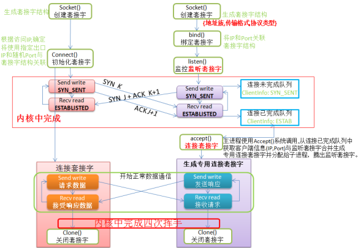

- socket

  ```c
  int socket(AF_INET, SOCK_STREAM, IPPROTO_TCP);
  ```

  1. 生成内核socket结构
     `socket_create`根据指定的协议簇，创建一个内核socket结构绑定到当前进程上
  2. 绑定文件描述符，并将文件描述符传给应用层
     `sock_map_fd()`将内核socket结构与文件描述符列表中的某个文件描述符绑定，之后可以通过查找文件描述符列表来对应内核socket结构

- bind

  ```c
  int bind(int sockfd,  const struct sockaddr, socklen_t addrlen);
  // 第二个参数是一个指向特定协议的地址结构的指针，第三个参数是该地址结构的长度。对于TCP，调用bind函数可以指定一个端口号，或指定一个IP地址，也可以两者都指定，还可以都不指定。
  ```

  服务程序通过分析配置文件，从中解析出想要监听的地址和端口，再加上可以通过`socket()`函数生成的套接字sockfd，就可以使用`bind()`函数将这个套接字绑定到要监听的地址和端口组合"addr:port"上。绑定了端口的套接字可以作为`listen()`函数的监听对象。绑定了地址和端口的套接字就有了源地址和源端口(对服务器自身来说是源)，再加上通过配置文件中指定的协议类型，五元组中就有了其中3个元组。即：`{protocal,src_addr,src_port}` 

  > bind函数内核交互
  >
  > 1. 调用系统调用`sys_bind()`
  > 2. `sock_lookup_light()`函数获得文件描述符对应的内核socket文件指针
  > 3. `Move_addr_to_kernel()`将应用层地址移到内核层
  > 4. 协议簇bind函数绑定协议簇

  当客户端与服务器通过三次握手建链，同步了TCP保障会话的状态序列号(Sequence Number)，窗口大小(Window Size)以及Client的源IP和源端口，这是服务器端的监听套接字就可以构建成完整的专用连接套接字，即五个关键元素组成了新的socket。当然Client也会生成本次于Server通信的**专用连接套接字**。
  所谓五元组，即 `{protocal, Server_src_addr, Server_src_port, Client_dest_addr, Client_dest_port}`,当还处于监听状态时，套接字称为监听套接字，此时它只包含三元组。

- listen

  ```C
  int listen(int sockfd, int backlog);
  // Linux Kernel2.2开始，这个参数只表示已完成队列(accept queue)的最大长度，而/proc/sys/net/ipv4/tcp_max_syn_backlog则用于设置未完成队列(syn queue/syn backlog)的最大长度。/proc/sys/net/core/somaxconn则是硬限制已完成队列的最大长度，默认为128，如果backlog参数大于somaxconn，则backlog会被截短为该硬限制值。
  ```

- connect

  ```C
  int connect(SOCKET s, const struct sockaddr * name, int namelen);
  ```

  而connect()函数则用于向某个已监听的套接字发起连接请求，也就是发起TCP的三次握手过程。从这里可以看出，连接请求方(如客户端)才会使用connect()函数，当然，在发起connect()之前，连接发起方也需要生成一个sockfd，且使用的很可能是绑定了随机端口的套接字。既然connect()函数是向某个套接字发起连接的，自然在使用connect()函数时需要带上连接的目的地，即目标地址和目标端口，这正是服务端的监听套接字上绑定的地址和端口。同时，它还要带上自己的地址和端口，对于服务端来说，这就是连接请求的源地址和源端口。于是，TCP连接的两端的套接字都已经成了五元组的完整格式。

  connect向服务器发送建立TCP连接请求，并包含部分[TCP参数](#TCP三次握手)

  > 报错信息：
  >
  > 1. 调用connect时内核发送一个SYN分节，若无响应则等待6s后再次发送一个，仍无响应则等待24s再发送一个，若总共等了75s后仍未收到响应则返回**ETIMEDOUT**错误；
  > 2. 若对客户的SYN的响应是RST，则表示该服务器主机在我们指定的端口上面没有进程在等待与之连接，例如服务器进程没运行，客户收到RST就马上返回**ECONNREFUSED**错误
  > 3. 若客户发出的SYN在中间的某个路由上引发了一个“destination unreachable”（目的不可达）ICMP错误，客户主机内核保存该消息，并按1中所述的时间间隔发送SYN，在某个规定的时间（4.4BSD规定75s）仍未收到响应，则把保存的ICMP错误作为**EHOSTUNREACH**或**ENETUNREACH**错误返回给进程。

- accept

  ```C
  int accept(int sockfd,struct sockaddr *addr,socklen_t *addrlen);
  ```

  accpet()函数的作用是读取已完成连接队列中的第一项(读完就从队列中移除)，**并对此项生成一个用于后续连接的套接字描述符**

  > 常听到同步连接和异步连接的概念，它们到底是怎么区分的？同步连接的意思是，从监听者监听到某个客户端发送的SYN数据开始，它必须一直等待直到建立连接套接字、并和客户端数据交互结束，在和这个客户端的连接关闭之前，中间不会接收任何其他客户端的连接请求。细致一点解释，那就是同步连接时需要保证socket buffer和app buffer数据保持一致。通常以同步连接的方式处理时，监听者和工作者是同一个进程，例如httpd的prefork模型。而异步连接则可以在建立连接和数据交互的任何一个阶段接收、处理其他连接请求。通常，监听者和工作者不是同一个进程时使用异步连接的方式，例如httpd的event模型，尽管worker模型中监听者和工作者分开了，但是仍采用同步连接，监听者将连接请求接入并创建了连接套接字后，立即交给工作线程，工作线程处理的过程中一直只服务于该客户端直到连接断开，而event模式的异步也仅仅是在工作线程处理特殊的连接(如处于长连接状态的连接)时，可以将它交给监听线程保管而已，对于正常的连接，它仍等价于同步连接的方式，因此httpd的event所谓异步，其实是伪异步。

- 

###### <span id="epoll">[epoll的底层实现原理](https://blog.csdn.net/armlinuxww/article/details/92803381)</span>

接受数据原理：网卡把数据写入内存后，网卡向CPU发出一个中断信号，操作系统便得知新数据到来，通过网卡中度程序去处理数据。

epoll通过两个措施改进select复用机制

1. 功能分离

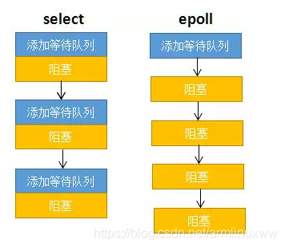
Epoll 的用法。如下的代码中，先用 epoll_create 创建一个 Epoll 对象 Epfd，再通过 epoll_ctl 将需要监视的 Socket 添加到 Epfd 中，最后调用 epoll_wait 等待数据： 

```c
int s = socket(AF_INET, SOCK_STREAM, 0);    
bind(s, ...) 
listen(s, ...) 
 
int epfd = epoll_create(...); 
epoll_ctl(epfd, ...); //将所有需要监听的socket添加到epfd中 
 
while(1){ 
    int n = epoll_wait(...) 
    for(接收到数据的socket){ 
        //处理 
    } 
}
```

1. 就绪列表：Select 低效的另一个原因在于程序不知道哪些 Socket 收到数据，只能一个个遍历。如果内核维护一个“就绪列表”，引用收到数据的 Socket，就能避免遍历。

   

- 创建 Epoll 对象后，可以用 epoll_ctl 添加或删除所要监听的 Socket。当 Socket 收到数据后，中断程序会操作 eventpoll 对象，而不是直接操作进程
- 当 Socket 收到数据后，中断程序会给 eventpoll 的“就绪列表”添加 Socket 引用。
- 当 Socket 接收到数据，中断程序一方面修改 Rdlist，另一方面唤醒 eventpoll 等待队列中的进程，进程 A 再次进入运行状态

epoll实现细节：

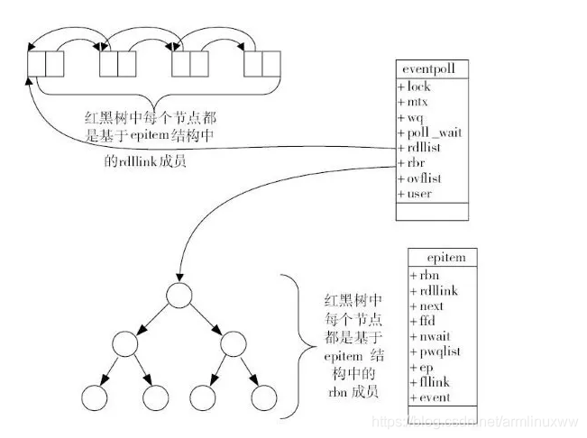

双向链表就是这样一种数据结构，Epoll 使用双向链表来实现就绪队列；既然 Epoll 将“维护监视队列”和“进程阻塞”分离，也意味着需要有个数据结构来保存监视的 Socket，至少要方便地添加和移除，还要便于搜索，以避免重复添加。因为操作系统要兼顾多种功能，以及有更多需要保存的数据，Rdlist 并非直接引用 Socket，而是通过 Epitem 间接引用，红黑树的节点也是 Epitem 对象。

###### [epoll细节补充](https://blog.csdn.net/Eunice_fan1207/article/details/99674021)

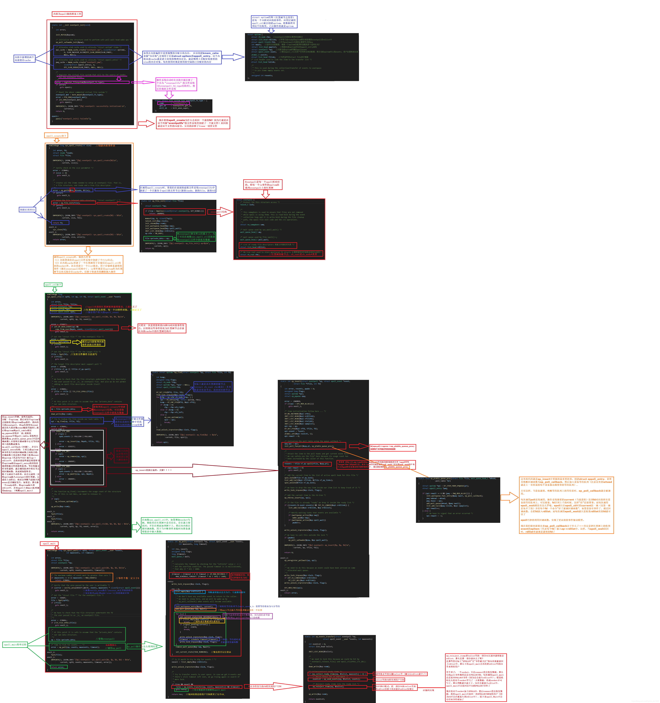

1. 内核为epoll的准备

   这个模块在内核初始化时（操作系统启动）注册了一个新的文件系统，叫"eventpollfs"（在eventpoll_fs_type结构里），然后挂载此文件系统。另外还创建两个内核cache（在内核编程中，如果需要频繁分配小块内存，应该创建kmem_cahe来做“内存池”）,分别用于存放struct epitem和eppoll_entry。这个内核高速cache区，就是建立连续的物理内存页，就是物理上分配好你想要的size的内存对象，每次使用时都是使用空闲的已分配好的内存。

   现在想想epoll_create为什么会返回一个新的fd？

   因为它就是在这个叫做"eventpollfs"的文件系统里创建了一个新文件！返回的就是这个文件的fd索引。完美地遵行了Linux一切皆文件的特色。

2. epoll_create
   在这个实现时，将用户空间epoll_event拷贝到内核中，后续可以将其转化为epitem作为节点存入红黑树中，从eventpoll的红黑树中查找fd所对应的epitem实例（二分搜索），根据传入的op参数行为进行switch判断，对红黑树进行不同的操作。对于ep_insert，首先设置了对应的回调函数，然后调用被监控文件的poll方法（每个支持poll的设备驱动程序都要调用），其实就是在poll里调用了回调函数，这个回调函数实际上不是真正的回调函数，真正的回调函数(ep_poll_callback)在该函数内调用，这个回调函数只是创建了struct eppoll_entry，将真正回调函数和epitem关联起来，之后将其加入设备等待队列。当设备就绪，唤醒等待队列上的等待者，调用对应的真正的回调函数，这个回调函数实际上就是将红黑树上收到event的epitem插入到它的就绪队列中并唤醒调用epoll_wait进程。

   **在ep_insert中还将epitem插入到eventpoll中的红黑树上，然后还会去判断当前插入的event是否是刚好发生，如果是直接将其加入就绪队列，然后唤醒epoll_wait**

3. epoll_wait

   在epoll_wait主要是调用了ep_poll，在ep_poll里直接判断就绪链表有无数据，有数据就返回，没有数据就sleep，等到timeout时间到后即使链表没数据也返回。当有数据时，还需要将内核就绪事件拷贝到传入参数的events中的用户空间，就绪链表中的数据一旦拷贝就没有了，所以这里要区分LT和ET，如果是LT有可能会将后续的重新放入就绪链表。

###### I/O模型

[参考](https://www.cnblogs.com/felixzh/p/10345929.html)


###### Reactor模式和Proactor模式的区别

Reactor和Proactor模式的主要区别就是真正的读取和写入操作是有谁来完成的，Reactor中需要应用程序自己读取或者写入数据，而Proactor模式中，应用程序不需要进行实际的读写过程，它只需要从缓存区读取或者写入即可，操作系统会读取缓存区或者写入缓存区到真正的IO设备.

##### I/O

###### Linux系统写入文件的具体过程

[参考](https://www.cnblogs.com/woainilsr/p/3590765.html)

- 读流程

  1. 应用程序发起读请求，触发系统调用read()函数，用户态切换为内核态；
  2. 文件系统通过目录项→inode→address_space→页缓存树，查询Page Cache是否存在
  3. Page Cache不存在产生缺页中断，CPU向DMA发出控制指令；
  4. DMA 控制器将数据从主存或硬盘拷贝到内核空间（kernel space）的缓冲区（read buffer）；
  5. DMA 磁盘控制器向 CPU 发出数据读完的信号，由 CPU 负责将数据从内核缓冲区拷贝到用户缓冲区；
  6. 用户进程由内核态切换回用户态，获得文件数据；
     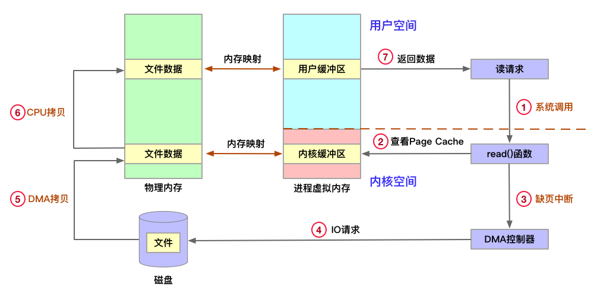

- 写流程

  1. 应用程序发起写请求，触发系统调用write()函数，用户态切换为内核态；

  2. 文件系统通过目录项→inode→address_space→页缓存树，查询Page Cache是否存在，如果不存在则需要创建；

  3. Page Cache存在后，CPU将数据从用户缓冲区拷贝到内核缓冲区，Page Cache变为脏页（Dirty Page），写流程返回；

  4. 用户主动触发刷盘或者达到特定条件内核触发刷盘，唤醒pdflush线程将内核缓冲区的数据刷入磁盘；

     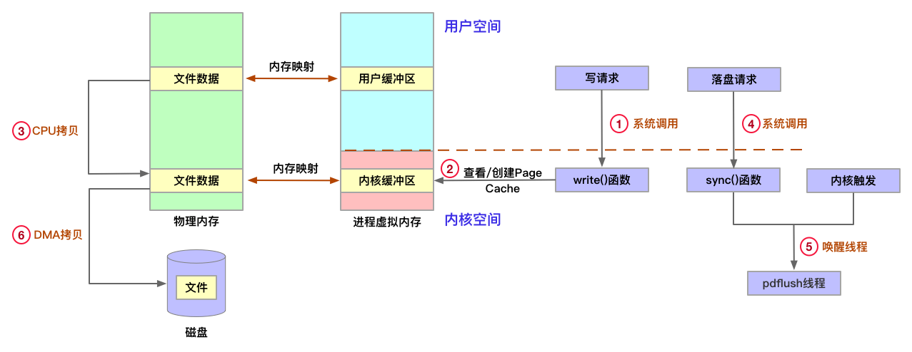

  > pdflush回写时机：
  >
  > 1. 定时方式执行；
  > 2. 内存不足
  > 3. 用户主动触发

###### [read/write和mmap有什么区别](https://blog.csdn.net/wb_snail/article/details/106050632)

- read执行过程：

  1. 操作系统上下文切换到对应的read中断处理程序，并从用户态切换到内核态(权限升级)
  2. DMA将文件数据从磁盘读到pageCache
  3. CPU将数据从pageCache拷贝到用户缓冲区
  4. 上下文切换回用户程序，切换到用户态，read返回

- write执行过程：

  1. 操作系统上下文切换到对应的write中断处理程序，并且从用户态切换到内核态(权限升级)
  2. CPU将数据从用户缓冲区拷贝到pageCache
  3. 上下文切换回应用程序，并切回用户态，write返回(到这里write就结束了)
  4. DMA将数据从pageCache写到磁盘中

  > pageCache: 操作系统会为**每个文件单独维护**一个pageCache，其本质是内核中的一段内存，用户进程对于文件的大多数读写操作会直接作用到pageCache上，相当于一次纯内存操作，操作系统会在适当的时候将pageCache中的内容写到磁盘上（当然我们可以手工fsync控制回写），这样可以大大减少磁盘的访问次数，从而提高读写性能
  >
  > DMA:在没有DMA时，所有的IO操作都由CPU亲力亲为，相对于CPU的风驰电掣来说(ns级)，IO的速度真可谓龟速慢爬了(ms级)，发起IO操作后，CPU只能一直忙等直到IO完成，这就造成CPU资源的极大浪费。DMA的引入就是为了将CPU从IO操作中解放出来，简单来说，DMA是一组芯片，专门负责和与硬件IO设备进行数据交互，控制数据传输。有了DMA后，CPU只需告诉DMA，要传啥数据，从哪来，到哪去，就可以放心离开了，实际传输工作由DMA完成，现在的硬件设备中都加上了DMA芯片，使得CPU很少需要再关心数据传输工作了

- mmap执行过程：

  1. 从发出mmap调用的进程地址空间中划出一段连续的虚拟地址空间
  2. 建立页表，维护虚拟地址空间与文件地址的映射关系
  3. 进程发起对这块虚拟地址空间的访问，发现文件数据并不在内存页中，引发缺页异常
  4. 操作系统将磁盘数据拷贝到pageCache中
  5. 程通过普通的内存读写即可访问到pageCache，也就是读写文件

- mmap和read/write

  mmap比read write操作多出来的步骤：① 建立映射关系 ② 处理缺页中断

  比read write操作节省的步骤：每次读写操作可以省去 ① 一次数据在用户空间与pageCache间的拷贝 ② 一次上下文切换

  对于一个文件来说，映射关系只要建立一次即可，一个页也只会触发一次缺页中断。所以在文件映射完成后，如果需要对该文件进行**大量的读写**，那mmap就很有优势，因为节省了大量的数据拷贝和内存开销，比如消息队列的场景中，会大量读写消息日志，这就非常适合采用mmap

  那我们就知道了，**mmap的适用场景是读写大文件**，如果文件很小，使用mmap带来的额外开销比节省的开销大，所以使用普通的read write效果更好

###### [I/O模型分析](https://blog.csdn.net/sehanlingfeng/article/details/78920423)

1. 同步阻塞I/O

   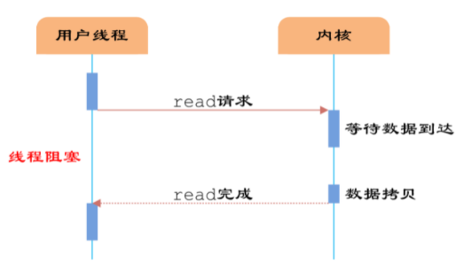

   用户线程通过系统调用read发起IO读操作，由用户空间转到内核空间。内核等到数据包到达后，然后将接收的数据拷贝到用户空间，完成read操作。
   即用户需要等待read将socket中的数据读取到buffer后，才继续处理接收的数据。整个IO请求的过程中，用户线程是被阻塞的，这导致用户在发起IO请求时，不能做任何事情，对CPU的资源利用率不够。

2. 同步非阻塞I/O

   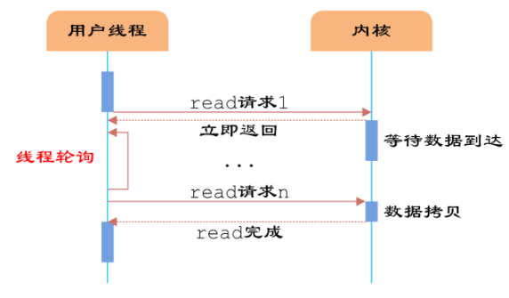

   由于socket是非阻塞的方式，因此用户线程发起IO请求时立即返回。但并未读取到任何数据，用户线程需要不断地发起IO请求，直到数据到达后，才真正读取到数据，继续执行。即用户需要**不断地调用read**，尝试读取socket中的数据，直到读取成功后，才继续处理接收的数据。整个IO请求的过程中，虽然用户线程每次发起IO请求后可以立即返回，但是为了等到数据，仍需要**不断地轮询、重复请求，消耗了大量的CPU的资源**。一般很少直接使用这种模型，而是在其他IO模型中使用非阻塞IO这一特性。

3. I/O多路复用

   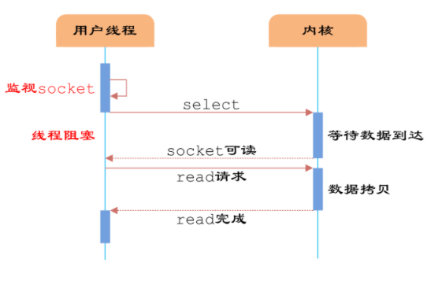

   用户首先将需要进行IO操作的socket添加到select中，然后阻塞等待select系统调用返回。当数据到达时，socket被激活，select函数返回。用户线程正式发起read请求，读取数据并继续执行。使用select函数进行IO请求和同步阻塞模型没有太大的区别，甚至还多了添加监视socket，以及调用select函数的额外操作，效率更差。但是，**使用select以后最大的优势是用户可以在一个线程内同时处理多个socket的IO请求**。用户可以注册多个socket，然后不断地调用select读取被激活的socket，即可达到在同一个线程内同时处理多个IO请求的目的。而在同步阻塞模型中，必须通过多线程的方式才能达到这个目的。

   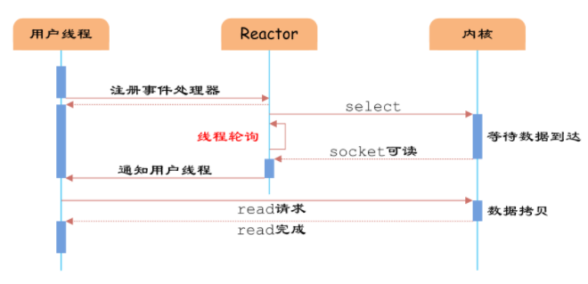

   IO多路复用是最常使用的IO模型，但是其异步程度还不够“彻底”，因为它使用了会阻塞线程的select系统调用。因此IO多路复用只能称为异步阻塞IO，而非真正的异步IO。

4. 异步I/O
   “真正”的异步IO需要操作系统更强的支持。在IO多路复用模型中，事件循环将文件句柄的状态事件通知给用户线程，由用户线程自行读取数据、处理数据。而在异步IO模型中，当用户线程收到通知时，数据已经被内核读取完毕，并放在了用户线程指定的缓冲区内，内核在IO完成后通知用户线程直接使用即可。

   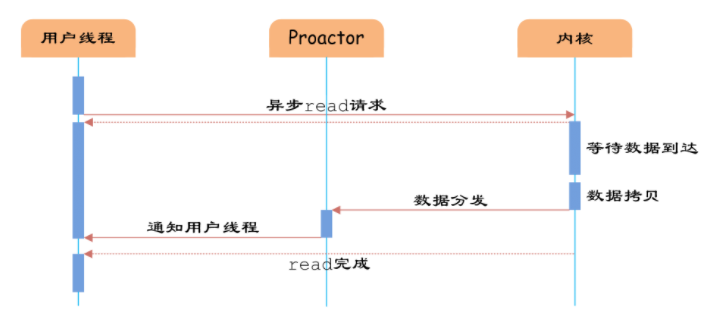

###### 多路复用I/O相关

在多路复用IO模型中，会有一个线程不断去轮询多个socket的状态，只有当socket真正有读写事件时，才真正调用实际的IO读写操作。因为在多路复用IO模型中，只需要使用一个线程就可以管理多个socket，系统不需要建立新的进程或者线程，也不必维护这些线程和进程，并且只有在真正有socket读写事件进行时，才会使用IO资源，所以它大大减少了资源占用。
实现方式：

1. select：它仅仅知道了，有I/O事件发生了，却并不知道是哪那几个流（可能有一个，多个，甚至全部），我们只能无差别轮询所有流，找出能读出数据，或者写入数据的流，对他们进行操作。所以**select具有O(n)的无差别轮询复杂度**，同时处理的流越多，无差别轮询时间就越长。
2. poll：poll本质上和select没有区别，它将用户传入的数组拷贝到内核空间，然后查询每个fd对应的设备状态， **但是它没有最大连接数的限制**，原因是它是基于链表来存储的.
3. [epoll](#epoll)

##### 线程进程

###### copy on write

[参考](https://blog.csdn.net/qq_34556414/article/details/108399543)
	
按照传统方法，直接将父进程数据拷贝到子进程中，拷贝完成后，父进程和子进程之间的数据段相互独立。但是子进程被fork出来往往并不是和父进程做同一件事情的，往往子进程都会执行`exec()`来做自己想要实现的功能，所以如果按照上面的做法，创建子进程时复制过去的数据是没用的(因为子进程执行`exec()`，原有的数据会被清空)
COW技术实现原理：我们在fork出子进程后，将父进程中的所有内存页权限设为"read-only"，子进程地址空间指向父进程，当只读内存相安无事，当其中某个进程写内存时，CPU硬件检测到内存页是read-only的，于是触发页异常中断（page-fault），陷入kernel的一个中断例程。中断例程中，kernel就会 **把触发的异常的页复制一份**，于是父子进程各自持有独立的一份。但是当父进程也进行写操作时，**就会触发大量的分页错误**，这样得不偿失

###### [线程资源](https://blog.csdn.net/xchysl/article/details/78634035)

- 线程共享资源：进程代码段、进程的公有数据(利用这些共享的数据，线程很容易的实现相互之间的通讯)、进程打开的文件描述符、信号的处理器、进程的当前目录和进程用户ID与进程组ID。
- 线程独享资源：
  1. 线程ID：每个线程都有自己的线程ID，这个ID在本进程中是唯一的。进程用此来标识线程。
  2. 寄存器组的值：由于线程间是并发运行的，每个线程有自己不同的运行线索，当从一个线程切换到另一个线程上 时，必须将原有的线程的寄存器集合的状态保存，以便将来该线程在被重新切换到时能得以恢复。
  3. 堆栈： 堆栈是保证线程独立运行所必须的；线程函数可以调用函数，而被调用函数中又是可以层层嵌套的，所以线程必须拥有自己的函数堆栈，使得函数调用可以正常执行，不受其他线程的影响。
  4. 错误返回码：由于同一个进程中有很多个线程在同时运行，可能某个线程进行系统调用后设置了errno值，而在该 线程还没有处理这个错误，另外一个线程就在此时被调度器投入运行，这样错误值就有可能被修改。所以，不同的线程应该拥有自己的错误返回码变量。
  5. 线程的信号屏蔽码：由于每个线程所感兴趣的信号不同，所以线程的信号屏蔽码应该由线程自己管理。但所有的线程都共享同样的信号处理器。
  6. 线程的优先级：由于线程需要像进程那样能够被调度，那么就必须要有可供调度使用的参数，这个参数就是线程的优先级。

###### [线程切换](https://blog.csdn.net/snvjd/article/details/102963259)

1. 线程等待（wait）
   调用该方法的线程进入 WAITING 状态，只有等待另外线程的通知或被中断才会返回，需要注意的是调用 wait()方法后，会释放对象的锁。因此，wait 方法一般用在同步方法或同步代码块中。
2. 线程睡眠（sleep）
   sleep 导致当前线程休眠，与 wait 方法不同的是 sleep 不会释放当前占有的锁,sleep(long)会导致线程进入 TIMED-WATING 状态，而 wait()方法会导致当前线程进入 WATING 状态
3. 线程让步（yield）
   yield 会使当前线程让出 CPU 执行时间片，与其他线程一起重新竞争 CPU 时间片。一般情况下，优先级高的线程有更大的可能性成功竞争得到 CPU 时间片，但这又不是绝对的，有的操作系统对线程优先级并不敏感。
4. 线程中断（interrupt）
   中断一个线程，其本意是给这个线程一个通知信号，会影响这个线程内部的一个中断标识位。这个线程本身并不会因此而改变状态(如阻塞，终止等)。

###### 线程和进程的区别

1. 进程是具有一定独立功能的程序关于某个数据集合上的一次运行活动,进程是系统进行资源分配和调度的一个独立单位。

2. 线程是进程的一个实体, 是CPU调度和分派的基本单位,它是比进程更小的能独立运行的基本单位.线程自己基本上不拥有系统资源,只拥有一点在运行中必不可少的资源(如程序计数器,一组寄存器和栈),但是它可与同属一个进程的其他的线程共享进程所拥有的全部资源。

3. 一个线程可以创建和撤销另一个线程，同一个进程中的多个线程之间可以并发执行。

   > 进程和线程的主要差别在于它们是不同的操作系统资源管理方式。进程有独立的地址空间，一个进程崩溃后，在保护模式下不会对其它进程产生影响，而线程只是一个进程中的不同执行路径。线程有自己的堆栈和局部变量，但线程之间没有单独的地址空间，一个线程死掉就等于整个进程死掉，所以多进程的程序要比多线程的程序 健壮，但在进程切换时，耗费资源较大，效率要差一些。但对于一些要求同时进行并且又要共享某些变量的并发操作，只能用线程，不能用进程。

###### 进程的内存布局

1. 栈，也叫堆栈（这个叫法说实话真不像一个程序员叫出来的），向下生长。数据结构中，我们学习过栈，这里的栈就是数据结构中学习的那种结构，LIFO（后进先出）。C语言要想顺利的运行必须要有栈，栈是存放临时变量、函数调用现场等的内存空间。C语言中定义的普通局部变量就在栈中分配内存。

2. 堆是程序运行时能够自由分配的一段内存空间，向上生长。正由于其非常自由，所以很多的程序安全问题发生于此。例如臭名昭著的“内存泄漏”，就会发生在这里。当你不断地向获取内存，而不释放，那么堆就会越来越小，最后无法完成分配的工作时，程序也将发生异常。C语言中，我们使用malloc，calloc,realloc函数来申请对内存，请记住，有借一定要有还（free）。

3. 数据段分为.bss段和.data段。未初始化的全局变量和静态局部变量存放于bss段。bss段会被初始化为0，这也正是全局变量和静态局部变量不初始化也会是0的原因。已经初始化的全局变量和静态局部变量存放于data段，这个初始值从程序文件中复制而来。

4. 代码段分为.rodata，.text和.init。const修饰的全局变量和一些字面值常量存放于rodata段，这段内存是只读的。text段存放的是程序指令。init段则用来给用户程序添加一些“初始化”的代码，包括环境变量的准备，命令行参数的组织和传递等，并将这部分数据之余栈底。

   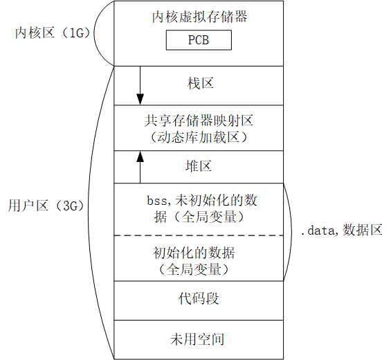

###### 多进程的优缺点

- 优点
  1. 进程之间独立，不影响主程序的稳定性，子进程崩溃没有关系
  2. 通过增加CPU，就可以
  3. 扩充性能
  4. 可以尽量减少线程加锁/解锁的影响，极大提高性能，就算是线程运行的模块算法效率低也没关系
  5. 由于进程之间独享内存空间，性能的上限大
- 缺点
  1. 程序逻辑复杂，需要和主程序交互
  2. 需要跨进程边界，如果有大数据量传送，就不太好，适合小数据量传送、密集运算
  3. 多进程调度开销较大

###### 多线程的优缺点

- 优点
  1. 程序逻辑简单，无需跨越进程边界
  2. 同属于一个进程的方式可以直接共享内存和变量
  3. 线程消耗的资源较进程小
- 缺点
  1. 每个线程与主程序共用地址空间，受限于2GB地址空间；
  2. 线程之间的同步和加锁控制比较麻烦；
  3. 线程的崩溃会影响到整个程序的稳定性
  4. 到达一定的线程数程度后，即使再增加CPU也无法提高性能
  5. 线程能够提高的总性能有限，而且线程多了之后，线程本身的调度也是一个麻烦事儿，需要消耗较多的CPU

###### 进程间通讯方式

- 管道pipe：管道是一种半双工的通信方式，数据只能单向流动，而且只能在具有亲缘关系的进程间使用。进程的亲缘关系通常是指父子进程关系。

  > [管道相关知识](https://blog.csdn.net/qq_38410730/article/details/81569852)
  >
  > 管道和共享内存的区别
  >
  > 1. 管道需要在内核和用空间进行四次数据拷贝，由用户空间的buf中将数据拷贝到内核中 -> 内核将数据拷贝到内存中 -> 内存到内核 -> 内核到用户空间的buf。而共享内存则只拷贝两次数据：用户空间到内存 -> 内存到用户空间。
  > 2. 管道用循环队列实现，传输的数据大小不限；共享内存每次传递的数据大小是相同的
  > 3. 共享内存可以随机访问被映射文件的任意位置，管道只能够顺序读写
  >
  > 由于子进程会继承父进程的资源，包括文件描述符。所以可以打开匿名管道这样的无文件名的文件，非亲属进程不能够打开匿名管道，所以衍生出命名管道进程间通讯方式
  >
  > 函数pipe()将在参数fildes中为进程返回这个文件的两个文件描述符`fildes[0]`和`fildes[1]`。其中，`fildes[0]`是一个具有“只读”属性的文件描述符，`fildes[1]`是一个具有“只写”属性的文件描述符，即进程通过`fildes[0]`只能进行文件的读操作，而通过`fildes[1]`只能进行文件的写操作。
  >
  > 管道的局限性：
  >
  > 1. 由于管道建立在内存中，所以它的容量不可能很大；
  > 2. 管道所传送的是无格式字节流，这就要求使用管道的双方实现必须对传输的数据格式进行约定。
- 命名管道FIFO：有名管道也是半双工的通信方式，但是它允许无亲缘关系进程间的通信。

- 消息队列MessageQueue：消息队列是由消息的链表，存放在内核中并由消息队列标识符标识。消息队列克服了信号传递信息少、管道只能承载无格式字节流以及缓冲区大小受限等缺点。

- 共享存储SharedMemory：共享内存就是映射一段能被其他进程所访问的内存，这段共享内存由一个进程创建，但多个进程都可以访问。共享内存是最快的 IPC 方式，它是针对其他进程间通信方式运行效率低而专门设计的。它往往与其他通信机制，如信号量，配合使用，来实现进程间的同步和通信。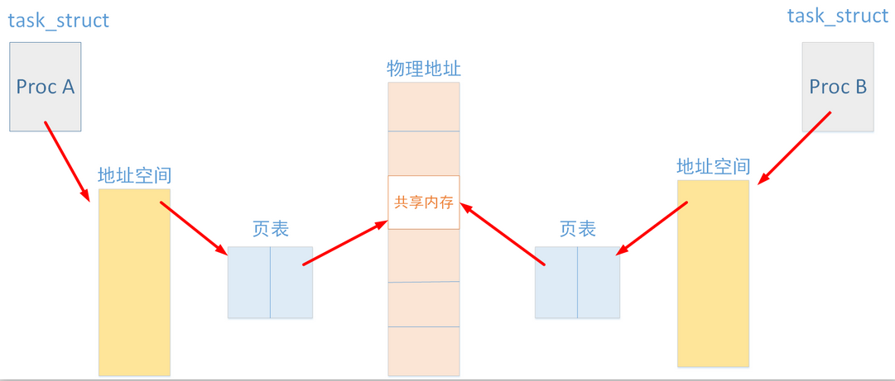

- 套接字Socket：套解口也是一种进程间通信机制，与其他通信机制不同的是，它可用于不同及其间的进程通信。

- 信号 ( sinal ) ： 信号是一种比较复杂的通信方式，用于通知接收进程某个事件已经发生。

###### 线程间通讯方式

- 互斥锁提供了以排他方式防止数据结构被并发修改的方法。
- 读写锁允许多个线程同时读共享数据，而对写操作是互斥的。
- 条件变量可以以原子的方式阻塞进程，直到某个特定条件为真为止。对条件的测试是在互斥锁的保护下进行的。条件变量始终与互斥锁一起使用。
  等待条件变量(pthread_cond_wait)可依次拆分为三个操作：**释放互斥锁、等待在条件变量上、再次获取互斥锁**。
  判断如果没有商品，则释放互斥锁，等待在条件变量上；当生产者生产了商品后，消费者立刻被唤醒，又再次获取互斥锁，重复以上的逻辑。
  并且条件变量并不会引起惊群效应，条件变量会根据线程优先级唤醒线程，不会存在唤醒全部争抢资源的情况
- 信号量机制(Semaphore)：包括无名线程信号量和命名线程信号量。信号量是一个计数器，可以用来控制多个进程对共享资源的访问。它常作为一种锁机制，防止某进程正在访问共享资源时，其他进程也访问该资源。因此，主要作为进程间以及同一进程内不同线程之间的同步手段。
- 信号机制(Signal)： 类似进程间的信号处理

###### 线程同步方式

1. 临界区：是一段独占对某些共享资源访问的代码，在任意时刻只允许一个线程对共享资源进行访问。如果有多个线程试图同时访问临界区，那么在有一个线程进入后其他所有试图访问此临界区的线程将被挂起，并一直持续到进入临界区的线程离开。临界区在被释放后，其他线程可以继续抢占，并以此达到用原子方式操作共享资源的目的。
2. 事件：是WIN32提供的最灵活的线程间同步方式，事件可以处于激发状态(signaled or true)或未激发状态(unsignal or false)。
3. 信号量：是维护0到指定最大值之间的同步对象。信号量状态在其计数大于0时是有信号的，而其计数是0时是无信号的。
4. 互斥量：采用互斥对象机制。 只有拥有互斥对象的线程才有访问公共资源的权限，因为互斥对象只有一个，所以能保证公共资源不会同时被多个线程访问。互斥不仅能实现同一应用程序的公共资源安全共享，还能实现不同应用程序的公共资源安全共享。

###### 线程的内存空间占用

创建一个线程会单独给线程分配一个调用栈，增加的空间就是调用栈的大小，具体可以根据`ulimit -s`查询线程堆栈大小

###### 互斥锁和信号量的作用和区别

1. 信号量用在多线程多任务同步的，一个线程完成了某一个动作就通过信号量告诉别的线程，别的线程再进行某些动作；

2. 互斥锁是用在多线程多任务互斥的，一个线程占用了某一个资源，那么别的线程就无法访问，直到这个线程unlock，其他的线程才开始可以利用这 个资源。比如对全局变量的访问，有时要加锁，操作完了，在解锁。有的时候锁和信号量会同时使用的

   > 信号量不一定是锁住某一个资源，还可以是进行一些计算或者数据处理之类的工作

###### 进程切换的开销

[参考](https://blog.csdn.net/guangcheng0312q/article/details/110358905)

1. 切换虚拟地址空间
2. 切换CPU上下文
3. 切换内核态

###### 线程切换的开销

1. 切换CPU上下文
2. 切换内核态

###### 进程内存模型


PCB（进程控制块）

1. PCB是进程存在的数据结构，系统通过PCB的存在而感知进程的存在		
2. 系统通过PCB对进程进行调度和管理
3. 进程(PCB)与PID是一对一关系，而与程序文件之间是多对一关系	

###### 进程状态转换图

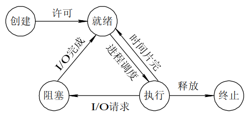

1. 创建
   一个应用程序从系统上启动，首先就是进入创建状态，需要获取系统资源创建进程管理块完成资源分配
2. 就绪
   在创建状态完成之后，进程已经准备好，但是还未获得处理器资源，无法运行
3. 运行
   获取处理器资源，被系统调度，开始进入运行状态。如果进程的时间片用完了就进入就绪状态
4. 阻塞
   在运行状态期间，如果进行了阻塞的操作，如耗时的I/O操作，此时进程暂时无法操作就进入到了阻塞状态，在这些操作完成后就进入就绪状态
5. 终止
   进程结束或者被系统终止，进入终止状态

###### 线/进程调度的算法

1. 最短工作优先
2. 最短剩余时间优先
3. 最高响应比优先
4. 优先级调度
5. 轮转调度

###### 协程(腾讯面试被问到)

[参考](https://www.jianshu.com/p/6dde7f92951e)

- 协程是比线程更轻量，一个进程可以拥有多个线程，一个线程可以拥有多个协程
- 协程不是被操作系统内核所管理的，而是完全由程序所控制，也就是在用户态执行。这样带来的好处是性能大幅度的提升，因为不会像线程切换那样消耗资源。
- 一个线程内的协程一定是串行执行的，没有办法像进程和线程那样利用CPU的多核能力

###### 僵尸进程和孤儿进程

- 僵尸进程：一个进程使用fork创建子进程，如果子进程退出，而父进程并没有调用wait/waitpid获取子进程的状态信息，那么子进程的进程描述符仍然保存在系统中。这种进程称之为僵尸进程。在每个进程退出的时候,内核释放该进程所有的资源,包括打开的文件,占用的内存等。 但是仍然为其保留一定的信息直到父进程通过wait / waitpid来取时才释放。 但这样就导致了问题，如果进程不调用wait / waitpid的话， 那么**保留的那段信息就不会释放，其进程号就会一直被占用**，但是系统所能使用的进程号是有限的，如果大量的产生僵死进程，将因为没有可用的进程号而导致系统不能产生新的进程. 
- 孤儿进程：一个父进程退出，而他的一个或多个子进程还在运行，那么这些子进程将成为孤儿进程，孤儿进程将被init进程(进程号为1的进程)所收养，并由init进程对它们完成状态收集工作，因此**孤儿进程并不会有什么危害。**

###### 僵尸进程的回收方式

1. 让僵尸进程变成孤儿进程，由init回收，就是让父亲先死
2. 采用信号SIGCHLD通知处理，并在信号处理程序中调用wait函数
3. 让僵尸进程的父进程来回收，父进程每隔一段时间来查询子进程是否结束并回收，调用wait()或者waitpid(),通知内核释放僵尸进程

##### 锁相关

###### 乐观锁和悲观锁实现原理

- 悲观锁：每次去拿数据的时候都认为别人会修改。所以每次在拿数据的时候都会上锁。这样别人想拿数据就被挡住，直到悲观锁被释放，**悲观锁中的共享资源每次只给一个线程使用，其它线程阻塞，用完后再把资源转让给其它线程**

  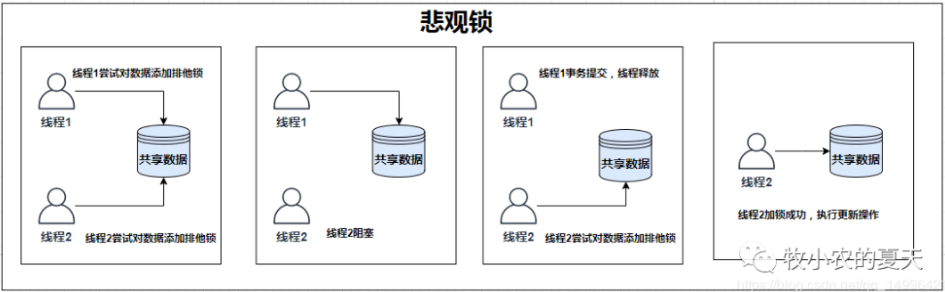

- 乐观锁：每次去拿数据的时候都认为别人不会修改。所以不会上锁，但是如果想要更新数据，则会在更新前检查在读取至更新这段时间别人有没有修改过这个数据。如果修改过，则重新读取，再次尝试更新，循环上述步骤直到更新成功(当然也允许更新失败的线程放弃操作),乐观锁适用于多读的应用类型，这样可以提高吞吐量

  


###### 死锁以及死锁产生的原因

- 死锁：多个进程在运行过程中因抢夺资源造成的僵局，无外力作用他们都将无法向前推进

  > 产生的四个必要条件：
  >
  > 1. 互斥条件：进程要求对所分配的资源进行排它性控制，即在一段时间内某资源仅为一进程所占用。
  > 2. 请求和保持条件：当进程因请求资源而阻塞时，对已获得的资源保持不放。
  > 3. 不剥夺条件：进程已获得的资源在未使用完之前，不能剥夺，只能在使用完时由自己释放。
  > 4. 环路等待条件：在发生死锁时，必然存在一个进程--资源的环形链。

- 预防死锁

  1. 资源一次性分配：一次性分配所有资源，这样就不会再有请求了：（破坏请求条件）

  2. 只要有一个资源得不到分配，也不给这个进程分配其他的资源：（破坏请保持条件）

  3. 可剥夺资源：即当某进程获得了部分资源，但得不到其它资源，则释放已占有的资源（破坏不可剥夺条件）

  4. 资源有序分配法：系统给每类资源赋予一个编号，每一个进程按编号递增的顺序请求资源，释放则相反（破坏环路等待条件）

     > **银行家算法**

###### 互斥锁和读写锁的区别

1. 互斥锁：保证在任意时刻，都只能有一个线程访问该对象，获取锁的操作失败，线程会进入睡眠状态，等待锁释放被唤醒
2. 读写锁：写锁只允许一个写者，但是允许多个读者进行读对象

##### 内存管理

###### 段氏存储和页式存储分别解决了什么问题

​	页是信息的物理单位，分页是为了实现离散分配方式，以消减内存的外零头，提高内存的利用率。段则是信息的逻辑单位，它含有一组其意义相对完整的信息。分段的目的是为了更好的满足用户的需要。

##### 虚拟地址转换流程

- 使用虚拟地址的好处：①在支持多进程的系统中，如果各个进程的镜像文件都使用物理地址，则在加载到同一物理内存空间的时候，可能发生冲突；②直接使用物理地址，不便于进行进程地址空间的隔离；③物理内存是有限的，在物理内存整体吃紧的时候，可以让多个进程通过分时复用的方法共享一个物理页面（某个进程需要保存的内容可以暂时swap到外部的disk/flash），这有点类似于多线程分时复用共享CPU的方式。

##### 用户态转内核态的转换

1. 系统调用：用户态进程主动要求切换到内核态的一种方式，用户态进程通过系统调用申请使用操作系统提供的服务程序完成工作，比如前例中fork()实际上就是执行了一个创建新进程的系统调用。而系统调用的机制其核心还是使用了操作系统为用户特别开放的一个中断来实现
2. 异常：当CPU在执行运行在用户态下的程序时，发生了某些事先不可知的异常，这时会触发由当前运行进程切换到处理此异常的内核相关程序中，也就转到了内核态，比如缺页异常。
3. 外围设备的中断：当外围设备完成用户请求的操作后，会向CPU发出相应的中断信号，这时CPU会暂停执行下一条即将要执行的指令转而去执行与中断信号对应的处理程序，如果先前执行的指令是用户态下的程序，那么这个转换的过程自然也就发生了由用户态到内核态的切换。比如硬盘读写操作完成，系统会切换到硬盘读写的中断处理程序中执行后续操作等。

##### 互斥和同步的关系

- 互斥是指某一资源同时只允许一个访问者对其进行访问，具有唯一性和排它性。但互斥无法限制访问者对资源的访问顺序，即访问是无序的。
- 同步是指在互斥的基础上（大多数情况），通过其它机制实现访问者对资源的有序访问。
- 同步其实已经实现了互斥，所以同步是一种更为复杂的互斥。
- 互斥是一种特殊的同步。

##### 同步和异步

所谓同步，就是在发出一个"调用"时，在没有得到结果之前，该“调用”就不返回。但是一旦调用返回，就得到返回值了。换句话说，就是由“调用者”主动等待这个“调用”的结果。而异步则是相反，"调用"在发出之后，这个调用就直接返回了，所以没有返回结果。换句话说，当一个异步过程调用发出后，调用者不会立刻得到结果。而是在"调用"发出后，"被调用者"通过状态、通知来通知调用者，或通过回调函数处理这个调用

##### 阻塞和非阻塞

强调的是程序在等待调用结果（消息，返回值）时的状态. 阻塞调用是指调用结果返回之前，当前线程会被挂起。调用线程只有在得到结果之后才会返回。非阻塞调用指在不能立刻得到结果之前，该调用不会阻塞当前线程。 对于同步调用来说，很多时候当前线程还是激活的状态，只是从逻辑上当前函数没有返回而已，即同步等待时什么都不干，白白占用着资源。

##### kill结束一个进程的过程

<pre> 1) SIGHUP	    2) SIGINT	     3) SIGQUIT	     4) SIGILL	     5) SIGTRAP
 6) SIGABRT	    7) SIGBUS	     8) SIGFPE	     9) SIGKILL	    10) SIGUSR1
11) SIGSEGV	    12) SIGUSR2	    13) SIGPIPE	    14) SIGALRM	    15) SIGTERM
16) SIGSTKFLT	17) SIGCHLD	    18) SIGCONT	    19) SIGSTOP	    20) SIGTSTP
21) SIGTTIN	    22) SIGTTOU	    23) SIGURG	    24) SIGXCPU	    25) SIGXFSZ
26) SIGVTALRM	27) SIGPROF	    28) SIGWINCH	29) SIGIO	    30) SIGPWR
31) SIGSYS	    34) SIGRTMIN	35) SIGRTMIN+1	36) SIGRTMIN+2	37) SIGRTMIN+3
38) SIGRTMIN+4	39) SIGRTMIN+5	40) SIGRTMIN+6	41) SIGRTMIN+7	42) SIGRTMIN+8
43) SIGRTMIN+9	44) SIGRTMIN+10	45) SIGRTMIN+11	46) SIGRTMIN+12	47) SIGRTMIN+13
48) SIGRTMIN+14	49) SIGRTMIN+15	50) SIGRTMAX-14	51) SIGRTMAX-13	52) SIGRTMAX-12
53) SIGRTMAX-11	54) SIGRTMAX-10	55) SIGRTMAX-9	56) SIGRTMAX-8	57) SIGRTMAX-7
58) SIGRTMAX-6	59) SIGRTMAX-5	60) SIGRTMAX-4	61) SIGRTMAX-3	62) SIGRTMAX-2
63) SIGRTMAX-1	64) SIGRTMAX  </pre>
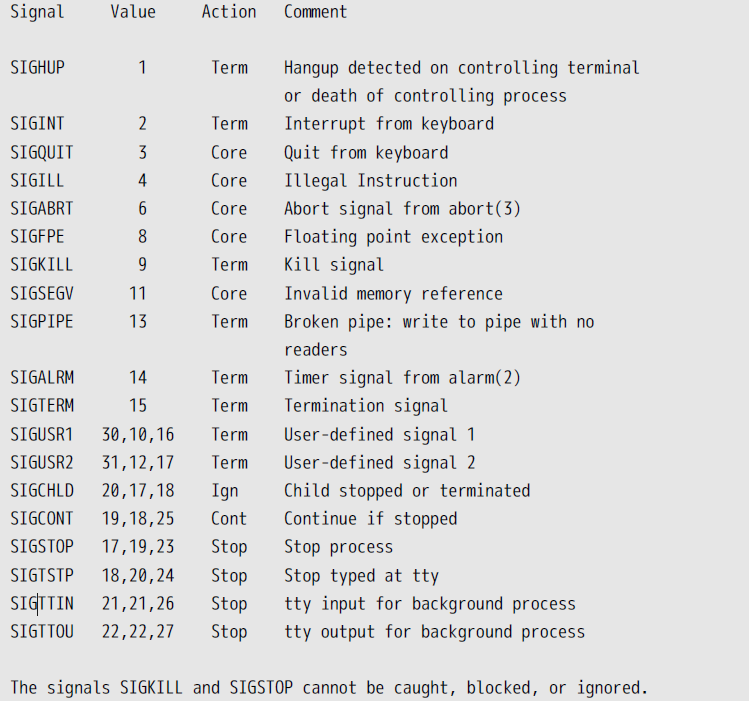

​	linux下可以通过信号机制来实现程序的软中断，是一个非常有用的编程方法。我们平时在程序运行的时候按下ctrl-c、ctrl-z或者kill一个进程的时候其实都等效于向这个进程发送了一个特定信号，当进程捕获到信号后，进程会被中断并立即跳转到信号处理函数。默认情况下一个程序对ctrl-c发出的信号（SIGINT）的处理方式是退出进程，所以当我们按下ctrl-c的时候就可以终止一个进程的运行。

##### 查看网络连接情况的命令

[参考](https://www.cnblogs.com/shamao/p/11278958.html)

##### CPU与外设交互方式

1. 查询方式：外设的接口处有**Ready标志位**，CPU想要和外设之间进行数据交互，就要**先查询接口的标志位**。
    **询问**外设是否准备就绪，如果没有准备就绪，CPU一会儿再来访问；如果外设准备就绪，进行数据传输。
    特点：**由程序发起IO请求，并且等待完成；交互必须通过CPU的参与。**
2. 无条件传输方式：无条件传输方式是一种**同步交互方式**。这种操作方式需要外设与CPU进行过完美的同步，
   保证每次CPU来读的时候，外设的数据都已经准备好了。
3. 中断方式： IO能力强，以内存为中心，直接与外设进行数据交换，传输过程几乎不需要CPU参与
4. 通道方式：通道是一种用来控制内存和外设交互的**专门部件**。通道有自己**独立的指令系统**，可以脱离CPU独立运行，也可以受控于CPU，常用在大型计算机中。
5. DMA方式：CPU把总线控制权交给DMAC，进入DMA方式，完成数据传输之后，DMAC交还总线控制权。特点：开始和结束的时候，向CPU交换**总线控制权**，**数据传输过程**不需要CPU介入

##### 查看内存使用的命令

[内存使用情况命令](https://www.cnblogs.com/mengchunchen/p/9669704.html)

##### 虚拟内存和物理内存的联系

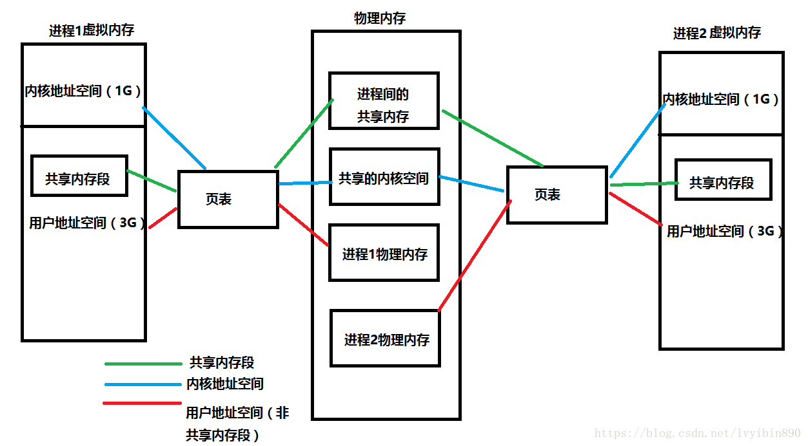

#### 数据库

##### 基本概念

###### 三大范式

- 第一范式(确保每列保持原子性)：第一范式是最基本的范式。如果数据库表中的所有字段值都是不可分解的原子值，就说明该数据库表满足了第一范式。
  第一范式的合理遵循需要根据系统的实际需求来定。比如某些数据库系统中需要用到“地址”这个属性，本来直接将“地址”属性设计成一个数据库表的字段就行。但是如果系统经常会访问“地址”属性中的“城市”部分，那么就非要将“地址”这个属性重新拆分为省份、城市、详细地址等多个部分进行存储，这样在对地址中某一部分操作的时候将非常方便。这样设计才算满足了数据库的第一范式，如下表所示。
- 第二范式(确保表中的每列都和主键相关)：第二范式在第一范式的基础之上更进一层。第二范式需要确保数据库表中的每一列都和主键相关，而不能只与主键的某一部分相关（主要针对联合主键而言）。也就是说在一个数据库表中，一个表中只能保存一种数据，不可以把多种数据保存在同一张数据库表中。
  **数据冗余、更新异常、插入异常、删除异常**
- 第三范式(确保每列都和主键列直接相关,而不是间接相关)：第三范式需要确保数据表中的每一列数据都和主键直接相关，而不能间接相关。
  **每一个非主的属性既不部分依赖于也不可以传递依赖于业务主键，也就是在第二范式的基础上，消除了非主属性对主键的传递依赖**

###### 语句的书写和执行顺序

```mysql
select
<要返回的数据列>
from
<表名>
<join, left join, right join...> join
<join表>
on
<join条件>
where
<where条件>
group by
<分组条件>
having
<分组后的筛选条件>
order by
<排序条件>
limit
<行数限制>

# 实际执行顺序
from
<表名> # 笛卡尔积
on
<筛选条件> #对笛卡尔积的虚表进行筛选
<join, left join, right join...> join
<join表> #指定join，用于添加数据到on之后的虚表中，例如left join会将左表的剩余数据添加到虚表中
where
<where条件> #对上述虚表进行筛选
group by
<分组条件> #分组
<sum()等聚合函数> #用于having子句进行判断，在书写上这类聚合函数是写在having判断里面的
having
<分组筛选> #对分组后的结果进行聚合筛选
select
<返回数据列表> #返回的单列必须在group by子句中，聚合函数除外
distinct
order by
<排序条件> #排序
limit
<行数限制>
```

###### [mysql框架](https://www.cnblogs.com/wangjiming/p/10410904.html)

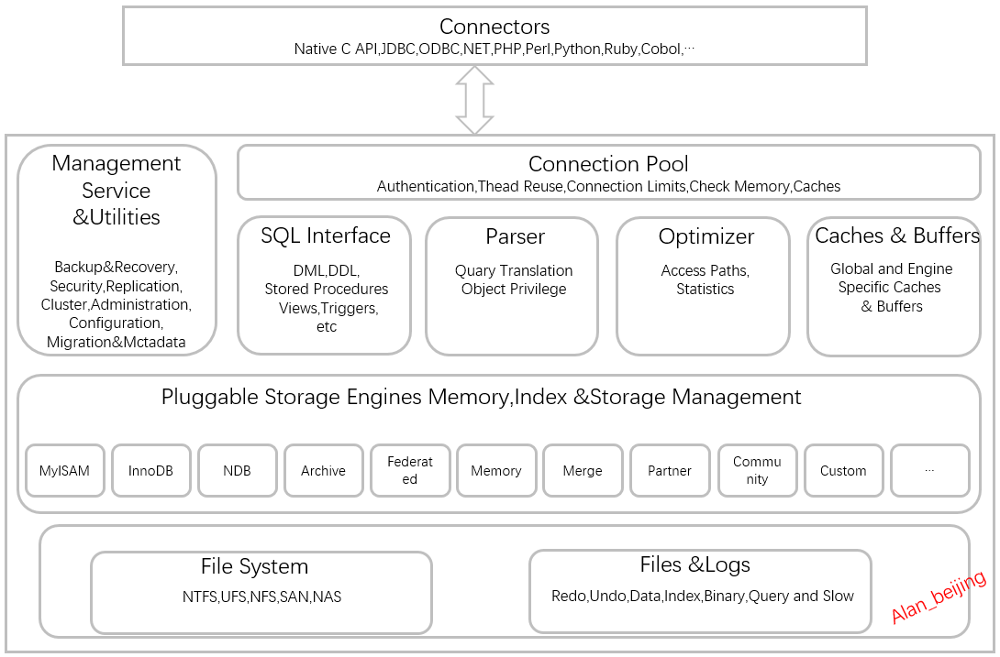

1. MySQL向外提供的交互接口（Connectors）
   Connectors组件，是MySQL向外提供的交互组件，如java,.net,php等语言可以通过该组件来操作SQL语句，实现与SQL的交互。

   > 连接器的作用
   >
   > 1. 负责与客户端的通信,是半双工模式,这就意味着某一固定时刻只能由客户端向服务器请求或者服务器向客户端发送数据,而不能同时进行,其中mysql在与客户端连接TC/IP的
   > 2. 验证请求用户的账户和密码是否正确,如果账户和密码错误,会报错:Access denied for user 'root'@'localhost' (using password: YES)
   > 3. 如果用户的账户和密码验证通过,会在mysql自带的权限表中查询当前用户的权限:
   >
   > 权限验证：mysql中存在4个控制权限的表，分别为`user，db，tables_priv，columns_priv`mysql权限表的验证过程为：
   >
   > 1. `User`:存放用户账户信息以及全局级别（所有数据库）权限，决定了来自哪些主机的哪些用户可以访问数据库实例
   > 2. `db`:存放**数据库级别**的权限，决定了来自哪些主机的哪些用户可以访问此数据库 
   > 3. `tables_priv`:存放**表级别**的权限，决定了来自哪些主机的哪些用户可以访问数据库的这个表
   > 4. `Columns_priv`:存放**列级别**的权限，决定了来自哪些主机的哪些用户可以访问数据库表的这个字段 
   > 5. `Procs_priv`：**存储过程和函数**级别的权限

2. 管理服务组件和工具组件(Management Service & Utilities)
   提供对MySQL的集成管理，如备份(Backup),恢复(Recovery),安全管理(Security)等

3. 连接池组件(Connection Pool)
   负责监听对客户端向MySQL Server端的各种请求，接收请求，转发请求到目标模块。每个成功连接MySQL Server的客户请求都会被创建或分配一个线程，该线程负责客户端与MySQL Server端的通信，接收客户端发送的命令，传递服务端的结果信息等。

4. SQL接口组件(SQL Interface)
   接收用户SQL命令，如DML,DDL和存储过程等，并将最终结果返回给用户。

5. 查询分析器组件(Parser)
    首先分析SQL命令语法的合法性，并尝试将SQL命令分解成数据结构，若分解失败，则提示SQL语句不合理。

6. 优化器组件（Optimizer）
   对SQL命令按照标准流程进行优化分析。

7. 缓存主件（Caches & Buffers）
   缓存和缓冲组件

8. 插件式存储引擎（Pluggable Storage Engines）
   MySQL属于关系型数据库，而关系型数据库的存储是以表的形式进行的，对于表的创建，数据的存储，检索，更新等都是由MySQL存储引擎完成的，这也是MySQL存储引擎在MySQL中扮演的重要角色。

9. 物理文件（File System）
   实际存储MySQL 数据库文件和一些日志文件等的系统，如Linux，Unix,Windows等。

##### [mysql查询流程](https://www.cnblogs.com/wyq178/p/11576065.html)

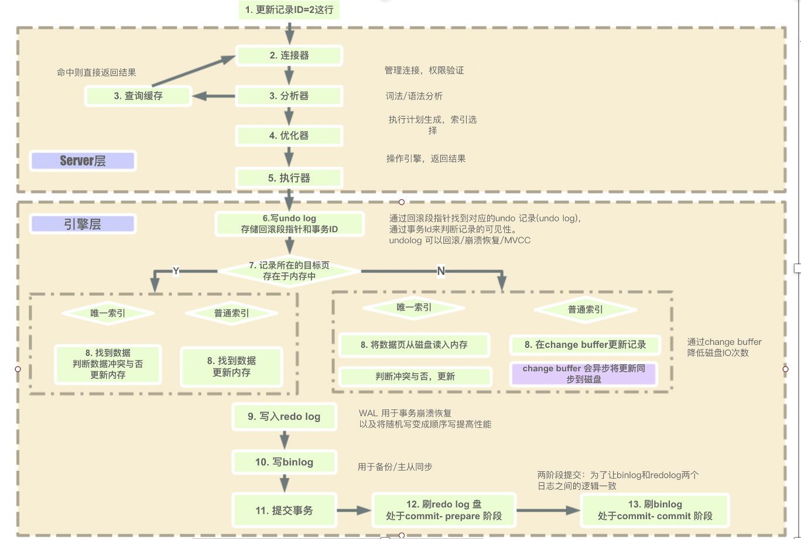

1. 连接器校验用户和用户权限，如果通过继续

2. mysql的缓存主要的作用是为了提升查询的效率，缓存以key和value的哈希表形式存储，key是具体的sql语句，value是结果的集合。如果无法命中缓存,就继续走到分析器的的一步,如果命中缓存就直接返回给客户端 。

   > mysql的8.0版本以后，缓存被官方删除掉了。之所以删除掉,是因为查询缓存的失效非常频繁,如果在一个写多读少的环境中,缓存会频繁的新增和失效。
   >
   > **比较推荐的一种做法是将缓存放在客户端，性能大概会提升5倍左右**

3. 分析器的主要作用是将客户端发过来的sql语句进行分析，这将包括预处理与解析过程，在这个阶段会解析sql语句的语义，并进行关键词和非关键词进行提取、解析，并组成一个解析树。

   > 客户端抛出异常:`ERROR:You have an error in your SQL syntax.`

4. 能够进入到优化器阶段表示sql是符合mysql的标准语义规则的并且可以执行的，此阶段主要是进行sql语句的优化，会根据执行计划进行最优的选择,匹配合适的索引,选择最佳的执行方案。（索引顺序调优）

5. 在执行器的阶段,此时会调用存储引擎的API,API会调用存储引擎，主要有一下存储的引擎，不过常用的还是**myisam**和`innodb`:

##### mysql buffer pool技术

###### 为什么buffer pool的LRU算法和常见LRU算法不同

- 预读失效：由于预读(Read-Ahead)，提前把页放入了缓冲池，但最终MySQL并没有从页中读取数据，称为预读失效。

  > 将数据划分为新生代和老生代
  
- mysql缓冲池污染：当某一个SQL语句，要批量扫描大量数据时，可能导致把缓冲池的所有页都替换出去，导致大量热数据被换出，MySQL性能急剧下降，这种情况叫缓冲池污染。

  > 老生代停留时间窗口：只有**满足**“被访问”并且“在老生代停留时间”**大于**T，才会被放入新生代头部
  >
  > 涉及到的配置中的三个配置参数
  >
  > `innodb_buffer_pool_size`：配置缓冲池的大小，在内存允许的情况下，DBA往往会建议调大这个参数，越多数据和索引放到内存里，数据库的性能会越好
  >
  > `innodb_old_blocks_pct`：老生代占整个LRU链长度的比例，默认是37，即整个LRU中新生代与老生代长度比例是63:37。
  >
  > `innodb_old_blocks_time`：老生代停留时间窗口，单位是毫秒，默认是1000，即同时满足“被访问”与“在老生代停留时间超过1秒”两个条件，才会被插入到新生代头部。

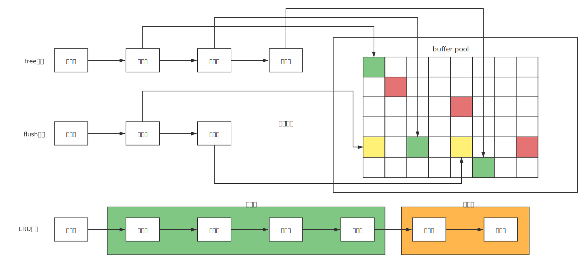

###### buffer pool原理

buffer pool大小默认为128MB，链表中存储的均为控制块，指向buffer pool中的某一页，free指向空闲空间，flush链表指向已修改内存但是还未同步到磁盘的脏页，由后台线程负责更新。LRU链表分为老生代和新生代，只有在老生代中停留超过时间窗口的内存页控制块可以转移到新生代中。

##### chaneg buffer（写缓存）

它是一种应用在**非唯一普通索引页**(non-unique secondary index page)不在缓冲池中，对页进行了写操作，并不会立刻将磁盘页加载到缓冲池，而仅仅记录缓冲变更(buffer changes)，等未来数据被读取时，再将数据合并(merge)恢复到缓冲池中的技术。写缓冲的**目的**是降低写操作的磁盘IO，提升数据库性能。

##### redo log、binlog、undo log

###### [redo log](https://blog.csdn.net/weixin_39673184/article/details/110924034)

	redo 日志的通用结构，redo 日志记录的是每个页面(page)更改**物理**情况，所以 redo 日志整体来说是比较小的

1. redo log结构
   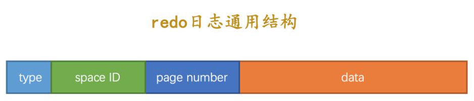
  - type：该条redo日志的类型

  - space ID：表空间ID

  - page number：页号

  - data：该条redo日志的具体内容

     **redo 日志会把事务在执行过程中对数据库所做的所有修改都记录下来，在之后系统崩溃重启后可以把事务所做的任何修改都恢复出来**

2. redo log执行机制
   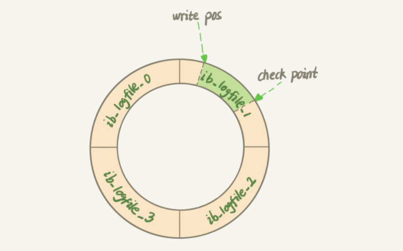

   write pos 和 checkpoint 之间的是“粉板”上还空着的部分，可以用来记录新的操作。如果 write pos 追上 checkpoint，表示“粉板”满了，这时候不能再执行新的更新，得停下来先擦掉一些记录，把 checkpoint 推进一下。

3. redo日志缓冲区
   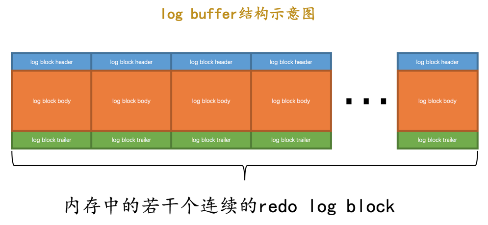
   **redo 日志并不是直接写入磁盘的，而是先写入到缓存区，我们把这个缓冲区叫做 redo日志缓冲区**。在服务器启动时就向操作系统申请了一大片称之为 redo log buffer 的连续内存空间，我们也可以简称为log buffer。这片内存空间被划分成若干个连续的 redo log block，

   > innodb_log_buffer_size 参数来设置 redo 日志缓冲区的大小

   在 MySQL 的配置文件中提供了 `innodb_flush_log_at_trx_commit` 参数，这个可以用来控制缓冲区和磁盘之间的数据如何同步，这里有 0、1、2 三个选项，在我装的 MySQL 下默认的是 1，简单介绍一下这三个选项的区别：

   - **0**：表示当提交事务时，并不将缓冲区的 redo 日志写入磁盘的日志文件，而是等待主线程每秒刷新。
   - **1**：在事务提交时将缓冲区的 redo 日志同步写入到磁盘，保证一定会写入成功。
   - **2**：在事务提交时将缓冲区的 redo 日志异步写入到磁盘，即不能完全保证 commit 时肯定会写入 redo 日志文件，只是有这个动作。

###### undo log

	undo log是一种**逻辑日志**，可以认为当delete一条记录时，undo log会记录对应的insert记录。当update一条记录时，它记录一条对应相反的update记录。
	是一种用于撤销回退的日志，用于事务没提交之前，会先记录存放到 Undo 日志文件里，当事务回滚时或者数据库崩溃时，可以利用 Undo 日志回退事务

###### binlog

binlog,即二进制日志,它记录了数据库上的所有改变，并以二进制的形式保存在磁盘中；它可以用来查看数据库的变更历史、数据库增量备份和恢复、Mysql的复制（主从数据库的复制）。

###### redo log和binlog的区别

1. redo log是在InnoDB存储引擎层产生，而binlog是MySQL数据库的上层产生的，并且二进制日志不仅仅针对INNODB存储引擎，MySQL数据库中的任何存储引擎对于数据库的更改都会产生二进制日志。
2. 两种日志记录的内容形式不同。MySQL的binlog是逻辑日志，其记录是对应的SQL语句。而innodb存储引擎层面的重做日志是物理日志。
3. 两种日志与记录写入磁盘的时间点不同，二进制日志只在事务提交完成后进行一次写入。而innodb存储引擎的重做日志在事务进行中不断地被写入，并日志不是随事务提交的顺序进行写入的。
   二进制日志仅在事务提交时记录，并且对于每一个事务，仅在事务提交时记录，并且对于每一个事务，仅包含对应事务的一个日志。而对于innodb存储引擎的重做日志，由于其记录是物理操作日志，因此每个事务对应多个日志条目，并且事务的重做日志写入是并发的，并非在事务提交时写入，其在文件中记录的顺序并非是事务开始的顺序。
4. binlog不是循环使用，在写满或者重启之后，会生成新的binlog文件，redo log是循环使用。
5. binlog可以作为恢复数据使用，主从复制搭建，redo log作为异常宕机或者介质故障后的数据恢复使用。

binlog有三种格式：Statement、Row以及Mixed。

- 基于SQL语句的复制(statement-based replication,SBR)，
- 基于行的复制(row-based replication,RBR)，
- 混合模式复制(mixed-based replication,MBR)。

- Statement
  每一条会修改数据的sql都会记录在binlog中。
  优点：不需要记录每一行的变化，减少了binlog日志量，节约了IO，提高性能。
  缺点：由于记录的只是执行语句，为了这些语句能在slave上正确运行，因此还必须记录每条语句在执行的时候的一些相关信息，以保证所有语句能在slave得到和在master端执行时候相同 的结果。另外mysql 的复制,像一些特定函数功能，slave可与master上要保持一致会有很多相关问题。

  > 相比row能节约多少性能与日志量，这个取决于应用的SQL情况，正常同一条记录修改或者插入row格式所产生的日志量还小于Statement产生的日志量，但是考虑到如果带条件的update操作，以及整表删除，alter表等操作，ROW格式会产生大量日志，因此在考虑是否使用ROW格式日志时应该跟据应用的实际情况，其所产生的日志量会增加多少，以及带来的IO性能问题。 

- Row
  5.1.5版本的MySQL才开始支持row level的复制,它不记录sql语句上下文相关信息，仅保存哪条记录被修改。
  优点： binlog中可以不记录执行的sql语句的上下文相关的信息，仅需要记录那一条记录被修改成什么了。所以rowlevel的日志内容会非常清楚的记录下每一行数据修改的细节。而且不会出现某些特定情况下的存储过程，或function，以及trigger的调用和触发无法被正确复制的问题.
  缺点:所有的执行的语句当记录到日志中的时候，都将以每行记录的修改来记录，这样可能会产生大量的日志内容。

  > 新版本的MySQL中对row level模式也被做了优化，并不是所有的修改都会以row level来记录，像遇到表结构变更的时候就会以statement模式来记录，如果sql语句确实就是update或者delete等修改数据的语句，那么还是会记录所有行的变更。

- Mixed
  在Mixed模式下，一般的语句修改使用statment格式保存binlog，如一些函数，statement无法完成主从复制的操作，则采用row格式保存binlog，MySQL会根据执行的每一条具体的sql语句来区分对待记录的日志形式，也就是在Statement和Row之间选择一种。

[崩溃恢复](https://www.cnblogs.com/xinysu/p/6586386.html)

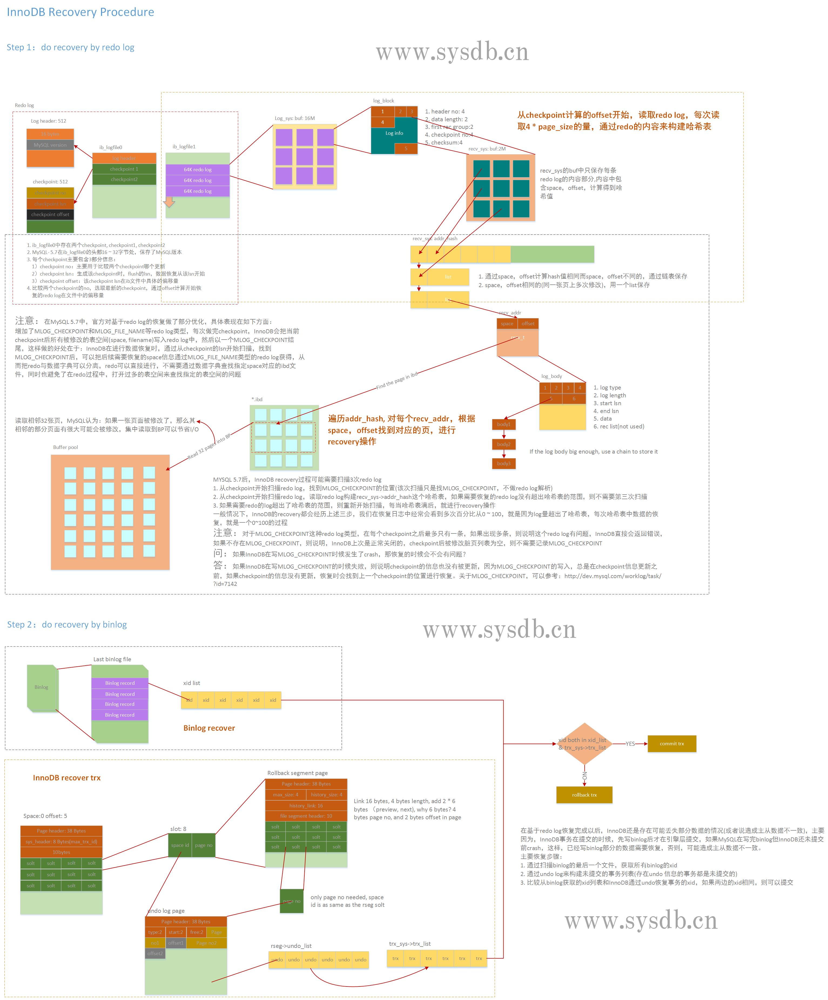

1. redo log恢复

   1. 打开系统表空间ibdata，读取第一个page中的LSN，若第一个页损坏，则依次往后面的page读，知道有个完整的page能够提供LSN，这个LSN当作上次shutdown时的checkpoint点，后续恢复，从这个LSN点开始恢复
   2. 进入redo log文件，读取第一个redo log文件头的checkpoint LSN， 并根据该LSN定位到redo日志文件中对应的位置，从该checkpoint点开始扫描，进行3次redo log文件扫描：
      1. **找 MLOG_CHECKPOINT日志**
         - 如果是正常关闭，这个日志是不做记录的，也就是扫描的过程中不回找到对应的MLOG_CHECKPOINT日志，不会进行接下来的两次扫描，因为属于正常关闭数据库服务，不需要考虑奔溃恢复情况；
         - 如果是非正常关闭，则会查找到 MLOG_CHECKPOINT （如果是多个，则说明redo文件已损坏，恢复报错），获取MLOG_FILE_NAME中指定后续需要恢复的ibd文件；
      2. **从redo log读到的LSN，找到checkpoint点开始重复扫描存储日志对象**
         - 根据MLOG_CHECKPOINT日志，读取对应LSN之后的日志解析到hash表中，如果剩下的日志解析结束后还没有填满hash表格，则不需要进行第三次扫描；
         - 进行到这里，则说明数据库是非正常关闭，会在errorlog中提示：Database was not shutdown normally!详见下图。
           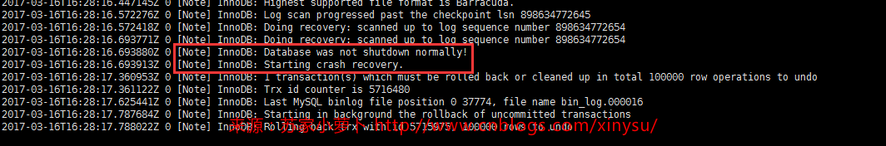
      3. **若第二次扫描hash表空间不足，则发起第三次扫描，清空hash表空间，重新从新的checkpoint点开始扫描**

   > 改进：根据hash表中的相应信息读取数据页， 读数据页的时候，5.7之前版本采用把所有表空间都打开，所有表格仅执行ReadOnly，5.7版本做了优化，新增了 `MLOG_FILE_NAME` 记录在checkpoint之后，所有被修改过的信息，根据这些信息，在恢复过程中，只需要打开相应的ibd文件即可，不涉及恢复的表格支持正常DML跟DDL操作，涉及恢复的表格则仅执行ReadOnly功能。
   >
   > 当把数据页读取到buffer pool中，以往版本是只读取对应的**单个页面**，而现在的是直接读取与该页面相邻的32个data page 也一起加载的buffer pool，因为一个数据页的修改，可能周围的页面也被修改，一次性读取，可以避免后面根据hash表中再重新读取其相邻的页面。

2. undo log binlog处理

   上一阶段中，把redo log中的操作都apply到数据页中，但是对于prepare状态的事务却还没有进行回滚处理，这个阶段则是针对prepare状态的事务进行处理，需要使用到binlog和undo log。

   1. 根据最后一个binlog文件，为啥不是所有binlog文件呢？因为每一个binlog文件切换的时候，都会确保当前binlog文件的所有操作已落盘，所以只需要考虑最后一个binlog文件。跟进最后一个binlog文件，获取所有**可能**没有提交事务的xid列表

   2. 根据undo log中的 insert_undo_list，upddate_undo_list事务链，构建undo_list，在根据undo_list构建未提交事务链表;

   3. 从未提交事务链表中，提取出xid，凡是存在于xid列表中的，则需要提交，不存在的，则回滚。

      > 在事务执行过程可以看出，在事务提交之前，会先写binlog，然后提交。提交之后的事务不存在undo信息，所以既在binlog中出现的事务又在undo log中的事务，即可以说当前事务是在完成后准备提交状态宕机打断，所以可以提交，而不再binlog的事务，只能回滚。


##### mysql隐藏字段

1. `row_id`：数据行id，用于标识一行数据。row_id并不是必要的，如果创建的表中有主键或者非NULL唯一键时都不会包含row_id列
2. `trx_id`：事务id，每次对某数据记录进行修改时，都会把对应的事务id赋值给trx_id列。每次事务操作都会分配一个事务id，它是一个自增id。
3. `roll_pointer`：当前数据记录的上一个版本的指针。每次对某条数据记录进行改动时，都会把旧版本数据记录按照一定格式写入到回滚日志(undo log) 中，而roll_pointer列则保存了该旧版本数据记录在回滚日志中的位置，相当于一个指针(也可以理解为常说的`offset`)。

##### MVCC原理

当执行查询sql时会生成一致性视图read—view，它由执行查询时所有未提交事务id数组(数组里最小的id为min_id)和已创建的最大事务id(max_id)组成，查询的数据结果需要跟read—view做比对从而得到快照结果

版本链比对规则：

1. 如果落在绿色部分(`trx_id`),表示这个版本是已提交事务产生的，这个数据是可见的
2. 如果落在红色部分(`trx_id`>`max_id`)，表示这个版本是由将来启动的事务生成的，是肯定不可见的
3. 如果落在黄色部分(`min_id <= trx_id <= max_id`)，那就包括两种情况
   1. 若row的`trx_id`在数组中，表示这个版本是由还没提交的事务生成的，不可见，当前自己时事务是可见的；
   2. 若row的`trx_id`不在数组中，表示这个版本是已经提交了的事务生成的，可见.

> 对于删除的情况可以认为是update的特殊情况，会将版本链上最新的数据复制一份，然后将trx id修改成删除操作的trx id，同时在该条记录的头信息(record header)里的(deleted flaq)标记位写上true，来表示当前记录已经被删除，在查询时按照上面的规则查到对应的记录如果delete flag标记位为true，意味看记录已被删除，则不返回数据。

##### 索引

###### 索引的作用

索引是一种特殊的文件(InnoDB数据表上的索引是表空间的一个组成部分)，它们包含着对数据表里所有记录的引用指针。更通俗的说，**数据库索引好比是一本书前面的目录**，**能加快数据库的查询速度**。索引分为聚簇索引和非聚簇索引两种，聚簇索引是按照数据存放的物理位置为顺序的，而非聚簇索引就不一样了；聚簇索引能提高多行检索的速度，而非聚簇索引对于单行的检索很快。

###### 索引的分类

1. **普通索引**
   这是最基本的索引，它没有任何限制，比如上文中为title字段创建的索引就是一个普通索引，MyIASM中默认的BTREE类型的索引，也是我们大多数情况下用到的索引。
2. **唯一索引**
   与普通索引类似，不同的就是：索引列的值必须唯一，但允许有空值。如果是组合索引，则列值的组合必须是唯一的，创建方法和普通索引类似
3. **组合索引**
   平时用的SQL查询语句一般都有比较多的限制条件，所以为了进一步榨取MySQL的效率，就要考虑建立组合索引。例如上表中针对title和time建立一个组合索引

###### 索引的优化

1. **索引不会包含有NULL值的列**

   只要列中包含有NULL值都将不会被包含在索引中，复合索引中只要有一列含有NULL值，那么这一列对于此复合索引就是无效的。所以我们在数据库设计时不要让字段的默认值为NULL。

2.  **使用短索引**

   对串列进行索引，如果可能应该指定一个前缀长度。例如，如果有一个CHAR(255)的列，如果在前10个或20个字符内，多数值是惟一的，那么就不要对整个列进行索引。短索引不仅可以提高查询速度而且可以节省磁盘空间和I/O操作。

3. **索引列排序**
   MySQL查询只使用一个索引，因此如果where子句中已经使用了索引的话，那么order by中的列是不会使用索引的。因此数据库默认排序可以符合要求的情况下不要使用排序操作；尽量不要包含多个列的排序，如果需要最好给这些列创建复合索引。

4.  **like语句操作**
   一般情况下不鼓励使用like操作，如果非使用不可，如何使用也是一个问题。like “%aaa%” 不会使用索引而like “aaa%”可以使用索引。

5. **不要在列上进行运算**elect * from users where YEAR(adddate)<2007，将在每个行上进行运算，这将导致索引失效而进行全表扫描，因此我们可以改成：select * from users where adddate<’2007-01-01′。关于这一点可以围观：一个单引号引发的MYSQL性能损失。

###### 索引失效总结

1. like 以%开头，索引无效；当like前缀没有%，后缀有%时，索引有效。
2. or语句前后没有同时使用索引。当or左右查询字段只有一个是索引，该索引失效，只有当or左右查询字段均为索引时，才会生效
3. 组合索引，不是使用第一列索引，索引失效。
4. 数据类型出现隐式转化。如varchar不加单引号的话可能会自动转换为int型，使索引无效，产生全表扫描。
5. 在索引字段上使用not，<>，!=。不等于操作符是永远不会用到索引的，因此对它的处理只会产生全表扫描。 优化方法： key<>0 改为 key>0 or key<0。
6. 对索引字段进行计算操作、字段上使用函数
7. 当全表扫描速度比索引速度快时，mysql会使用全表扫描，此时索引失效。

##### 数据库主从复制

通过配置两台及以上的数据库的主从关系，将一台数据库服务器的数据更新到另外一台上，可以实现读写分离，改善数据库的负载压力

1. master将数据改变记录到二进制日志中，也即是配置文件log-bin指定的文件
2. salve将master的二进制日志文件拷贝到中继日志
3. salve重做中继日志中的操作，完成将master上改动映射到自己的数据库中。

##### 乐观锁与悲观锁

1. 悲观锁：当我们要对一个数据库中的一条数据进行修改的时候，为了避免同时被其他人修改，最好的办法就是直接对该数据进行加锁以防止并发。这种借助数据库锁机制在修改数据之前先锁定，再修改的方式被称之为悲观并发控制

   > 悲观锁的实现方式
   >
   > 1. 在对记录进行修改前，先尝试为该记录加上排他锁
   > 2. 如果加锁失败，说明该记录正在被修改，那么当前查询可能要等待或者抛出异常。具体响应方式由开发者根据实际需要决定。
   > 3. 如果成功加锁，那么就可以对记录做修改，事务完成后就会解锁了。
   > 4. 其间如果有其他事务对该记录做加锁的操作，都要等待当前事务解锁或直接抛出异常。

2. 乐观锁：乐观锁假设数据一般情况下不会造成冲突，所以在数据进行提交更新的时候，才会正式对数据的冲突与否进行检测，如果发现冲突了，则让返回用户错误的信息，让用户决定如何去做。

   > 使用乐观锁就不需要借助数据库的锁机制了，乐观锁的概念中其实已经阐述了他的具体实现细节：主要就是两个步骤：冲突检测和数据更新。其实现方式有一种比较典型的就是[**Compare and Swap(CAS)技术**](#CAS)：CAS是项乐观锁技术，当多个线程尝试使用CAS同时更新同一个变量时，只有其中一个线程能更新变量的值，而其它线程都失败，**失败的线程并不会被挂起，而是被告知这次竞争中失败，并可以再次尝试。**
   >
   > - 使用版本号
   > - 使用时间戳

##### 事务的类型

1. 原子性：事务中的所有操作要么全部成功，要么全部失败。
2. 持久性：事务一旦提交，对数据库的影响就是持久性的。
3. 一致性：事务必须使数据库从一个一致性状态转换为另一个一致性状态。也就是事务执行前后状态保持一致。
4. 隔离性：多个并发事务之间相互隔离。

##### 隔离级别

1. 脏读：并发事务之间一个事务读取了另一个事务还未提交的数据。
2. 不可重复读：并发事务间一个事务多次读取，分别读取了另一个事务未提交和已经提交的数据，导致多次读取的数据状态不一致。
3. 并发事务间一个事务读取了另一个事务已经提交的数据。与不可重复读的区别是不可重复读前后读取的是同一数据项，而幻读是一批数据。比如前后读取的数据数量不一致。

##### 事务隔离级别

- 可串行化（serializable）：通常保证可串行化调度。然而，一些数据库系统对该隔离性级别的实现在某些情况下允许非可串行化执行。最高隔离性级别。强制事务串行执行。可避免脏读、不可重复读、幻读的发生。

- 可重复读（repeatable read）：只允许读取已提交数据，而且在一个事务两次读取一个数据项期间，其他事务不得更新该数据。但该事务不要求与其他事务可串行化。例如：当一个事务在查找满足某些条件的数据时，它可能找到一个已提交事务插入的一些数据，但可能找不到该事务插入的其他数据。保证在同一个事务中多次读取同样数据的结果是一样的。可避免脏读、不可重复读的发生。

- 已提交读（read committed）：只允许读取已提交数据，但不要求可重复读。比如，在事务两次读取一个数据项期间，另一个事务更新了该数据并提交。一个事务只能读取已经提交的事务所做的修改。换句话说，一个事物所做的修改在提交之前对其他事务是不可见的。可避免脏读的发生。

- 未提交读（read uncommitted）：允许读取未提交数据。这是SQL允许的最低一致性级别。事务中的修改，即使没有提交，对其他事务也是可见的。最低级别，任何情况都无法保证。幻读、不可重复读、脏读

> 以上所有隔离性级别都不允许脏写（dirty write），即如果一个数据项已经被另外一个尚未提交或中止的事务写入，则不允许对该数据项执行写操作。

##### innoDB锁类型

- 共享锁(读锁)：多个事务可以共享一把锁，都可以访问到数据，但只能读不能修改。事务`commit/rollback`解锁

- 排它锁(写锁)：排他锁不能与其他锁并存，如一个事务获取了一个数据行的排他锁，其他事务就不能再获取该行的锁（共享锁、排他锁） ，只有该获取了排他锁的事务是可以对数据行进行读取和修改。

- 意向锁：是由数据引擎自己维护的，用户无法手动操作意向锁。意向共享锁(Intention Shared Lock,简称IS锁)。

  - 意向排他锁 IX锁：表示事务准备给数据行加入排他锁，说明事务在一个数据行加排他锁前必须先取得该表的IX锁。

  - 意向共享锁 IS锁：表示事务准备给数据行加入共享锁，也就是说一个数据行加共享锁前必须先取得该表的IS锁。

    > 为什么要有表级的意向锁：提高加表锁效率，避免全表扫描表锁（类似于一个火车上厕所的信号灯）

- 记录锁：唯一性索引等值查询，精准匹配

- 间隙锁：记录条件不存在，主要阻止插入。

- 临键锁：范围查询包含记录和区间 
  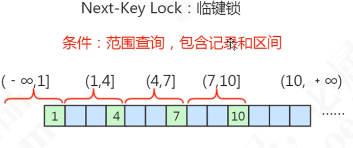

  
  

##### 内连接、左连接、右连接的区别

[参考](https://www.cnblogs.com/cs071122/p/6753681.html)

　　1.内连接,显示两个表中有联系的所有数据;

　　2.左链接,以左表为参照,显示所有数据;

　　3.右链接,以右表为参照显示数据;

##### 为什么innoDB表必须建立主键，并且图间使用整型的自增主键

- 不建立主键的话，innoDB会自己寻找一个适合建立主键的数据列，浪费数据库性能
- 整型比较大小快，比UUID节省空间；叶子节点是自增，会插入到后方节点可以**避免B+树和频繁合并和分裂**（对比使用UUID）。如果使用字符串主键和随机主键，会使得数据随机插入，效率比较差。

##### 为什么B+树比B树更适合做索引

B树也是多叉树结构，一种自平衡的树，而且B+树是从B树演化而来的，那么为什么不使用B+树的前身B树呢？从结构比较来看，B树相比B+树的一个主要区别就在于B树的分支节点上存储着数据，而B+树的分支节点只是叶子节点的索引而已。根据这个差别可以得出以下结论：

- 磁盘IO读写次数相比B树降低了
    在B+树中，其非叶子的内部节点都变成了key值，因此其内部节点相对B 树更小。如果把所有同一内部节点的key存放在同一盘块中，那么盘块所能容纳的key数量也越多。一次性读内存中的需要查找的key值也就越多。相对来说IO读写次数也就降低了。
- 每次查询的时间复杂度是固定的
    在B+树中，由于分支节点只是叶子节点的索引，所以对于任意关键字的查找都必须从根节点走到分支节点，所有关键字查询路径长度相同，每次查询的时间复杂度是固定的。但是在B树中，其分支节点上也保存有数据，对于每一个数据的查询所走的路径长度是不一样的，所以查询效率也不一样。
- 遍历效率更高
    由于B+树的数据都存储在叶子节点上，分支节点均为索引，方便扫库，只需扫一遍叶子即可。但是B树在分支节点上都保存着数据，要找到具体的顺序数据，需要执行一次中序遍历来查找。所以B+树更加适合范围查询的情况，在解决磁盘IO性能的同时解决了B树元素遍历效率低下的问题。
- 因为B树不管叶子节点还是非叶子节点，都会保存数据，这样导致在非叶子节点中能保存的指针数量变少（有些资料也称为扇出），指针少的情况下要保存大量数据，只能增加树的高度，导致IO操作变多，查询性能变低；

##### MyIsam和InnoDB的区别

1. InnoDB支持事务，MyISAM不支持，对于InnoDB每一条SQL语言都默认封装成事务，自动提交，这样会影响速度，所以最好把多条SQL语言放在begin和commit之间，组成一个事务；

2. InnoDB支持外键，而MyISAM不支持。对一个包含外键的InnoDB表转为MYISAM会失败； 

3. InnoDB是**聚集索引**，使用**B+Tree**作为索引结构，数据文件是和（主键）索引绑在一起的（表数据文件本身就是按B+Tree组织的一个索引结构），必须要有主键，通过主键索引效率很高。但是辅助索引需要两次查询，先查询到主键，然后再通过主键查询到数据。因此，主键不应该过大，因为主键太大，其他索引也都会很大。 MyISAM是非聚集索引，也是使用B+Tree作为索引结构，索引和数据文件是分离的，索引保存的是数据文件的指针。主键索引和辅助索引是独立的。

4. InnoDB不保存表的具体行数，执行select count(\*) from table时需要全表扫描。而MyISAM用一个变量保存了整个表的行数，执行上述语句时只需要读出该变量即可，速度很快（注意不能加有任何WHERE条件）；

   > 那么为什么InnoDB没有了这个变量呢？
   >
   >因为InnoDB的事务特性，在同一时刻表中的行数对于不同的事务而言是不一样的，因此count统计会计算对于当前事务而言可以统计到的行数，而不是将总行数储存起来方便快速查询。InnoDB会尝试遍历一个尽可能小的索引除非优化器提示使用别的索引。如果二级索引不存在，InnoDB还会尝试去遍历其他聚簇索引。
   >
   > 如果索引并没有完全处于InnoDB维护的缓冲区（Buffer Pool）中，count操作会比较费时。可以建立一个记录总行数的表并让你的程序在INSERT/DELETE时更新对应的数据。和上面提到的问题一样，如果此时存在多个事务的话这种方案也不太好用。如果得到大致的行数值已经足够满足需求可以尝试SHOW TABLE STATUS
   
5. Innodb不支持全文索引，而MyISAM支持全文索引，在涉及全文索引领域的查询效率上MyISAM速度更快高；PS：5.7以后的InnoDB支持全文索引了

6.  MyISAM表格可以被压缩后进行查询操作

7.  InnoDB支持表、行(默认)级锁，而MyISAM支持表级锁

8. InnoDB表必须有唯一索引（如主键）（用户没有指定的话会自己找/生产一个隐藏列Row_id来充当默认主键），而Myisam可以没有

9. Innodb存储文件有frm、ibd，而Myisam是frm、MYD、MYI

   > Innodb：frm是表定义文件，ibd是数据文件
   >
   > Myisam：frm是表定义文件，myd是数据文件，myi是索引文件

> 1. 是否要支持事务，如果要请选择innodb，如果不需要可以考虑MyISAM；
>
> 2. 如果表中绝大多数都只是读查询，可以考虑MyISAM，如果既有读也有写，请使用InnoDB。
>
> 3. 系统奔溃后，MyISAM恢复起来更困难，能否接受；
>
> 4. MySQL5.5版本开始Innodb已经成为Mysql的默认引擎(之前是MyISAM)，说明其优势是有目共睹的，如果你不知道用什么，那就用InnoDB，至少不会差。
##### InnoDB四大特性

1. 插入缓冲
2. 二次写
3. 自适应哈希索引
4. 预读

##### ACID靠什么保证

1. 原子性：undo log保证，记录需要回滚的日志信息，事务回滚是撤销执行成功sql语句
2. 一致性：由其他三大特性保证，程序代码保证业务的一致性
3. 隔离性：MVCC保证
4. 持续性：内存+redo log保证，mysql修改数据同时会在内存和redo log记录这次操作，宕机的时候可以从redo log中恢复

##### drop、delete、truncate

- `delete`：在 InnoDB 中，DELETE其实并不会真的把数据删除，mysql 实际上只是给删除的数据打了个标记为已删除，因此 delete 删除表中的数据时，表文件在磁盘上所占空间不会变小，存储空间不会被释放，只是把删除的数据行设置为不可见。
  虽然未释放磁盘空间，但是下次插入数据的时候，仍然可以重用这部分空间（重用 → 覆盖）。DELETE执行时，会先将所删除数据缓存到rollback segement中，事务commit之后生效;
  delete from table_name删除表的全部数据,对于MyISAM 会立刻释放磁盘空间，InnoDB 不会释放磁盘空间;
  对于delete from table_name where xxx 带条件的删除, 不管是InnoDB还是MyISAM都不会释放磁盘空间;
  delete操作以后使用 optimize table table_name 会立刻释放磁盘空间。不管是InnoDB还是MyISAM 。所以要想达到释放磁盘空间的目的，delete以后执行optimize table 操作。

- `truncate`：runcate table table_name 立刻释放磁盘空间 ，不管是 InnoDB和MyISAM 。truncate table其实有点类似于drop table 然后creat,只不过这个create table 的过程做了优化，比如表结构文件之前已经有了等等。所以速度上应该是接近drop table的速度;

  > - 对于MyISAM，truncate会重置auto_increment（自增序列）的值为1。而delete后表仍然保持auto_increment。
  > - 对于InnoDB，truncate会重置auto_increment的值为1。delete后表仍然保持auto_increment。但是在做delete整个表之后重启MySQL的话，则重启后的auto_increment会被置为1。
  > - 也就是说，InnoDB的表本身是无法持久保存auto_increment。delete表之后auto_increment仍然保存在内存，但是重启后就丢失了，只能从1开始。实质上重启后的auto_increment会从 SELECT 1+MAX(ai_col) FROM t 开始。

- drop table table_name 立刻释放磁盘空间 ，不管是 InnoDB 和 MyISAM; drop 语句将删除表的结构被依赖的约束(constrain)、触发器(trigger)、索引(index);  依赖于该表的存储过程/函数将保留,但是变为 invalid 状态。

  > 一本书，delete是把目录撕了，truncate是把书的内容撕下来烧了，drop是把书烧了。

#### 设计模式

[参考①](https://www.cnblogs.com/chengjundu/p/8473564.html)

##### 工厂模式

将所要创建的具体对象工作延迟到子类，从而实现一种扩展的策略，较好的解决了这种紧耦合关系，解决单个对象的变化；**缺点在于要求创建的方法/参数相同**

在工厂模式中，我们在创建对象时不会对客户端暴露创建逻辑，并且是通过使用一个共同的接口来指向新创建的对象。工厂模式作为一种创建模式，一般在创建复杂对象时，考虑使用；在创建简单对象时，建议直接new完成一个实例对象的创建。

###### 简单工厂模式

##### 单例模式

单例模式顾名思义，保证一个类仅可以有一个实例化对象，并且提供一个可以访问它的全局接口

- 单例类只能由一个实例化对象。
- 单例类必须自己提供一个实例化对象。
- 单例类必须提供一个可以访问唯一实例化对象的接口。

###### 懒汉模式

不到万不得已就不会去实例化类，也就是说在第一次用到类实例的时候才会去实例化一个对象。在访问量较小，甚至可能不会去访问的情况下，采用懒汉实现，这是以时间换空间。

```c++
std::mutex mt;

class Singleton
{
public:
    static Singleton* getInstance();
private:
    Singleton(){}                                    //构造函数私有
    Singleton(const Singleton&) = delete;            //明确拒绝
    Singleton& operator=(const Singleton&) = delete; //明确拒绝

    static Singleton* m_pSingleton;

};
Singleton* Singleton::m_pSingleton = NULL;

Singleton* Singleton::getInstance()
{
    if(m_pSingleton == NULL)
    {
        mt.lock();                                  // 互斥量锁住，保证线程安全
        if(m_pSingleton == NULL)
        {
            m_pSingleton = new Singleton();
        }
        mt.unlock();
    }
    return m_pSingleton;
}
```

###### 饿汉模式

单例类定义的时候就进行实例化。在访问量比较大，或者可能访问的线程比较多时，采用饿汉实现，可以实现更好的性能。这是以空间换时间。

```c++
//饿汉式：线程安全，注意一定要在合适的地方去delete它
class Singleton
{
public:
    static Singleton* getInstance();
private:
    Singleton(){}                                    //构造函数私有
    Singleton(const Singleton&) = delete;            //明确拒绝
    Singleton& operator=(const Singleton&) = delete; //明确拒绝

    static Singleton* m_pSingleton;
};

Singleton* Singleton::m_pSingleton = new Singleton();

Singleton* Singleton::getInstance()
{
    return m_pSingleton;
}
```

##### 策略模式

策略模式是指定义一系列的算法，把它们单独封装起来，并且使它们可以互相替换，使得算法可以独立于使用它的客户端而变化，也是说这些算法所完成的功能类型是一样的，对外接口也是一样的，只是不同的策略为引起环境角色环境角色表现出不同的行为。

##### 观察者模式

定义对象间的一种一对多的依赖关系，当一个对象的状态发生改变时，所有依赖于它的对象都要得到通知并自动更新。

```c++
/*
* 关键代码：在目标类中增加一个ArrayList来存放观察者们。
*/
#include <iostream>
#include <list>
#include <memory>

using namespace std;

class View;

//被观察者抽象类   数据模型
class DataModel
{
public:
    virtual ~DataModel(){}
    virtual void addView(View* view) = 0;
    virtual void removeView(View* view) = 0;
    virtual void notify() = 0;   //通知函数
};

//观察者抽象类   视图
class View
{
public:
    virtual ~View(){ cout << "~View()" << endl; }
    virtual void update() = 0;
    virtual void setViewName(const string& name) = 0;
    virtual const string& name() = 0;
};

//具体的被观察类， 整数模型
class IntDataModel:public DataModel
{
public:
    ~IntDataModel()
    {
        m_pViewList.clear();
    }

    virtual void addView(View* view) override
    {
        shared_ptr<View> temp(view);
        auto iter = find(m_pViewList.begin(), m_pViewList.end(), temp);
        if(iter == m_pViewList.end())
        {
            m_pViewList.push_front(temp);
        }
        else
        {
            cout << "View already exists" << endl;
        }
    }

    void removeView(View* view) override
    {
        auto iter = m_pViewList.begin();
        for(; iter != m_pViewList.end(); iter++)
        {
            if((*iter).get() == view)
            {
                m_pViewList.erase(iter);
                cout << "remove view" << endl;
                return;
            }
        }
    }

    virtual void notify() override
    {
        auto iter = m_pViewList.begin();
        for(; iter != m_pViewList.end(); iter++)
        {
            (*iter).get()->update();
        }
    }

private:
    list<shared_ptr<View>> m_pViewList;
};

//具体的观察者类    表视图
class TableView : public View
{
public:
    TableView() : m_name("unknow"){}
    TableView(const string& name) : m_name(name){}
    ~TableView(){ cout << "~TableView(): " << m_name.data() << endl; }

    void setViewName(const string& name)
    {
        m_name = name;
    }

    const string& name()
    {
        return m_name;
    }

    void update() override
    {
        cout << m_name.data() << " update" << endl;
    }

private:
    string m_name;
};

int main()
{
    /*
    * 这里需要补充说明的是在此示例代码中，View一旦被注册到DataModel类之后，DataModel解析时会自动解析掉     * 内部容器中存储的View对象，因此注册后的View对象不需要在手动去delete，再去delete View对象会出错。
    */

    View* v1 = new TableView("TableView1");
    View* v2 = new TableView("TableView2");
    View* v3 = new TableView("TableView3");
    View* v4 = new TableView("TableView4");

    IntDataModel* model = new IntDataModel;
    model->addView(v1);
    model->addView(v2);
    model->addView(v3);
    model->addView(v4);

    model->notify();

    cout << "-------------\n" << endl;

    model->removeView(v1);

    model->notify();

    delete model;
    model = nullptr;

    return 0;
}

```

##### 策略模式

#### 大数据设计题

##### 外部排序

阶段一：把原始数据分成M段，每次读取一段，存入一个数组，使用内排序算法对这一段数据进行排序，然后将排完序的数据写入一个临时文件。假定最大数组规模为10万个int型值，则每个临时文件中保存着10万个有序的int型值。我们用S1、S2、.....Sk表示这些临时文件，其中最后的一个数据段Sk，包含的数据个数可能不足10万。

阶段二：将每对有序数据段（比如S1跟S2、S3跟S4....）合并为一个大的有序的数据段，将其存入一个新的临时文件。重复此过程，直至只剩下一个数据段。

##### 大文件寻找出现频率最高的词

有一个1G大小的一个文件，里面每一行是一个词，词的大小不超过16字节，内存限制大小是1M，要求返回频数最高的100个词

1. 此处1G文件远远大于1M内存，分治法，先hash映射把大文件分成很多个小文件，具体操作如下：读文件中，对于每个词x，取hash(x)%5000，然后按照该值存到5000个小文件(记为f0,f1,...,f4999)中，这样每个文件大概是200k左右（每个相同的词一定被映射到了同一文件中）
2. 对于每个文件fi，都用hash_map做词和出现频率的统计，取出频率大的前100个词（怎么取？topK问题，建立一个100个节点的最小堆），把这100个词和出现频率再单独存入一个文件
3. 根据上述处理，我们又得到了5000个文件，归并文件取出top100

##### 大数据寻找中位数

在一个大文件中有100亿个32位整数，乱序排列，要求找出中位数，内存限制为512MB；

1. 分析
   假设我们用`usigned int`存储，那么在非极端情况下是可以表示区间内有多少数的
   而512MB可以存下32位整数为$512\times 2^{20}\div 4=134217728$个数，那么我们一次可以向内存中读取$10^8$个数，读取100次即可遍历
   对于32位整数int范围为$[-2^{31},2^{31}-1]$共4294967296个数，那么可将整数区间划分为100000个区间，利用512MB剩余的空间统计区间内数的数量，很明显统计区间数的数量占据内存$\small{400000B<<34217728}$，故算法在空间上是可行的

2. 算法

   1. 将100亿整数分为100次读入，每次读入时统计其对应的区间，假设区间采用一个数组`nums`存储，假设一个数为`n`，那么`nums[n/42949]++`
   2. 最终100亿数据读入，且以及统计当前100000区间内各有多少数字，利用`unsigned long long`累加，知道当前数值大于50亿，说明中位数在当前区间。
   3. 那么第二次遍历只需要统计当前区域内具体每个数的出现次数，即可以得到中位数具体数值

   > 大数据统计思路基本上基于Hash或者是分治的思想的，所以在极端情况下，比如说只给定4B字节，怎么得到大数据中位数，那么只有借用外存和二分的思想得到中位数的数值

