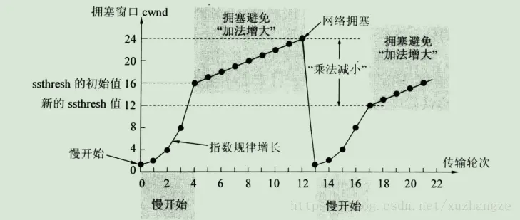

##### 红黑树相关

插入时：旋转和颜色变换规则，所有插入的点默认为红色

1. 变颜色的情况：当前结点的父亲是红色，且它的祖父结点的另一个子结点也是红色. （叔叔结点） ：

   1. 把父节点设为黑色
   2. 把叔叔也设为黑色
   3. 把祖父也就是父亲的父亲设为红色（爷爷）
   4. 把指针定义到祖父结点设为当前要操作的（爷爷）分析的点变换的规则

2. 左旋：当前父结点是红色，叔叔是黑色的时候，且当前的结点是右子树，左旋以父结点作为左旋。

3. 右旋：当前父结点是红色，叔叔是黑色的时候，且当前的结点是左子树.右旋

   1. 把父结点变为黑色
   2. 把祖父结点变为红色（答爷）
   3. 以祖父结点旋转（爷爷）

##### OSI七层模型

| OSI七层模型 |                             功能                             |
| :---------: | :----------------------------------------------------------: |
|   应用层    | 它是计算机用户，以及各种应用程序和网络之间的接口，其功能是直接向用户提供服务，完成用户希望在网络上完成的各种工作。它在其他6层工作的基础上，负责完成网络中应用程序与网络操作系统之间的联系，建立与结束使用者之间的联系，并完成网络用户提出的各种网络服务及应用所需的监督、管理和服务等各种协议。此外，该层还负责协调各个应用程序间的工作 |
|   表示层    |    处理用户信息的表示问题，如编码、数据格式转换和加密解密    |
|   会话层    | 向两个实体的表示层提供建立和使用连接的方法。将不同实体之间的表示层的连接称为会话。因此会话层的任务就是组织和协调两个会话进程之间的通信，并对数据交换进行管理。 |
|   传输层    | 向用户提供可靠的端到端的差错和流量控制，保证报文的正确传输。传输层的作用是向高层屏蔽下层数据通信的细节，即向用户透明地传送报文。 |
|   网络层    | 通过路由选择算法，为报文或分组通过通信子网选择最适当的路径。该层控制数据链路层与传输层之间的信息转发，建立、维持和终止网络的连接。具体地说，数据链路层的数据在这一层被转换为数据包，然后通过路径选择、分段组合、顺序、进/出路由等控制，将信息从一个网络设备传送到另一个网络设备。 |
| 数据链路层  | 通过各种控制协议，将有差错的物理信道变为无差错的、能可靠传输数据帧的数据链路,通过差错控制、流量控制方法，使有差错的物理线路变为无差错的数据链路 |
|   物理层    |  利用传输介质为数据链路层提供物理连接，实现比特流的透明传输  |

- 各层模型中常见设备
  - 物理层：网卡，网线，集线器(广播的形式来传输信息)，中继器，调制解调器
  - 数据链路层：网桥，交换机(用来进行报文交换的机器。多为链路层设备(二层交换机)，能够进行地址学习，采用存储转发的形式来交换报文)
  - 网络层：路由器(的一个作用是连通不同的网络，另一个作用是选择信息传送的线路。选择通畅快捷的近路，能大大提高通信速度，减轻网络系统通信负荷，节约网络系统资源，提高网络系统畅通率)
  - 网关：工作在第四层传输层及其以上

##### [在浏览器中输入url后执行的全过程](https://www.cnblogs.com/wangxirui/p/12794765.html)

1. 域名解析，获取该域名的IP地址
2. 应用层-浏览器发送HTTP请求
3. 传输层TCP、UDP封装数据
4. 网络层，IP协议封装IP地址，获取目的MAC地址
5. 链路层，建立TCP连接


##### 为什么需要接收方最后需要等待2MSL

- 本质原因是网络是不可靠的，所以TIME_WAIT状态就是用来重发可能丢失的ACK报文

  | 字段 |                             含义                             |
  | :--: | :----------------------------------------------------------: |
  | URG  |       紧急指针是否有效。为1，表示某一位需要被优先处理        |
  | ACK  |                 确认号是否有效，一般置为1。                  |
  | PSH  |        提示接收端应用程序立即从TCP缓冲区把数据读走。         |
  | RST  |                 对方要求重新建立连接，复位。                 |
  | SYN  | 请求建立连接，并在其序列号的字段进行序列号的初始值设定。建立连接，设置为1 |
  | FIN  |                         希望断开连接                         |
  
  - 序列号`seq`：占4个字节，用来标记数据段的顺序，TCP把连接中发送的所有数据字节都编上一个序号，第一个字节的编号由本地随机产生；给字节编上序号后，就给每一个报文段指派一个序号；序列号seq就是这个报文段中的第一个字节的数据编号。
  
  
  - 确认号`ack`：占4个字节，期待收到对方下一个报文段的第一个数据字节的序号；序列号表示报文段携带数据的第一个字节的编号；而确认号指的是期望接收到下一个字节的编号；因此当前报文段最后一个字节的编号+1即为确认号。

  > [参考](https://blog.csdn.net/qq_38950316/article/details/81087809)
  >
  > **TCP三次握手**
  >
  > 1. 建立连接时，客户端发送syn包（syn=x）到服务器，并进入**SYN_SENT**状态，等待服务器确认；SYN：同步序列编号
  >
  > 2. 服务器收到syn包，必须确认客户的SYN（ack=x+1），同时自己也发送一个SYN包（syn=y），即SYN+ACK包，此时服务器进入SYN_RECV状态；
  >
  > 3. 客户端收到服务器的SYN+ACK包，向服务器发送确认包ACK(ack=y+1），此包发送完毕，客户端和服务器进入**ESTABLISHED**（TCP连接成功）状态，完成三次握手。
  >
  >    
  >
  > **TCP四次挥手**
  >
  > 1. 客户端进程发出连接释放报文，并且停止发送数据。释放数据报文首部，FIN=1，其序列号为seq=u（等于前面已经传送过来的数据的最后一个字节的序号加1），此时，客户端进入FIN-WAIT-1（终止等待1）状态。 TCP规定，FIN报文段即使不携带数据，也要消耗一个序号。
  >
  > 2. 服务器收到连接释放报文，发出确认报文，ACK=1，ack=u+1，并且带上自己的序列号seq=v，此时，服务端就进入了CLOSE-WAIT（关闭等待）状态。TCP服务器通知高层的应用进程，客户端向服务器的方向就释放了，这时候处于半关闭状态，即客户端已经没有数据要发送了，但是服务器若发送数据，客户端依然要接受。这个状态还要持续一段时间，也就是整个CLOSE-WAIT状态持续的时间。
  >
  > 3. 客户端收到服务器的确认请求后，此时，客户端就进入FIN-WAIT-2（终止等待2）状态，等待服务器发送连接释放报文（在这之前还需要接受服务器发送的最后的数据）
  >
  > 4. 服务器将最后的数据发送完毕后，就向客户端发送连接释放报文，FIN=1，ack=u+1，由于在半关闭状态，服务器很可能又发送了一些数据，假定此时的序列号为seq=w，此时，服务器就进入了LAST-ACK（最后确认）状态，等待客户端的确认。
  >
  > 5. 客户端收到服务器的连接释放报文后，必须发出确认，ACK=1，ack=w+1，而自己的序列号是seq=u+1，此时，客户端就进入了TIME-WAIT（时间等待）状态。注意此时TCP连接还没有释放，必须经过2∗∗MSL（最长报文段寿命）的时间后，当客户端撤销相应的TCB后，才进入CLOSED状态。
  >
  > 6. 服务器只要收到了客户端发出的确认，立即进入CLOSED状态。同样，撤销TCB后，就结束了这次的TCP连接。可以看到，服务器结束TCP连接的时间要比客户端早一些。
  >
  >    

##### http返回码

> [参考](https://blog.csdn.net/kongxianglei5313/article/details/80636167)

- **1XX**：临时响应并需要请求者继续执行操作的状态代码
- **2XX**：成功处理了请求的状态代码
- **3XX**：表示要完成请求，需要进一步操作。 通常，这些状态代码用来重定向
- **4XX**：状态代码表示请求可能出错，妨碍了服务器的处理
- **5XX**：状态代码表示服务器在尝试处理请求时发生内部错误。 这些错误可能是服务器本身的错误，而不是请求出错。

##### http和https的区别

​	首先**https=http+SSL**，https就是http加上SSL保护壳，信息的加密过程就是SSL中完成的，[参考](https://www.cnblogs.com/wqhwe/p/5407468.html)

1. https协议需要到ca申请证书，一般免费证书较少，因而需要一定费用。
2. http是超文本传输协议，信息是明文传输，https则是具有安全性的ssl加密传输协议。
3. http和https使用的是完全不同的连接方式，用的**端口**也不一样，前者是80，后者是443。
4. http的连接很简单，是无状态的；HTTPS协议是由SSL+HTTP协议构建的可进行加密传输、身份认证的网络协议，比http协议安全。

**TCP如何保证可靠性**

​	[参考](https://www.jianshu.com/p/42dbcd39c3e7)

1. 校验和，计算方法为：在发送方将整个报文段分为多个16位的段，然后将所有段进行反码相加，将结果存放在检验和字段中，接收方用相同的方法进行计算，如最终结果为检验字段所有位是全1则正确（UDP中为0是正确），否则存在错误。
2. 确认应答和序列号：多次发送一次确认
3. 超时重传
4. 连接管理：三次握手与四次挥手
5. 流量控制
6. 拥塞控制

TCP和UDP的区别

1. 基于连接和无连接
2. 对系统资源要求
3. UDP程序结构较为简单
4. 流模式和数据报模式
5. TCP保证数据的正确性，UDP则有可能丢包

##### TCP为什么不是四次握手，三次挥手

保证数据的完整性，[参考](https://www.cnblogs.com/zhuzhenwei918/p/7465467.html)

##### TIME_WAIT为了解决什么问题

1. 为实现TCP全双工连接的可靠释放

   由TCP状态变迁图可知，假设发起主动关闭的一方（client）最后发送的ACK在网络中丢失，由于TCP协议的重传机制，执行被动关闭的一方（server）将会重发其FIN，在该FIN到达client之前，client必须维护这条连接状态，也就说这条TCP连接所对应的资源（client方的local_ip,local_port）不能被立即释放或重新分配，直到另一方重发的FIN达到之后，client重发ACK后，经过2MSL时间周期没有再收到另一方的FIN之后，该TCP连接才能恢复初始的CLOSED状态。如果主动关闭一方不维护这样一个TIME_WAIT状态，那么当被动关闭一方重发的FIN到达时，主动关闭一方的TCP传输层会用RST包响应对方，这会被对方认为是有错误发生，然而这事实上只是正常的关闭连接过程，并非异常。

2. 为使旧的数据包在网络因过期而消失
   因某些原因，我们先关闭，接着很快以相同的四元组建立一条新连接。本文前面介绍过，TCP连接由四元组唯一标识，因此，在我们假设的情况中，TCP协议栈是无法区分前后两条TCP连接的不同的，在它看来，这根本就是同一条连接，中间先释放再建立的过程对其来说是“感知”不到的。这样就可能发生这样的情况：前一条TCP连接由local peer发送的数据到达remote peer后，会被该remot peer的TCP传输层当做当前TCP连接的正常数据接收并向上传递至应用层，从而引起数据错乱进而导致各种无法预知的诡异现象。作为一种可靠的传输协议，TCP必须在协议层面考虑并避免这种情况的发生，这正是TIME_WAIT状态存在的第2个原因。

##### C++ 11新特性

​	[参考博客](https://blog.csdn.net/zhanglu_1024/article/details/85049480?utm_medium=distribute.pc_relevant.none-task-blog-baidujs_baidulandingword-0&spm=1001.2101.3001.4242)

1. 关键字以及语法
   - auto关键字：编译器根据上下文情况，确定auto变量的真正类型
   - nullptr：空指针，避免NULL所引起的歧义
   - for循环语法
2. STL容器：
   - std::array：跟数组并没有太大区别
   - std::forward_list：新增的线性表
   - std::unordered_map：内部是哈希表的实现方式
3. 多线程
   - std::thread
   - std::atomic：原子数据类型不会发生数据竞争，能直接用在多线程中而不必我们用户对其进行添加互斥资源锁的类型。从实现上，大家可以理解为这些原子类型内部自己加了锁。
   - std::condition_variable：可以让线程休眠，直到别唤醒，现在在从新执行。线程等待在多线程编程中使用非常频繁，经常需要等待一些异步执行的条件的返回结果
4. 智能指针内存管理
   - std::shared_ptr
   - std::weak_ptr

##### C++常见容器的优缺点

​	[参考](https://www.cnblogs.com/steamedbun/p/9376403.html)

##### strcopy的缺点

​	strcpy函数并不检查目的缓冲区的大小边界，而是将源字符串逐一的全部赋值给目的字符串地址起始的一块连续的内存空间，同时加上字符串终止符。(memcpy)

##### sizeof和strlen的区别

- sizeof：一个单目运算符，而不是一个函数。与函数 strlen 不同，它的参数可以是数组、指针、类型、对象、函数，sizeof不能用来返回动态分配内存空间的大小，包括结束字符‘\0’
- strlen：是一个函数，它用来计算指定字符串 str 的长度，但不包括结束字符

##### C++内存分布

1. 栈区（stack）： 由编译器自动分配释放 ，存放函数的参数值，局部变量的值等。
2. 堆区（heap） ： 一般由程序员分配释放， 若程序员不释放，在程序结束时，操作系统回收。
3. BSS段（Block Started by Symbol）：.bss段被用来存放那些没有初始化或者初始化为0的全局变量。bss段只占运行时的内存空间而不占文件空间。在程序运行的整个周期内，.bss段的数据一直存在
4. 全局区（静态区）：全局变量和静态变量的存储是放在一块的， 未初始化的全局变量和未初始化的静态变量在相邻的另一块区域。 在程序序结束后由系统释放。 
5. DATA区（初始化的数据段）：为数据分配空间，数据保存在目标文件中
6. 文字（只读）常量区 ：常量字符串就是放在这里的。 程序结束后由系统释放 
7. 代码段（TXT）：存放函数体的二进制代码

##### 常见解决hash冲突的方法

1. 开放定址法
   - 线性探测再散列
   - 二次探测在散列
   - 伪随机探测再散列
2. 再哈希法：同时构造多个不同的哈希函数：
3. 链地址法：本思想是将所有哈希地址为i的元素构成一个称为同义词链的单链表，并将单链表的头指针存在哈希表的第i个单元中，因而查找、插入和删除主要在同义词链中进行。链地址法适用于经常进行插入和删除的情况。
4. 建立公共溢出区：哈希表分为基本表和溢出表两部分，凡是和基本表发生冲突的元素，一律填入溢出表。

- vector：在内存中分配一块连续的内存空间进行存储。支持不指定vector大小的存储。STL内部实现时，首先分配一个非常大的内存空间预备进行存储，即capacituy（）函数返回的大小， 当超过此分配的空间时再整体重新放分配一块内存存储，这给人以vector可以不指定vector即一个连续内存的大小的感觉。
- list：实质上是一个双向链表，一个节点包括信息快Info、一个前驱指针Pre、一个后驱指针Post。可以不分配必须的内存大小方便的进行添加和删除操作。使用的是非连续的内存空间进行存储。

##### 深拷贝和浅拷贝的区别

在对含有指针成员的对象进行拷贝时，必须要自己定义拷贝构造函数，使拷贝后的对象指针成员有自己的内存空间，即进行深拷贝，这样就避免了内存泄漏发生。

浅拷贝只是对指针的拷贝，拷贝后两个指针指向同一个内存空间，深拷贝不但对指针进行拷贝，而且对指针指向的内容进行拷贝，经深拷贝后的指针是指向两个不同地址的指针。

浅拷贝带来问题的本质在于析构函数释放多次堆内存，使用std::shared_ptr，可以完美解决这个问题。

[深拷贝与浅拷贝参考](https://blog.csdn.net/caoshangpa/article/details/79226270?utm_medium=distribute.pc_relevant_t0.none-task-blog-BlogCommendFromMachineLearnPai2-1.control&dist_request_id=1328603.58384.16151935998172127&depth_1-utm_source=distribute.pc_relevant_t0.none-task-blog-BlogCommendFromMachineLearnPai2-1.control)

##### malloc细节(需要补充)

1. 分配内存空间

2. 检查内存是否分配成功，成功返回内存首地址，失败返回NULL

3. 清空分配好的内存空间

4. 使用内存

5. 使用完后释放内存

6. 对指针置空，防止称为野指针

   > 大多数实现所分配的存储空间比所要求的要稍大一些，额外的空间用来记录管理信息——分配块的长度，指向下一个分配块的指针等等。在free空间之时，将指针指向当前可用空间的首地址，并将`is_available`标志置1

##### static关键字

1. 隐藏作用：编译多个文件时候，未加static前缀的全局变量和函数都有全局可见性，如果加了static，就会对其它源文件隐藏
2. 保持变量内容的持久：它的生存期为整个源程序，但是其作用域仍与自动变量相同
3. 默认初始化为0

##### const 关键字

const名叫常量限定符，用来限定特定变量，以通知编译器该变量是不可修改的。习惯性的使用const，可以避免在函数中对某些不应修改的变量造成可能的改动。

1. const修饰基本数据类型

   - const修饰一般常量及数组

     基本数据类型，修饰符const可以用在类型说明符前，也可以用在类型说明符后，其结果是一样的。在使用这些常量的时候，只要不改变这些常量的值便好。 

   - const修饰指针变量*及引用变量& 

     如果const位于星号*的左侧，则const就是用来修饰指针所指向的变量，即指针指向为常量；

     如果const位于星号的右侧，const就是修饰指针本身，即指针本身是常量。

2. const应用到函数中,  

   - 作为参数的const修饰符

     调用函数的时候，用相应的变量初始化const常量，则在函数体中，按照const所修饰的部分进行常量化,保护了原对象的属性。
     [注意]：参数const通常用于参数为指针或引用的情况; 

   - 作为函数返回值的const修饰符

     声明了返回值后，const按照"修饰原则"进行修饰，起到相应的保护作用。

3. const在类中的用法

   不能在类声明中初始化const数据成员。正确的使用const实现方法为：const数据成员的初始化只能在类构造函数的初始化表中进行
     类中的成员函数：A fun4()const; 其意义上是不能修改所在类的的任何变量。

4. const修饰类对象，定义常量对象 
   常量对象只能调用常量函数，别的成员函数都不能调用。

##### malloc和new的区别

​	[参考1](https://blog.csdn.net/nie19940803/article/details/76358673)，[参考2](https://blog.csdn.net/zhong29/article/details/80930919)

1. `new`/`delete`是C++关键字需要编译器支持，malloc/free是库函数需要头文件支持

2. 使用new操作符申请内存分配时无须指定内存块的大小，编译器会根据类型信息自行计算。而malloc则需要显式地指出所需内存的尺寸。

3. new内存分配失败时，会抛出bac_alloc异常。malloc分配内存失败时返回NULL。

4. new会先调用operator new函数，申请足够的内存，然后调用类型的构造函数，初始化成员变量，最后返回自定义类型指针。delete先调用析构函数，然后调用operator delete函数释放内存； malloc/free是库函数，只能动态的申请和释放内存，无法强制要求其做自定义类型对象构造和析构工作。

5. C++允许重载new/delete操作符，特别的，布局new的就不需要为对象分配内存，而是指定了一个地址作为内存起始区域，new在这段内存上为对象调用构造函数完成初始化工作，并返回此地址。而malloc不允许重载。

6. new操作符从自由存储区（free store）上为对象动态分配内存空间，而malloc函数从堆上动态分配内存。自由存储区是C++基于new操作符的一个抽象概念，凡是通过new操作符进行内存申请，该内存即为自由存储区。而堆是操作系统中的术语，是操作系统所维护的一块特殊内存，用于程序的内存动态分配，C语言使用malloc从堆上分配内存，使用free释放已分配的对应内存。自由存储区不等于堆，如上所述，布局new就可以不位于堆中。

   > delete/free释放的是什么内容?
   >
   > free/delet释放的是指针指向的内存，而不是指针本身，在经过释放之后指针指向空间随机，称为野指针，所以在释放之后记得将指针置NULL

##### C怎样防止内存泄露

​	[参考](https://www.sohu.com/a/379234840_505888)

##### C++编译运行的过程

1. 预处理
   预处理用于将所有的#include头文件以及宏定义替换成其真正的内容
2. 编译
   将经过预处理之后的程序转换成特定汇编代码(assembly code)的过程
3. 汇编
   汇编过程将上一步的汇编代码转换成机器码
4. 链接
   链接过程将多个目标文件以及所需的库文件(.so等)链接成最终的可执行文件(executable file)。

##### C++内存管理

​	在C++中，内存分成5个区，他们分别是堆、栈、自由存储区、全局/静态存储区和常量存储区。[参考](https://www.cnblogs.com/findumars/p/5929831.html?utm_source=itdadao&utm_medium=referral)

- 栈：函数内局部变量存储单元均在栈上建立，函数执行结束存储单元自动释放
- 堆：new分配的内存块，释放由应用程序控制，new-delete对应，程序没有释放的话操作系统自动回收
- 自由存储区：就是那些由malloc等分配的内存块，他和堆是十分相似的，不过它是用free来结束自己的生命的
- 全局/静态存储区：全局变量和静态变量被分配到同一块内存中
- 常量存储区：这是一块比较特殊的存储区，他们里面存放的是常量，不允许修改。

##### 动态链接库的原理

对于常规的函数库，链接器从中拷贝它需要的所有库函数，并把确切的函数地址传送给调用这些函数的程序。而对于DLLs，函数储存在一个独立的动态链接库文件中。在创建Windows程序时，链接过程并不把DLLs文件链接到程序上。直到程序运行并调用一个DLLs中的函数时，该程序才要求这个函数的地址。此时Windows才在DLLs中寻找被调用函数，并把它的地址传送给调用程序。采用这种方法，DLLs达到了复用代码的极限。

##### 构造函数不能是析构函数，析构函数可以是虚函数

1. 构造函数不能是虚函数，因为虚函数是基于对象的，构造函数是用来产生对象的，若构造函数是虚函数，则需要对象来调用，但是此时构造函数没有执行，就没有对象存在，产生矛盾，所以构造函数不能是虚函数。
2. 析构函数是虚函数，因为若有父类指针指向子类对象存在，需要析构的是子类对象，但父类析构函数不是虚函数，则只析构了父类，造成子类对象没有及时释放，引起内存泄漏。

##### 类内存分布以及虚函数表

​	[参考](https://www.cnblogs.com/jerry19880126/p/3616999.html)，

##### 智能指针内存泄露，以及解决方案

1. 智能指针有没有内存泄露的情况？
   答：当两个对象同时使用一个shared_ptr成员变量指向对方，会造成循环引用，使引用计数失效，从而导致内存泄露。

1. 智能指针的内存泄漏如何解决？
   答：为了解决循环引用导致的内存泄漏，引入了弱指针weak_ptr，weak_ptr的构造函数不会修改引用计数的值，从而不会对对象的内存进行管理，其类似一个普通指针，但是不会指向引用计数的共享内存，但是可以检测到所管理的对象是否已经被释放，从而避免非法访问。

##### map、unordermap的底层实现结构

1. map：红黑树实现
2. unordermap：hash的方式实现，冲突的时候使用开链法解决冲突，产生哈希冲撞 的数据全部链到当前位置的下面，看上去就像是 在下面链上了一个一个的桶子，因此这样的方法我们有称作是哈希桶

##### [排序算法以及其实现和性质](https://www.cnblogs.com/onepixel/articles/7674659.html)

- 冒泡排序
   冒泡排序是一种简单的排序算法。它重复地走访过要排序的数列，一次比较两个元素，如果它们的顺序错误就把它们交换过来。走访数列的工作是重复地进行直到没有再需要交换，也就是说该数列已经排序完成。这个算法的名字由来是因为越小的元素会经由交换慢慢“浮”到数列的顶端。 

   

   ```c++
   void bubblesort(vector<int> &nums)
   // 次序不对，交换次序
   {
       for (int i = 0; i < nums.size(); i++)
       {
           for (int j = 1; j < nums.size(); j++)
           {
               if (nums[j - 1] > nums[j])
                   swap(nums[j], nums[j - 1]);
           }
       }
   }
   ```
   
- 选择排序
  选择排序(Selection-sort)是一种简单直观的排序算法。它的工作原理：首先在未排序序列中找到最小（大）元素，存放到排序序列的起始位置，然后，再从剩余未排序元素中继续寻找最小（大）元素，然后放到已排序序列的末尾。以此类推，直到所有元素均排序完毕。 
  
  
  ```c++
  void selectsort(vector<int> &nums)
  // 每一次都选择最小/大的
  {
      for (int i = 0; i < nums.size(); i++)
      {
          int minindex = i;
          for (int j = i + 1; j < nums.size(); j++)
          {
              if(nums[minindex] > nums[j])
                  minindex = j;
          }
          swap(nums[minindex], nums[i]);
      }
  }
  ```
  
- 插入排序
   插入排序（Insertion-Sort）的算法描述是一种简单直观的排序算法。它的工作原理是通过构建有序序列，对于未排序数据，在已排序序列中从后向前扫描，找到相应位置并插入。
   

   ```c++
   function insertionSort(arr) {
       varlen = arr.length;
       varpreIndex, current;
       for(vari = 1; i < len; i++) {
           preIndex = i - 1;
           current = arr[i];
           while(preIndex >= 0 && arr[preIndex] > current) {
               arr[preIndex + 1] = arr[preIndex];
               preIndex--;
           }
           arr[preIndex + 1] = current;
       }
       return arr;
   }
   ```

- 希尔排序
   第一个突破O(n2)的排序算法，是简单插入排序的改进版。它与插入排序的不同之处在于，它会优先比较距离较远的元素。

   先将整个待排序的记录序列分割成为若干子序列分别进行直接插入排序，具体算法描述：

   - 选择一个增量序列t1，t2，…，tk，其中ti>tj，tk=1；
   - 按增量序列个数k，对序列进行k 趟排序；
   - 每趟排序，根据对应的增量ti，将待排序列分割成若干长度为m 的子序列，分别对各子表进行直接插入排序。仅增量因子为1 时，整个序列作为一个表来处理，表长度即为整个序列的长度。

   ```c++
   function shellSort(arr) {
       varlen = arr.length;
       for(vargap = Math.floor(len / 2); gap > 0; gap = Math.floor(gap / 2)) {
           // 注意：这里和动图演示的不一样，动图是分组执行，实际操作是多个分组交替执行
           for(vari = gap; i < len; i++) {
               varj = i;
               varcurrent = arr[i];
               while(j - gap >= 0 && current < arr[j - gap]) {
                    arr[j] = arr[j - gap];
                    j = j - gap;
               }
               arr[j] = current;
           }
       }
       retur narr;
   }
   ```

- 归并排序
   - 把长度为n的输入序列分成两个长度为n/2的子序列；
   - 对这两个子序列分别采用归并排序；
   - 将两个排序好的子序列合并成一个最终的排序序列。

   

   ```c++
   void merge(vector<int> &nums, int left, int right)
   {
       int mid = (right - left) / 2 + left;
       vector<int> l(mid - left + 2, 0), r(right - mid + 1, 0);
       for (int i = 0; i < mid - left + 1; i++)
           l[i] = nums[i + left];
       for (int i = mid + 1; i < right + 1; i++)
           r[i - mid - 1] = nums[i];
   
       l[l.size() - 1] = INT_MAX;
       r[r.size() - 1] = INT_MAX;
       int i = 0, j = 0;
       for (int k = left; k < right + 1; k++)
       {
           if (l[i] <= r[j])
               nums[k] = l[i++];
           else
               nums[k] = r[j++];
       }
   }
   void mergesort(vector<int> &nums, int left, int right)
   {
       if (left < right)
       {
           int mid = (right - left) / 2 + left;
           mergesort(nums, left, mid);
           mergesort(nums, mid + 1, right);
           merge(nums, left, right);
       }
   }
   ```

- 快速排序
   快速排序使用分治法来把一个串（list）分为两个子串（sub-lists）。具体算法描述如下：

   - 从数列中挑出一个元素，称为 “基准”（pivot）；
   - 重新排序数列，所有元素比基准值小的摆放在基准前面，所有元素比基准值大的摆在基准的后面（相同的数可以到任一边）。在这个分区退出之后，该基准就处于数列的中间位置。这个称为分区（partition）操作；
   - 递归地（recursive）把小于基准值元素的子数列和大于基准值元素的子数列排序。

   

   ```c++
   void quicksort(vector<int> &nums, int left, int right)
   {
       if (left >= right)
           return;
       int base = nums[left];
       int i = left, j = right, temp = 0;
       while (i < j)
       {
           while (i < j && nums[j] > base)
               j--;
           while (i < j && nums[i] <= base)
               i++;
           temp = nums[i];
           nums[i] = nums[j];
           nums[j] = temp;
       }
       nums[left] = nums[i];
       nums[i] = base;
       quicksort(nums, left, i - 1);
       quicksort(nums, i + 1, right);
   }
   ```
   
- 堆排序

   - 将初始待排序关键字序列(R1,R2….Rn)构建成大顶堆，此堆为初始的无序区；
   
   - 将堆顶元素R[1]与最后一个元素R[n]交换，此时得到新的无序区(R1,R2,……Rn-1)和新的有序区(Rn),且满足R[1,2…n-1]<=R[n]；
   - 由于交换后新的堆顶R[1]可能违反堆的性质，因此需要对当前无序区(R1,R2,……Rn-1)调整为新堆，然后再次将R[1]与无序区最后一个元素交换，得到新的无序区(R1,R2….Rn-2)和新的有序区(Rn-1,Rn)。不断重复此过程直到有序区的元素个数为n-1，则整个排序过程完成。

   
   
   ```c++
   varlen;   // 因为声明的多个函数都需要数据长度，所以把len设置成为全局变量
    
   function buildMaxHeap(arr) {  // 建立大顶堆
       len = arr.length;
       for(vari = Math.floor(len/2); i >= 0; i--) {
           heapify(arr, i);
       }
   }
    
   function heapify(arr, i) {    // 堆调整
       varleft = 2 * i + 1,
           right = 2 * i + 2,
           largest = i;
    
       if(left < len && arr[left] > arr[largest]) {
           largest = left;
       }
    
       if(right < len && arr[right] > arr[largest]) {
           largest = right;
       }
    
       if(largest != i) {
           swap(arr, i, largest);
           heapify(arr, largest);
       }
   }
    
   function swap(arr, i, j) {
       vartemp = arr[i];
       arr[i] = arr[j];
       arr[j] = temp;
   }
    
   function heapSort(arr) {
       buildMaxHeap(arr);
    
       for(vari = arr.length - 1; i > 0; i--) {
           swap(arr, 0, i);
           len--;
           heapify(arr, 0);
       }
       return arr;
   }
   ```
   
- 计数排序

   - 找出待排序的数组中最大和最小的元素；
- 统计数组中每个值为i的元素出现的次数，存入数组C的第i项；
  
   - 对所有的计数累加（从C中的第一个元素开始，每一项和前一项相加）；
- 反向填充目标数组：将每个元素i放在新数组的第C(i)项，每放一个元素就将C(i)减去1。
  


   ```c++
   function countingSort(arr, maxValue) {
       varbucket =newArray(maxValue + 1),
           sortedIndex = 0;
           arrLen = arr.length,
           bucketLen = maxValue + 1;
    
       for(vari = 0; i < arrLen; i++) {
           if(!bucket[arr[i]]) {
               bucket[arr[i]] = 0;
           }
           bucket[arr[i]]++;
       }
    
       for(varj = 0; j < bucketLen; j++) {
           while(bucket[j] > 0) {
               arr[sortedIndex++] = j;
               bucket[j]--;
           }
       }
    
       return arr;
   }
   ```

- 桶排序

   - 设置一个定量的数组当作空桶；
   - 遍历输入数据，并且把数据一个一个放到对应的桶里去；
   - 对每个不是空的桶进行排序；
   - 从不是空的桶里把排好序的数据拼接起来

   

   ```c++
   function bucketSort(arr, bucketSize) {
       if(arr.length === 0) {
         returnarr;
       }
    
       vari;
       varminValue = arr[0];
       varmaxValue = arr[0];
       for(i = 1; i < arr.length; i++) {
         if(arr[i] < minValue) {
             minValue = arr[i];               // 输入数据的最小值
         }elseif(arr[i] > maxValue) {
             maxValue = arr[i];               // 输入数据的最大值
         }
       }
    
       // 桶的初始化
       varDEFAULT_BUCKET_SIZE = 5;           // 设置桶的默认数量为5
       bucketSize = bucketSize || DEFAULT_BUCKET_SIZE;
       varbucketCount = Math.floor((maxValue - minValue) / bucketSize) + 1;  
       varbuckets =newArray(bucketCount);
       for(i = 0; i < buckets.length; i++) {
           buckets[i] = [];
       }
    
       // 利用映射函数将数据分配到各个桶中
       for(i = 0; i < arr.length; i++) {
           buckets[Math.floor((arr[i] - minValue) / bucketSize)].push(arr[i]);
       }
    
       arr.length = 0;
       for(i = 0; i < buckets.length; i++) {
           insertionSort(buckets[i]);                     // 对每个桶进行排序，这里使用了插入排序
           for(varj = 0; j < buckets[i].length; j++) {
               arr.push(buckets[i][j]);                     
           }
       }
    
       return arr;
   }
   ```

- 基数排序

   - 取得数组中的最大数，并取得位数；
   - arr为原始数组，从最低位开始取每个位组成radix数组；
   - 对radix进行计数排序（利用计数排序适用于小范围数的特点）

   

   ```c++
   varcounter = [];
   function radixSort(arr, maxDigit) {
       varmod = 10;
       vardev = 1;
       for(vari = 0; i < maxDigit; i++, dev *= 10, mod *= 10) {
           for(varj = 0; j < arr.length; j++) {
               varbucket = parseInt((arr[j] % mod) / dev);
               if(counter[bucket]==null) {
                   counter[bucket] = [];
               }
               counter[bucket].push(arr[j]);
           }
           varpos = 0;
           for(varj = 0; j < counter.length; j++) {
               varvalue =null;
               if(counter[j]!=null) {
                   while((value = counter[j].shift()) !=null) {
                         arr[pos++] = value;
                   }
             }
           }
       }
       return arr;
   }
   ```

| 排序方式 | 冒泡排序 | 选择排序 | 插入排序 | 希尔排序 | 归并排序 | 快速排序 | 堆排序 | 计数排序 | 桶排序 | 基数排序 |
| :------: | :------: | :------: | :------: | :------: | :------: | :------: | :----: | :------: | :----: | :------: |
| 是否稳定 |   稳定   |  最稳定  |   稳定   |  不稳定  |   稳定   |  不稳定  | 不稳定 |   稳定   | 稳定的 |   稳定   |

##### copy on write

​	[参考](https://blog.csdn.net/qq_34556414/article/details/108399543)

​	按照传统方法，直接将父进程数据拷贝到子进程中，拷贝完成后，父进程和子进程之间的数据段相互独立。但是子进程被fork出来往往并不是和父进程做同一件事情的，往往子进程都会执行`exec()`来做自己想要实现的功能，所以如果按照上面的做法，创建子进程时复制过去的数据是没用的(因为子进程执行`exec()`，原有的数据会被清空)

​	COW技术实现原理：我们在fork出子进程后，将父进程中的所有内存页权限设为"read-only"，子进程地址空间指向父进程，当只读内存相安无事，当其中某个进程写内存时，CPU硬件检测到内存页是read-only的，于是触发页异常中断（page-fault），陷入kernel的一个中断例程。中断例程中，kernel就会 **把触发的异常的页复制一份**，于是父子进程各自持有独立的一份。但是当父进程也进行写操作时，**就会触发大量的分页错误**，这样得不偿失

##### **线程和进程的区别**

1. 进程是具有一定独立功能的程序关于某个数据集合上的一次运行活动,进程是系统进行资源分配和调度的一个独立单位。

2. 线程是进程的一个实体, 是CPU调度和分派的基本单位,它是比进程更小的能独立运行的基本单位.线程自己基本上不拥有系统资源,只拥有一点在运行中必不可少的资源(如程序计数器,一组寄存器和栈),但是它可与同属一个进程的其他的线程共享进程所拥有的全部资源。

3. 一个线程可以创建和撤销另一个线程，同一个进程中的多个线程之间可以并发执行。

   > 进程和线程的主要差别在于它们是不同的操作系统资源管理方式。进程有独立的地址空间，一个进程崩溃后，在保护模式下不会对其它进程产生影响，而线程只是一个进程中的不同执行路径。线程有自己的堆栈和局部变量，但线程之间没有单独的地址空间，一个线程死掉就等于整个进程死掉，所以多进程的程序要比多线程的程序 健壮，但在进程切换                时，耗费资源较大，效率要差一些。但对于一些要求同时进行并且又要共享某些变量的并发操作，只能用线程，不能用进程。

##### 多进程的优缺点

- 优点
  1. 进程之间独立，不影响主程序的稳定性，子进程崩溃没有关系
  2. 通过增加CPU，就可以
  3. 扩充性能
  4. 可以尽量减少线程加锁/解锁的影响，极大提高性能，就算是线程运行的模块算法效率低也没关系
  5. 由于进程之间独享内存空间，性能的上限大
- 缺点
  1. 程序逻辑复杂，需要和主程序交互
  2. 需要跨进程边界，如果有大数据量传送，就不太好，适合小数据量传送、密集运算
  3. 多进程调度开销较大

##### 多线程的优缺点

- 优点
  1. 程序逻辑简单，无需跨越进程边界
  2. 同属于一个进程的方式可以直接共享内存和变量
  3. 线程消耗的资源较进程小
- 缺点
  1. 每个线程与主程序共用地址空间，受限于2GB地址空间；
  2. 线程之间的同步和加锁控制比较麻烦；
  3. 线程的崩溃会影响到整个程序的稳定性
  4. 到达一定的线程数程度后，即使再增加CPU也无法提高性能
  5. 线程能够提高的总性能有限，而且线程多了之后，线程本身的调度也是一个麻烦事儿，需要消耗较多的CPU

##### 多态

​	在面向对象方法中，所谓多态性就是不同对象收到相同消息，产生不同的行为。在C++程序设计中，**多态性是指用一个名字定义不同的函数，这些函数执行不同但又类似的操作，这样就可以用同一个函数名调用不同内容的函数**。换言之，可以用同样的接口访问功能不同的函数，从而实现“一个接口，多种方法”。

##### 进程间通讯方式

- 管道pipe：管道是一种半双工的通信方式，数据只能单向流动，而且只能在具有亲缘关系的进程间使用。进程的亲缘关系通常是指父子进程关系。
- 命名管道FIFO：有名管道也是半双工的通信方式，但是它允许无亲缘关系进程间的通信。
- 消息队列MessageQueue：消息队列是由消息的链表，存放在内核中并由消息队列标识符标识。消息队列克服了信号传递信息少、管道只能承载无格式字节流以及缓冲区大小受限等缺点。
- 共享存储SharedMemory：共享内存就是映射一段能被其他进程所访问的内存，这段共享内存由一个进程创建，但多个进程都可以访问。共享内存是最快的 IPC 方式，它是针对其他进程间通信方式运行效率低而专门设计的。它往往与其他通信机制，如信号量，配合使用，来实现进程间的同步和通信。
- 套接字Socket：套解口也是一种进程间通信机制，与其他通信机制不同的是，它可用于不同及其间的进程通信。
- 信号 ( sinal ) ： 信号是一种比较复杂的通信方式，用于通知接收进程某个事件已经发生。

##### 线程间通讯方式

- 互斥锁提供了以排他方式防止数据结构被并发修改的方法。
- 读写锁允许多个线程同时读共享数据，而对写操作是互斥的。
- 条件变量可以以原子的方式阻塞进程，直到某个特定条件为真为止。对条件的测试是在互斥锁的保护下进行的。条件变量始终与互斥锁一起使用。
- 信号量机制(Semaphore)：包括无名线程信号量和命名线程信号量。信号量是一个计数器，可以用来控制多个进程对共享资源的访问。它常作为一种锁机制，防止某进程正在访问共享资源时，其他进程也访问该资源。因此，主要作为进程间以及同一进程内不同线程之间的同步手段。
- 信号机制(Signal)： 类似进程间的信号处理

##### 僵尸进程和孤儿进程

- 僵尸进程：一个进程使用fork创建子进程，如果子进程退出，而父进程并没有调用wait/waitpid获取子进程的状态信息，那么子进程的进程描述符仍然保存在系统中。这种进程称之为僵尸进程。在每个进程退出的时候,内核释放该进程所有的资源,包括打开的文件,占用的内存等。 但是仍然为其保留一定的信息直到父进程通过wait / waitpid来取时才释放。 但这样就导致了问题，如果进程不调用wait / waitpid的话， 那么**保留的那段信息就不会释放，其进程号就会一直被占用**，但是系统所能使用的进程号是有限的，如果大量的产生僵死进程，将因为没有可用的进程号而导致系统不能产生新的进程. 
- 孤儿进程：一个父进程退出，而他的一个或多个子进程还在运行，那么这些子进程将成为孤儿进程，孤儿进程将被init进程(进程号为1的进程)所收养，并由init进程对它们完成状态收集工作，因此**孤儿进程并不会有什么危害。**

##### 僵尸进程的回收方式

1. 让僵尸进程变成孤儿进程，由init回收，就是让父亲先死
2. 采用信号SIGCHLD通知处理，并在信号处理程序中调用wait函数
3. 让僵尸进程的父进程来回收，父进程每隔一段时间来查询子进程是否结束并回收，调用wait()或者waitpid(),通知内核释放僵尸进程

##### 进程内存模型


PCB（进程控制块）

1. PCB是进程存在的数据结构，系统通过PCB的存在而感知进程的存在		
2. 系统通过PCB对进程进行调度和管理
3. 进程(PCB)与PID是一对一关系，而与程序文件之间是多对一关系	

##### 进程状态转换图


1. 创建
   一个应用程序从系统上启动，首先就是进入创建状态，需要获取系统资源创建进程管理块完成资源分配
2. 就绪
   在创建状态完成之后，进程已经准备好，但是还未获得处理器资源，无法运行
3. 运行
   获取处理器资源，被系统调度，开始进入运行状态。如果进程的时间片用完了就进入就绪状态
4. 阻塞
   在运行状态期间，如果进行了阻塞的操作，如耗时的I/O操作，此时进程暂时无法操作就进入到了阻塞状态，在这些操作完成后就进入就绪状态
5. 终止
   进程结束或者被系统终止，进入终止状态

##### TCP是百分之百可靠的吗

TCP协议为了实现可靠传输，在三次握手的实现过程中设置了一些异常处理机制。比如说，在三次握手的第三步，如果服务器一直没有收到客户端的ACK报文，服务器一般会进行重试，也就是再次发送SYN+ACK报文给客户端，并且一直处于SYN-RECV状态，将客户端加入等待列表（半连接队列）。重发一般会进行3~5次，大概每隔30秒会轮询一次半连接队列，重试所有的客户端。此外，服务器在发送SYN+ACK报文后，会预留一部分资源给即将建立的TCP连接，这个资源在等待重试期间会一直保留。

然而，服务器的资源是有限的，可维护的等待列表大小超过一定限度后，服务器就不在接受新的SYN报文了，也就是说服务器拒绝建立新的TCP连接了。

攻击者可以伪造大量的IP地址给服务器发送SYN报文，由于伪造的IP地址几乎不可能存在，服务器也就收不到从伪造的IP地址发来的任何回应，因此服务器将会维护一个很大的等待列表，并不断地尝试向等待列表中的IP地址发送SYN+ACK，这样不仅会占用很大的系统资源，而且由于服务器等待队列已满，服务器拒绝建立新的TCP连接，这样正常的客户端想要建立连接时，反而不能成功。

##### 实现可靠的UDP

​       传输层无法保证数据的可靠传输，只能通过应用层来实现了。实现的方式可以参照tcp可靠性传输的方式，只是实现不在传输层，实现转移到了应用层。实现**确认机制、重传机制、窗口确认机制**。

##### 互斥和同步的关系

- 互斥是指某一资源同时只允许一个访问者对其进行访问，具有唯一性和排它性。但互斥无法限制访问者对资源的访问顺序，即访问是无序的。
- 同步是指在互斥的基础上（大多数情况），通过其它机制实现访问者对资源的有序访问。
- 同步其实已经实现了互斥，所以同步是一种更为复杂的互斥。
- 互斥是一种特殊的同步。
